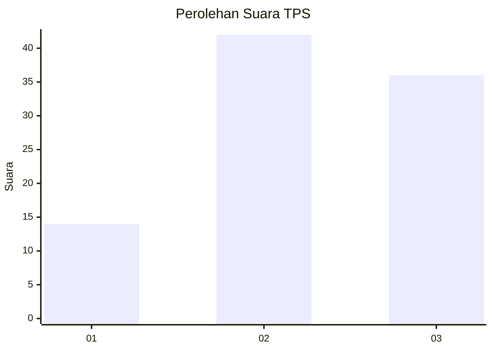
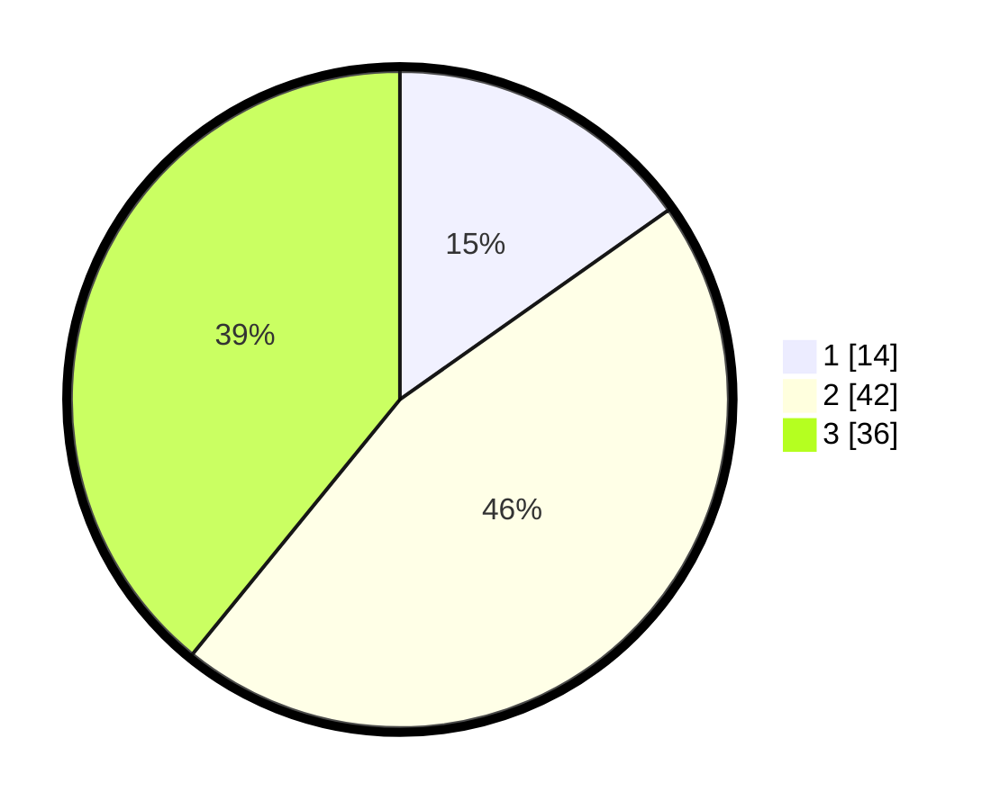

# Hasil

## Grafik

## Tabel

| No. | Nama Paslon    | Suara | Suara (raw) | Persentase |
|:--- |:-------------- | -----:| -----------:| ----------:|
| 1   | ANIES MUHAIMIN | 14    | [14][p-1]   | 15,22      |
| 2   | PRABOWO GIBRAN | 42    | [42][p-2]   | 45,65      |
| 3   | GANJAR MAHFUD  | 36    | [36][p-3]   | 39,13      |

[p-1]: https://github.com/gigit-pemilu/pemilu-2024-33-jawa-tengah/blob/main/pilpres/hitung-suara/sub/33-jawa-tengah/sub/29-brebes/sub/05-sirampog/sub/2012-plompong/sub/024-tps/sub/paslon-1.txt
[p-2]: https://github.com/gigit-pemilu/pemilu-2024-33-jawa-tengah/blob/main/pilpres/hitung-suara/sub/33-jawa-tengah/sub/29-brebes/sub/05-sirampog/sub/2012-plompong/sub/024-tps/sub/paslon-2.txt
[p-3]: https://github.com/gigit-pemilu/pemilu-2024-33-jawa-tengah/blob/main/pilpres/hitung-suara/sub/33-jawa-tengah/sub/29-brebes/sub/05-sirampog/sub/2012-plompong/sub/024-tps/sub/paslon-3.txt

## Foto C Plano

https://sirekap-obj-formc.kpu.go.id/60ee/pemilu/ppwp/33/29/05/20/12/3329052012024-20240215-072508--ca90948e-aea6-42a1-870c-537f8211db29.jpg

https://sirekap-obj-formc.kpu.go.id/60ee/pemilu/ppwp/33/29/05/20/12/3329052012024-20240215-072648--9d0b2dcc-84a1-4ce7-a65d-ac05a9fb8356.jpg

https://sirekap-obj-formc.kpu.go.id/60ee/pemilu/ppwp/33/29/05/20/12/3329052012024-20240215-072815--f0208e1d-5eb3-4413-be2f-e3fcd5d4a7c4.jpg

## Metadata

| Key        | Value               |
| ---------- | ------------------- |
| Time Stamp | 2024-02-24 22:31:28 |

