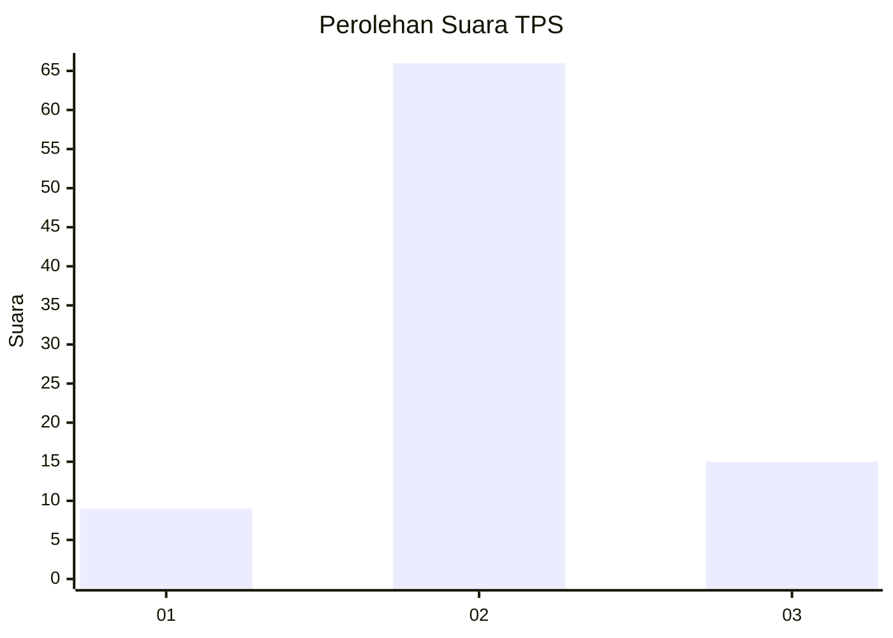
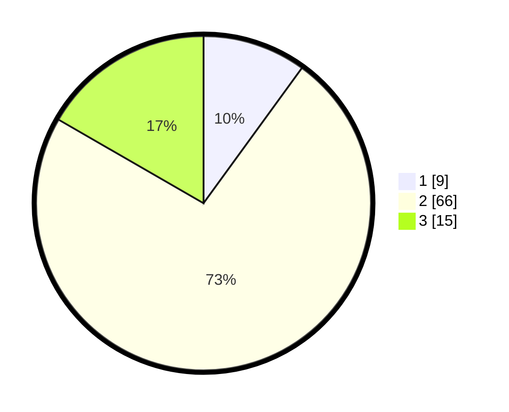

# Hasil

## Grafik

## Tabel

| No. | Nama Paslon    | Suara | Suara (raw) | Persentase |
|:--- |:-------------- | -----:| -----------:| ----------:|
| 1   | ANIES MUHAIMIN | 9     | [9][p-1]    | 10,00      |
| 2   | PRABOWO GIBRAN | 66    | [66][p-2]   | 73,33      |
| 3   | GANJAR MAHFUD  | 15    | [15][p-3]   | 16,67      |

[p-1]: https://github.com/gigit-pemilu/pemilu-2024/blob/main/pilpres/hitung-suara/sub/33-jawa-tengah/sub/29-brebes/sub/05-sirampog/sub/2012-plompong/sub/030-tps/sub/paslon-1.txt
[p-2]: https://github.com/gigit-pemilu/pemilu-2024/blob/main/pilpres/hitung-suara/sub/33-jawa-tengah/sub/29-brebes/sub/05-sirampog/sub/2012-plompong/sub/030-tps/sub/paslon-2.txt
[p-3]: https://github.com/gigit-pemilu/pemilu-2024/blob/main/pilpres/hitung-suara/sub/33-jawa-tengah/sub/29-brebes/sub/05-sirampog/sub/2012-plompong/sub/030-tps/sub/paslon-3.txt

## Foto C Plano

https://sirekap-obj-formc.kpu.go.id/8e4f/pemilu/ppwp/33/29/05/20/12/3329052012030-20240215-011415--9cffbd17-990b-4561-9c21-a57888405ad1.jpg

https://sirekap-obj-formc.kpu.go.id/8e4f/pemilu/ppwp/33/29/05/20/12/3329052012030-20240215-071212--2a1448ce-e636-4de2-b260-fbbdf2dd9f50.jpg

https://sirekap-obj-formc.kpu.go.id/8e4f/pemilu/ppwp/33/29/05/20/12/3329052012030-20240215-023430--bbd2b1f6-a8c0-41c1-a9f1-bbb75b921c31.jpg

## Metadata

| Key        | Value               |
| ---------- | ------------------- |
| Time Stamp | 2024-02-25 14:00:00 |

