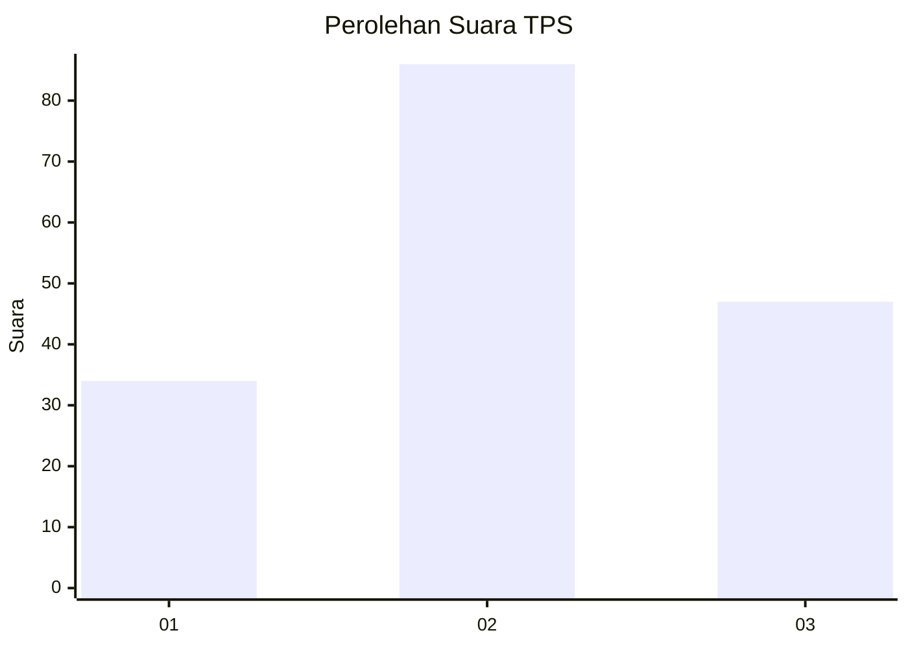
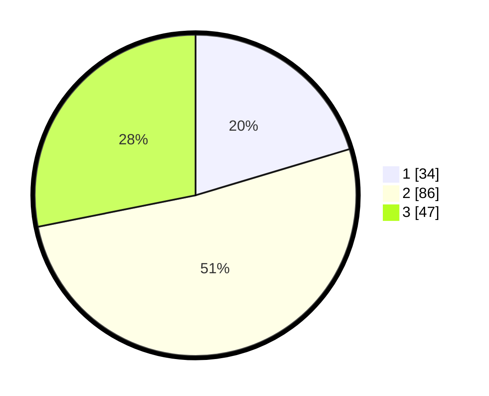

# Hasil

## Grafik

## Tabel

| No. | Nama Paslon    | Suara | Suara (raw) | Persentase |
|:--- |:-------------- | -----:| -----------:| ----------:|
| 1   | ANIES MUHAIMIN | 34    | [34][p-1]   | 20,36      |
| 2   | PRABOWO GIBRAN | 86    | [86][p-2]   | 51,50      |
| 3   | GANJAR MAHFUD  | 47    | [47][p-3]   | 28,14      |

[p-1]: https://github.com/gigit-pemilu/pemilu-2024/blob/main/pilpres/hitung-suara/sub/33-jawa-tengah/sub/29-brebes/sub/06-tonjong/sub/2001-galuhtimur/sub/002-tps/sub/paslon-1.txt
[p-2]: https://github.com/gigit-pemilu/pemilu-2024/blob/main/pilpres/hitung-suara/sub/33-jawa-tengah/sub/29-brebes/sub/06-tonjong/sub/2001-galuhtimur/sub/002-tps/sub/paslon-2.txt
[p-3]: https://github.com/gigit-pemilu/pemilu-2024/blob/main/pilpres/hitung-suara/sub/33-jawa-tengah/sub/29-brebes/sub/06-tonjong/sub/2001-galuhtimur/sub/002-tps/sub/paslon-3.txt

## Foto C Plano

https://sirekap-obj-formc.kpu.go.id/569e/pemilu/ppwp/33/29/06/20/01/3329062001002-20240215-025403--43a9036c-5dc2-4ab3-a907-8bcd458ce3e2.jpg

https://sirekap-obj-formc.kpu.go.id/569e/pemilu/ppwp/33/29/06/20/01/3329062001002-20240217-103253--d6fa1cf0-09cb-4f7d-8dc6-dcc0dc86c85a.jpg

https://sirekap-obj-formc.kpu.go.id/569e/pemilu/ppwp/33/29/06/20/01/3329062001002-20240217-214540--27264aef-82e0-45a0-821e-6229b94ee120.jpg

## Metadata

| Key        | Value               |
| ---------- | ------------------- |
| Time Stamp | 2024-02-19 06:16:00 |

