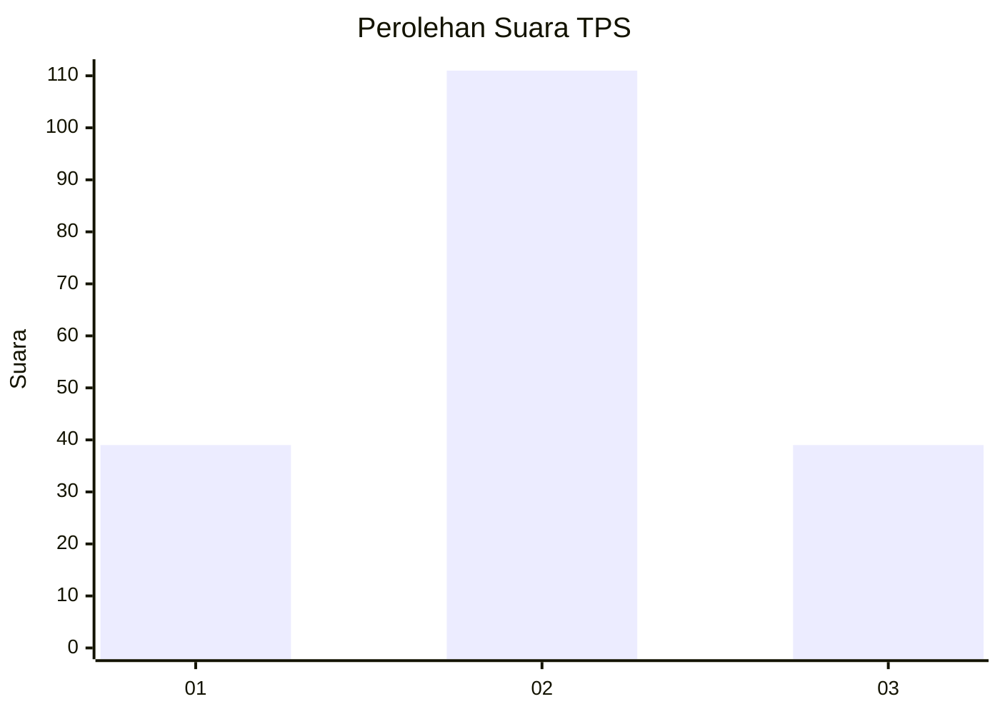
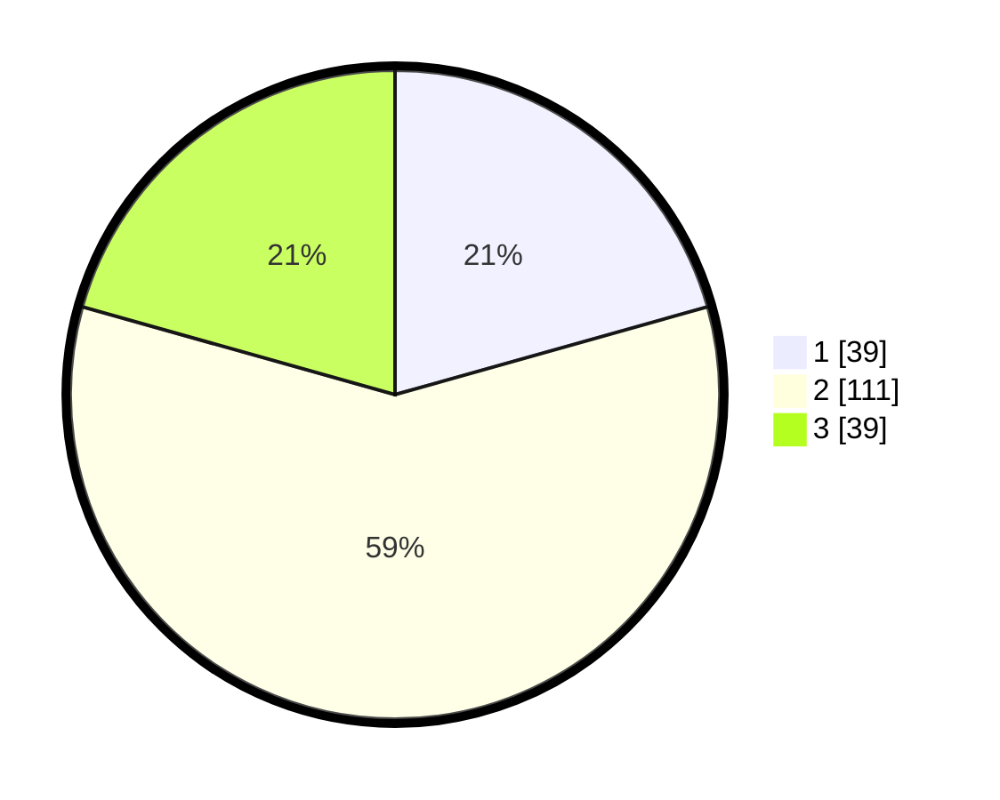

# Hasil

## Grafik

## Tabel

| No. | Nama Paslon    | Suara | Suara (raw) | Persentase |
|:--- |:-------------- | -----:| -----------:| ----------:|
| 1   | ANIES MUHAIMIN | 39    | [39][p-1]   | 20,63      |
| 2   | PRABOWO GIBRAN | 111   | [111][p-2]  | 58,73      |
| 3   | GANJAR MAHFUD  | 39    | [39][p-3]   | 20,63      |

[p-1]: https://github.com/gigit-pemilu/pemilu-2024-33-jawa-tengah/blob/main/pilpres/hitung-suara/sub/33-jawa-tengah/sub/29-brebes/sub/06-tonjong/sub/2001-galuhtimur/sub/003-tps/sub/paslon-1.txt
[p-2]: https://github.com/gigit-pemilu/pemilu-2024-33-jawa-tengah/blob/main/pilpres/hitung-suara/sub/33-jawa-tengah/sub/29-brebes/sub/06-tonjong/sub/2001-galuhtimur/sub/003-tps/sub/paslon-2.txt
[p-3]: https://github.com/gigit-pemilu/pemilu-2024-33-jawa-tengah/blob/main/pilpres/hitung-suara/sub/33-jawa-tengah/sub/29-brebes/sub/06-tonjong/sub/2001-galuhtimur/sub/003-tps/sub/paslon-3.txt

## Foto C Plano

https://sirekap-obj-formc.kpu.go.id/c304/pemilu/ppwp/33/29/06/20/01/3329062001003-20240215-023523--cea34d5e-a2b9-4a7b-ae0a-7350069dce23.jpg

https://sirekap-obj-formc.kpu.go.id/c304/pemilu/ppwp/33/29/06/20/01/3329062001003-20240215-031230--81a607b2-41d0-4e23-967c-3a00d367fd2d.jpg

https://sirekap-obj-formc.kpu.go.id/c304/pemilu/ppwp/33/29/06/20/01/3329062001003-20240215-031315--6228fad5-3653-4bd6-a6db-11c12831dd9b.jpg

## Metadata

| Key        | Value               |
| ---------- | ------------------- |
| Time Stamp | 2024-02-15 16:00:26 |

