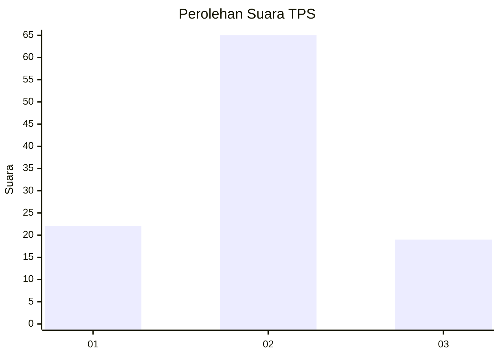
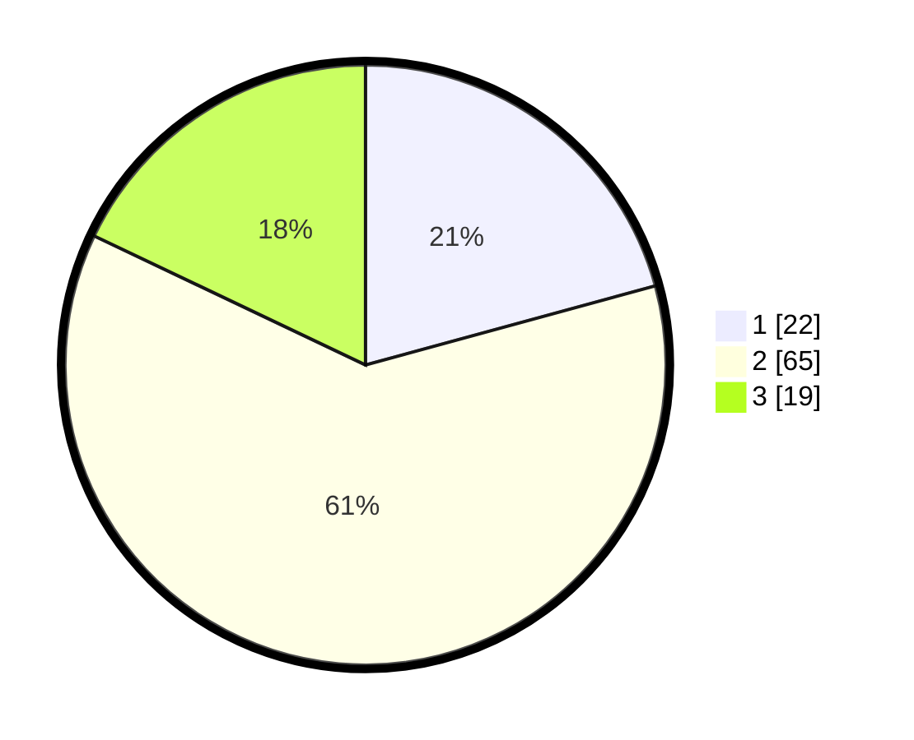

# Hasil

## Grafik

## Tabel

| No. | Nama Paslon    | Suara | Suara (raw) | Persentase |
|:--- |:-------------- | -----:| -----------:| ----------:|
| 1   | ANIES MUHAIMIN | 22    | [22][p-1]   | 20,75      |
| 2   | PRABOWO GIBRAN | 65    | [65][p-2]   | 61,32      |
| 3   | GANJAR MAHFUD  | 19    | [19][p-3]   | 17,92      |

[p-1]: https://github.com/gigit-pemilu/pemilu-2024/blob/main/pilpres/hitung-suara/sub/33-jawa-tengah/sub/29-brebes/sub/06-tonjong/sub/2001-galuhtimur/sub/024-tps/sub/paslon-1.txt
[p-2]: https://github.com/gigit-pemilu/pemilu-2024/blob/main/pilpres/hitung-suara/sub/33-jawa-tengah/sub/29-brebes/sub/06-tonjong/sub/2001-galuhtimur/sub/024-tps/sub/paslon-2.txt
[p-3]: https://github.com/gigit-pemilu/pemilu-2024/blob/main/pilpres/hitung-suara/sub/33-jawa-tengah/sub/29-brebes/sub/06-tonjong/sub/2001-galuhtimur/sub/024-tps/sub/paslon-3.txt

## Foto C Plano

https://sirekap-obj-formc.kpu.go.id/e0e3/pemilu/ppwp/33/29/06/20/01/3329062001024-20240215-044059--5426e630-c036-46cd-9729-07b73611be71.jpg

https://sirekap-obj-formc.kpu.go.id/e0e3/pemilu/ppwp/33/29/06/20/01/3329062001024-20240215-044141--0166210b-9640-4c7f-935f-4a6c08b11c78.jpg

https://sirekap-obj-formc.kpu.go.id/e0e3/pemilu/ppwp/33/29/06/20/01/3329062001024-20240215-044220--145f88ab-7fcb-4127-8ea1-718de3924536.jpg

## Metadata

| Key        | Value               |
| ---------- | ------------------- |
| Time Stamp | 2024-02-26 23:00:00 |

