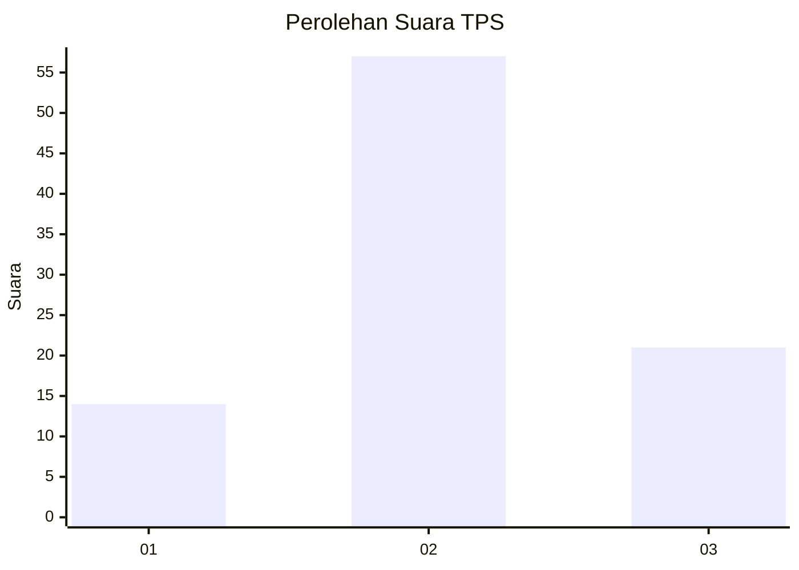
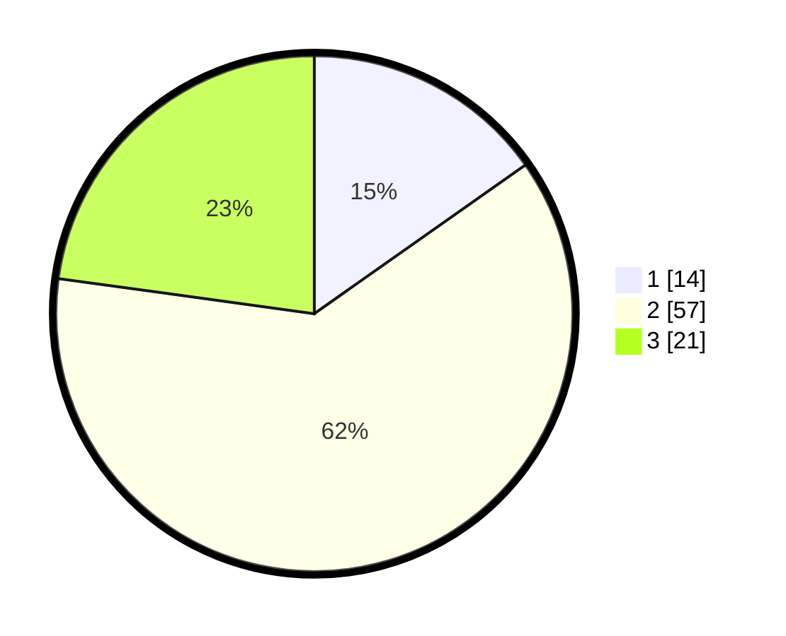

# Hasil

## Grafik

## Tabel

| No. | Nama Paslon    | Suara | Suara (raw) | Persentase |
|:--- |:-------------- | -----:| -----------:| ----------:|
| 1   | ANIES MUHAIMIN | 14    | [14][p-1]   | 15,22      |
| 2   | PRABOWO GIBRAN | 57    | [57][p-2]   | 61,96      |
| 3   | GANJAR MAHFUD  | 21    | [21][p-3]   | 22,83      |

[p-1]: https://github.com/gigit-pemilu/pemilu-2024-33-jawa-tengah/blob/main/pilpres/hitung-suara/sub/33-jawa-tengah/sub/29-brebes/sub/06-tonjong/sub/2001-galuhtimur/sub/025-tps/sub/paslon-1.txt
[p-2]: https://github.com/gigit-pemilu/pemilu-2024-33-jawa-tengah/blob/main/pilpres/hitung-suara/sub/33-jawa-tengah/sub/29-brebes/sub/06-tonjong/sub/2001-galuhtimur/sub/025-tps/sub/paslon-2.txt
[p-3]: https://github.com/gigit-pemilu/pemilu-2024-33-jawa-tengah/blob/main/pilpres/hitung-suara/sub/33-jawa-tengah/sub/29-brebes/sub/06-tonjong/sub/2001-galuhtimur/sub/025-tps/sub/paslon-3.txt

## Foto C Plano

https://sirekap-obj-formc.kpu.go.id/d5e8/pemilu/ppwp/33/29/06/20/01/3329062001025-20240215-084152--ca4ec4d8-21fd-44a3-a6dc-336b02535173.jpg

https://sirekap-obj-formc.kpu.go.id/d5e8/pemilu/ppwp/33/29/06/20/01/3329062001025-20240215-081234--3bb80c51-edf0-47b0-b151-1b3f1e7f3648.jpg

https://sirekap-obj-formc.kpu.go.id/d5e8/pemilu/ppwp/33/29/06/20/01/3329062001025-20240215-081327--a6d48eec-2321-436b-bc5f-b79df9849f6f.jpg

## Metadata

| Key        | Value               |
| ---------- | ------------------- |
| Time Stamp | 2024-02-24 22:31:28 |

