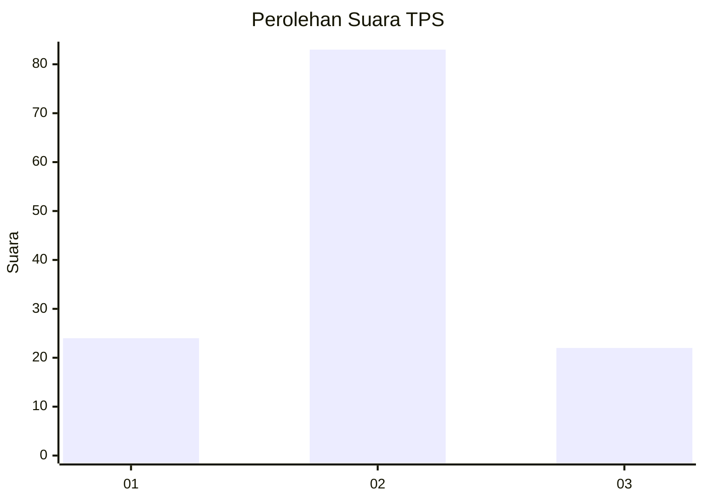
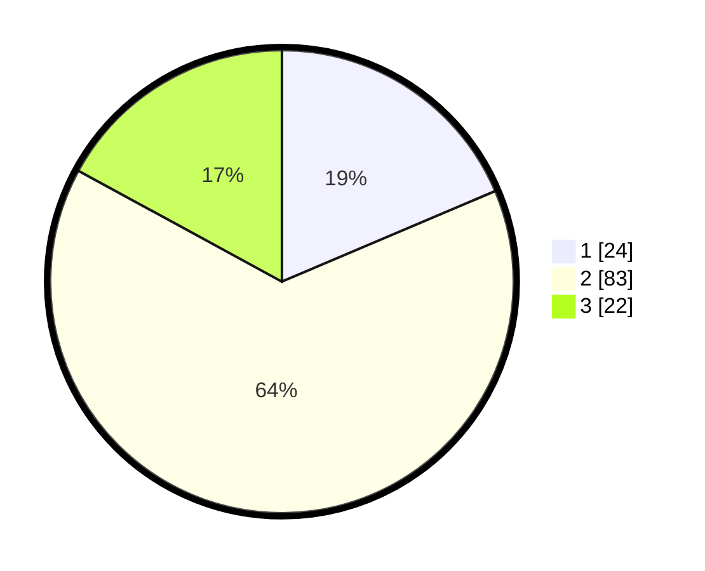

# Hasil

## Grafik

## Tabel

| No. | Nama Paslon    | Suara | Suara (raw) | Persentase |
|:--- |:-------------- | -----:| -----------:| ----------:|
| 1   | ANIES MUHAIMIN | 24    | [24][p-1]   | 18,60      |
| 2   | PRABOWO GIBRAN | 83    | [83][p-2]   | 64,34      |
| 3   | GANJAR MAHFUD  | 22    | [22][p-3]   | 17,05      |

[p-1]: https://github.com/gigit-pemilu/pemilu-2024-33-jawa-tengah/blob/main/pilpres/hitung-suara/sub/33-jawa-tengah/sub/29-brebes/sub/06-tonjong/sub/2001-galuhtimur/sub/026-tps/sub/paslon-1.txt
[p-2]: https://github.com/gigit-pemilu/pemilu-2024-33-jawa-tengah/blob/main/pilpres/hitung-suara/sub/33-jawa-tengah/sub/29-brebes/sub/06-tonjong/sub/2001-galuhtimur/sub/026-tps/sub/paslon-2.txt
[p-3]: https://github.com/gigit-pemilu/pemilu-2024-33-jawa-tengah/blob/main/pilpres/hitung-suara/sub/33-jawa-tengah/sub/29-brebes/sub/06-tonjong/sub/2001-galuhtimur/sub/026-tps/sub/paslon-3.txt

## Foto C Plano

https://sirekap-obj-formc.kpu.go.id/e1b2/pemilu/ppwp/33/29/06/20/01/3329062001026-20240215-065856--dd7f5064-43bf-41ea-871a-7d1489ffc0c4.jpg

https://sirekap-obj-formc.kpu.go.id/e1b2/pemilu/ppwp/33/29/06/20/01/3329062001026-20240215-073606--e4635644-9ee5-451f-ba89-8bdce2f5c9a8.jpg

https://sirekap-obj-formc.kpu.go.id/e1b2/pemilu/ppwp/33/29/06/20/01/3329062001026-20240215-080105--3dcacb34-bb01-47f4-a849-d6d2f77dcfab.jpg

## Metadata

| Key        | Value               |
| ---------- | ------------------- |
| Time Stamp | 2024-02-15 19:00:26 |

