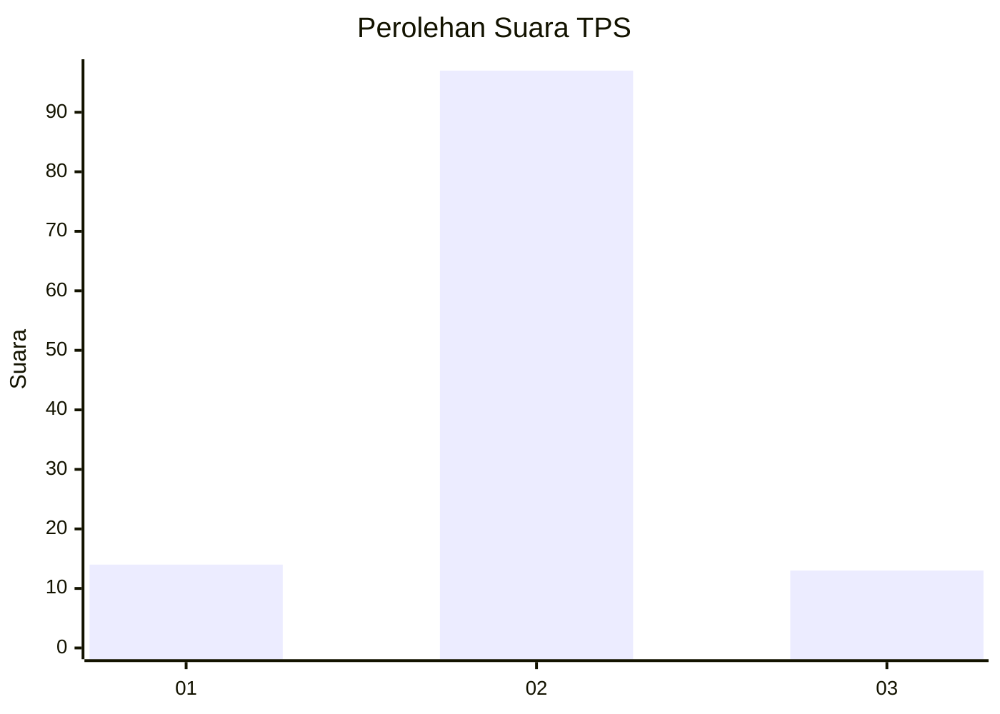
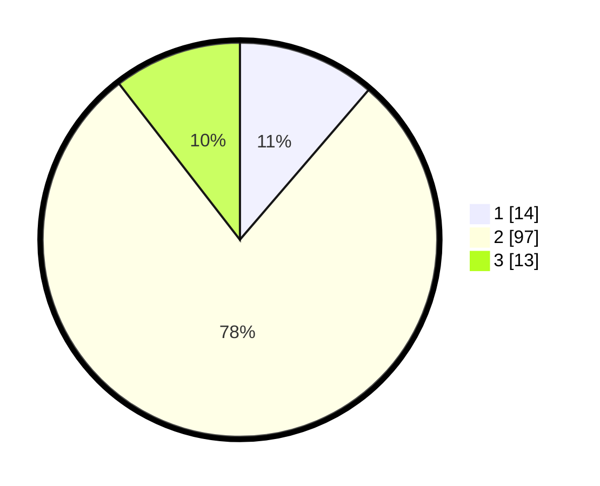

# Hasil

## Grafik

## Tabel

| No. | Nama Paslon    | Suara | Suara (raw) | Persentase |
|:--- |:-------------- | -----:| -----------:| ----------:|
| 1   | ANIES MUHAIMIN | 14    | [14][p-1]   | 11,29      |
| 2   | PRABOWO GIBRAN | 97    | [97][p-2]   | 78,23      |
| 3   | GANJAR MAHFUD  | 13    | [13][p-3]   | 10,48      |

[p-1]: https://github.com/gigit-pemilu/pemilu-2024-33-jawa-tengah/blob/main/pilpres/hitung-suara/sub/33-jawa-tengah/sub/29-brebes/sub/06-tonjong/sub/2005-kutayu/sub/004-tps/sub/paslon-1.txt
[p-2]: https://github.com/gigit-pemilu/pemilu-2024-33-jawa-tengah/blob/main/pilpres/hitung-suara/sub/33-jawa-tengah/sub/29-brebes/sub/06-tonjong/sub/2005-kutayu/sub/004-tps/sub/paslon-2.txt
[p-3]: https://github.com/gigit-pemilu/pemilu-2024-33-jawa-tengah/blob/main/pilpres/hitung-suara/sub/33-jawa-tengah/sub/29-brebes/sub/06-tonjong/sub/2005-kutayu/sub/004-tps/sub/paslon-3.txt

## Foto C Plano

https://sirekap-obj-formc.kpu.go.id/47b5/pemilu/ppwp/33/29/06/20/05/3329062005004-20240217-104730--6fbf07b5-dd82-40a0-9d70-c9339b386a8d.jpg

https://sirekap-obj-formc.kpu.go.id/47b5/pemilu/ppwp/33/29/06/20/05/3329062005004-20240214-214300--d552bc19-204e-4cf1-830d-347790e6290d.jpg

https://sirekap-obj-formc.kpu.go.id/47b5/pemilu/ppwp/33/29/06/20/05/3329062005004-20240214-214135--a2209f01-138a-4cf8-a9bd-991fa3aa70c5.jpg

## Metadata

| Key        | Value               |
| ---------- | ------------------- |
| Time Stamp | 2024-02-24 22:31:28 |

