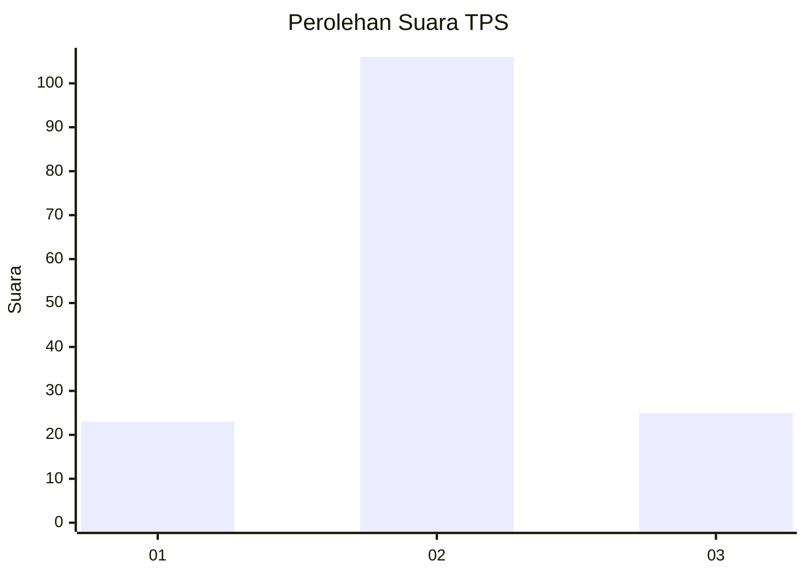
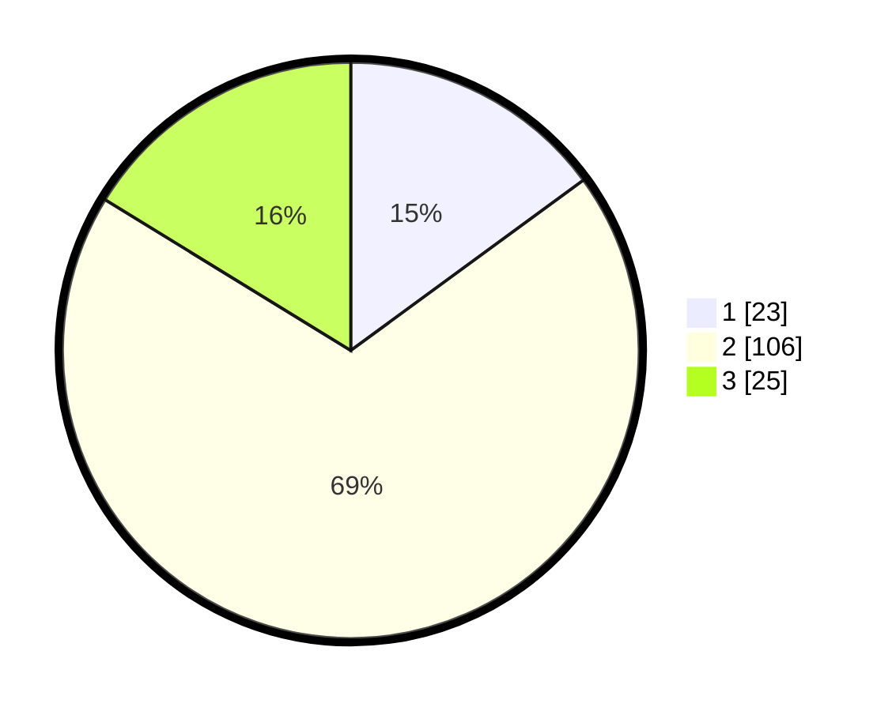

# Hasil

## Grafik

## Tabel

| No. | Nama Paslon    | Suara | Suara (raw) | Persentase |
|:--- |:-------------- | -----:| -----------:| ----------:|
| 1   | ANIES MUHAIMIN | 23    | [23][p-1]   | 14,94      |
| 2   | PRABOWO GIBRAN | 106   | [106][p-2]  | 68,83      |
| 3   | GANJAR MAHFUD  | 25    | [25][p-3]   | 16,23      |

[p-1]: https://github.com/gigit-pemilu/pemilu-2024/blob/main/pilpres/hitung-suara/sub/33-jawa-tengah/sub/29-brebes/sub/06-tonjong/sub/2005-kutayu/sub/005-tps/sub/paslon-1.txt
[p-2]: https://github.com/gigit-pemilu/pemilu-2024/blob/main/pilpres/hitung-suara/sub/33-jawa-tengah/sub/29-brebes/sub/06-tonjong/sub/2005-kutayu/sub/005-tps/sub/paslon-2.txt
[p-3]: https://github.com/gigit-pemilu/pemilu-2024/blob/main/pilpres/hitung-suara/sub/33-jawa-tengah/sub/29-brebes/sub/06-tonjong/sub/2005-kutayu/sub/005-tps/sub/paslon-3.txt

## Foto C Plano

https://sirekap-obj-formc.kpu.go.id/7b8a/pemilu/ppwp/33/29/06/20/05/3329062005005-20240214-220026--a8c2a3c2-ff81-4302-8ee8-b7d73d49fdba.jpg

https://sirekap-obj-formc.kpu.go.id/7b8a/pemilu/ppwp/33/29/06/20/05/3329062005005-20240214-220040--6905f371-e17c-4565-9ea9-105654cb3ef0.jpg

https://sirekap-obj-formc.kpu.go.id/7b8a/pemilu/ppwp/33/29/06/20/05/3329062005005-20240214-220048--d9976fb8-24d6-45ec-8fa9-8bba3a3395eb.jpg

## Metadata

| Key        | Value               |
| ---------- | ------------------- |
| Time Stamp | 2024-02-24 22:31:28 |

