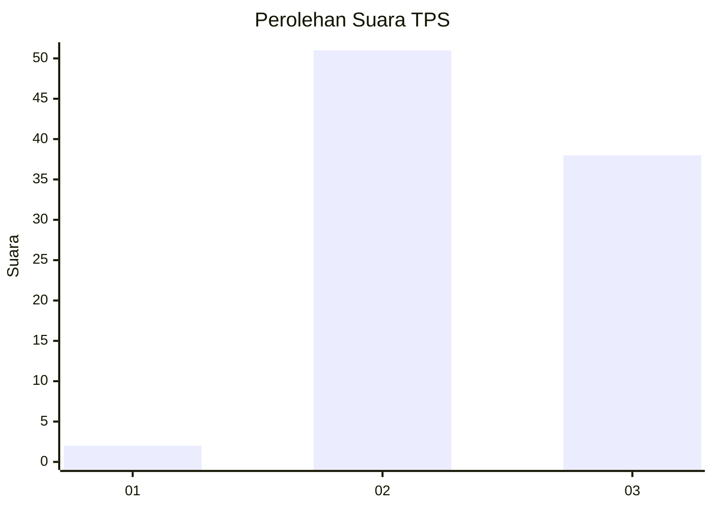
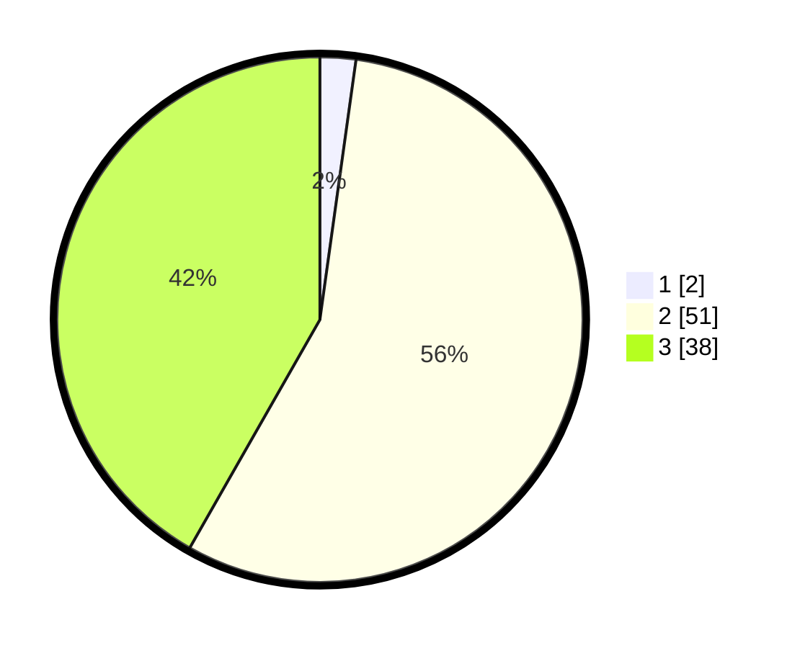

# Hasil

## Grafik

## Tabel

| No. | Nama Paslon    | Suara | Suara (raw) | Persentase |
|:--- |:-------------- | -----:| -----------:| ----------:|
| 1   | ANIES MUHAIMIN | 2     | [2][p-1]    | 2,20       |
| 2   | PRABOWO GIBRAN | 51    | [51][p-2]   | 56,04      |
| 3   | GANJAR MAHFUD  | 38    | [38][p-3]   | 41,76      |

[p-1]: https://github.com/gigit-pemilu/pemilu-2024-33-jawa-tengah/blob/main/pilpres/hitung-suara/sub/33-jawa-tengah/sub/29-brebes/sub/06-tonjong/sub/2010-rajawetan/sub/009-tps/sub/paslon-1.txt
[p-2]: https://github.com/gigit-pemilu/pemilu-2024-33-jawa-tengah/blob/main/pilpres/hitung-suara/sub/33-jawa-tengah/sub/29-brebes/sub/06-tonjong/sub/2010-rajawetan/sub/009-tps/sub/paslon-2.txt
[p-3]: https://github.com/gigit-pemilu/pemilu-2024-33-jawa-tengah/blob/main/pilpres/hitung-suara/sub/33-jawa-tengah/sub/29-brebes/sub/06-tonjong/sub/2010-rajawetan/sub/009-tps/sub/paslon-3.txt

## Foto C Plano

https://sirekap-obj-formc.kpu.go.id/0b82/pemilu/ppwp/33/29/06/20/10/3329062010009-20240214-222337--ff8ad774-bfb5-4b7f-8bb3-348ffb7ec3ba.jpg

https://sirekap-obj-formc.kpu.go.id/0b82/pemilu/ppwp/33/29/06/20/10/3329062010009-20240214-222502--892aaee3-8ce0-43c5-b582-004b31558f2b.jpg

https://sirekap-obj-formc.kpu.go.id/0b82/pemilu/ppwp/33/29/06/20/10/3329062010009-20240214-222659--c9e9c6c6-4754-424f-9e4d-702775fd9118.jpg

## Metadata

| Key        | Value               |
| ---------- | ------------------- |
| Time Stamp | 2024-02-15 17:30:25 |

