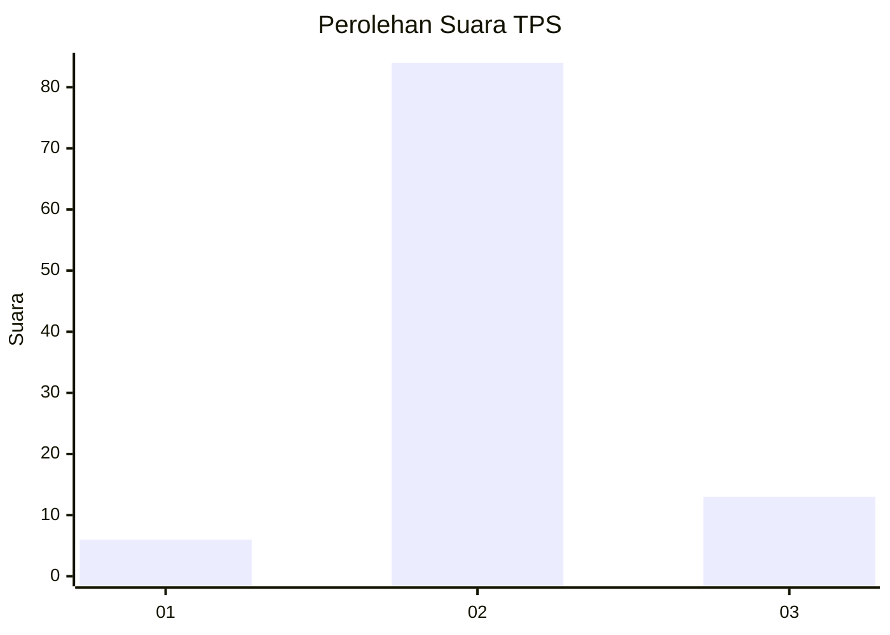
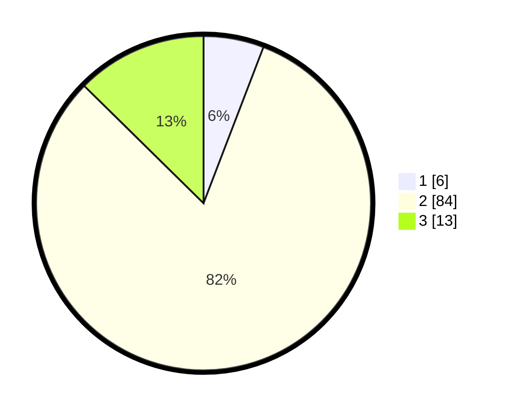

# Hasil

## Grafik

## Tabel

| No. | Nama Paslon    | Suara | Suara (raw) | Persentase |
|:--- |:-------------- | -----:| -----------:| ----------:|
| 1   | ANIES MUHAIMIN | 6     | [6][p-1]    | 5,83       |
| 2   | PRABOWO GIBRAN | 84    | [84][p-2]   | 81,55      |
| 3   | GANJAR MAHFUD  | 13    | [13][p-3]   | 12,62      |

[p-1]: https://github.com/gigit-pemilu/pemilu-2024/blob/main/pilpres/hitung-suara/sub/33-jawa-tengah/sub/29-brebes/sub/06-tonjong/sub/2010-rajawetan/sub/010-tps/sub/paslon-1.txt
[p-2]: https://github.com/gigit-pemilu/pemilu-2024/blob/main/pilpres/hitung-suara/sub/33-jawa-tengah/sub/29-brebes/sub/06-tonjong/sub/2010-rajawetan/sub/010-tps/sub/paslon-2.txt
[p-3]: https://github.com/gigit-pemilu/pemilu-2024/blob/main/pilpres/hitung-suara/sub/33-jawa-tengah/sub/29-brebes/sub/06-tonjong/sub/2010-rajawetan/sub/010-tps/sub/paslon-3.txt

## Foto C Plano

https://sirekap-obj-formc.kpu.go.id/5ddc/pemilu/ppwp/33/29/06/20/10/3329062010010-20240215-005644--a30190f3-fffc-44f1-8017-1b1cfb758d0d.jpg

https://sirekap-obj-formc.kpu.go.id/5ddc/pemilu/ppwp/33/29/06/20/10/3329062010010-20240215-005815--befa34d2-d039-4c8a-9bb7-c89dbcf187ae.jpg

https://sirekap-obj-formc.kpu.go.id/5ddc/pemilu/ppwp/33/29/06/20/10/3329062010010-20240215-005905--19c72e44-a61a-491d-8024-f1f528bdd393.jpg

## Metadata

| Key        | Value               |
| ---------- | ------------------- |
| Time Stamp | 2024-02-15 17:30:25 |

