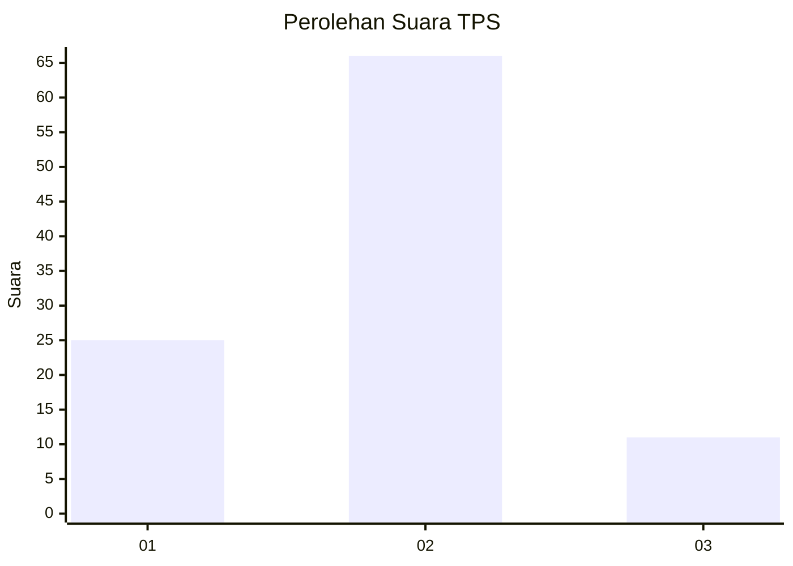

# Hasil

## Grafik

## Tabel

| No. | Nama Paslon    | Suara | Suara (raw) | Persentase |
|:--- |:-------------- | -----:| -----------:| ----------:|
| 1   | ANIES MUHAIMIN | 25    | [25][p-1]   | 24,51      |
| 2   | PRABOWO GIBRAN | 66    | [66][p-2]   | 64,71      |
| 3   | GANJAR MAHFUD  | 11    | [11][p-3]   | 10,78      |

[p-1]: https://github.com/gigit-pemilu/pemilu-2024-33-jawa-tengah/blob/main/pilpres/hitung-suara/sub/33-jawa-tengah/sub/29-brebes/sub/06-tonjong/sub/2012-tanggeran/sub/013-tps/sub/paslon-1.txt
[p-2]: https://github.com/gigit-pemilu/pemilu-2024-33-jawa-tengah/blob/main/pilpres/hitung-suara/sub/33-jawa-tengah/sub/29-brebes/sub/06-tonjong/sub/2012-tanggeran/sub/013-tps/sub/paslon-2.txt
[p-3]: https://github.com/gigit-pemilu/pemilu-2024-33-jawa-tengah/blob/main/pilpres/hitung-suara/sub/33-jawa-tengah/sub/29-brebes/sub/06-tonjong/sub/2012-tanggeran/sub/013-tps/sub/paslon-3.txt

## Foto C Plano

https://sirekap-obj-formc.kpu.go.id/27d2/pemilu/ppwp/33/29/06/20/12/3329062012013-20240218-094006--73f6f604-290d-4b14-a511-ee001a4216cf.jpg

https://sirekap-obj-formc.kpu.go.id/27d2/pemilu/ppwp/33/29/06/20/12/3329062012013-20240218-105055--952e393a-b541-46e1-aafa-9aee83448adc.jpg

https://sirekap-obj-formc.kpu.go.id/27d2/pemilu/ppwp/33/29/06/20/12/3329062012013-20240218-074734--81f03062-4128-4a03-94bf-a49673761918.jpg

## Metadata

| Key        | Value               |
| ---------- | ------------------- |
| Time Stamp | 2024-02-24 22:31:28 |

