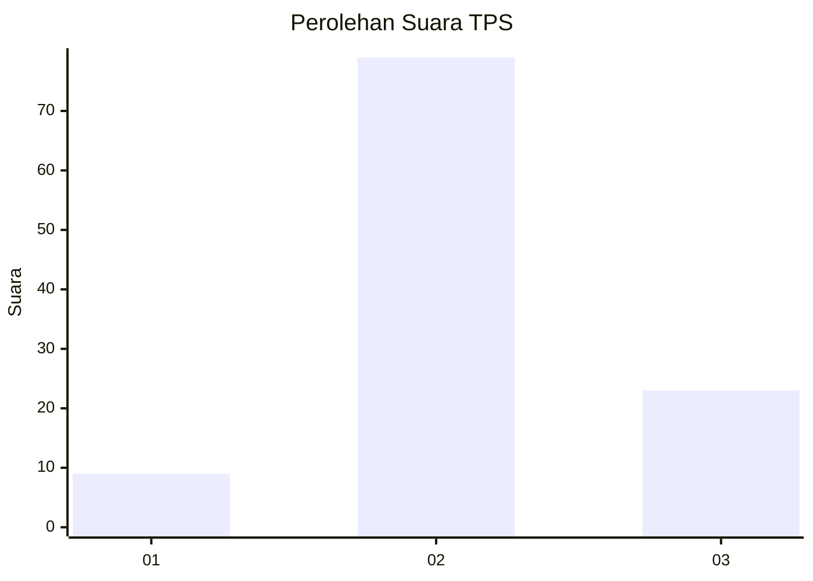
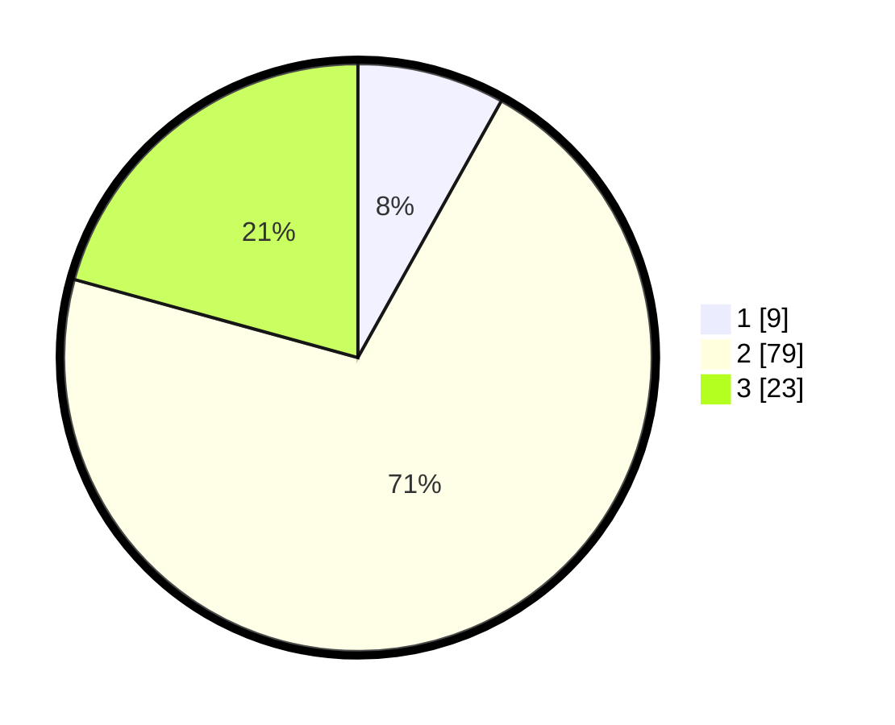

# Hasil

## Grafik

## Tabel

| No. | Nama Paslon    | Suara | Suara (raw) | Persentase |
|:--- |:-------------- | -----:| -----------:| ----------:|
| 1   | ANIES MUHAIMIN | 9     | [9][p-1]    | 8,11       |
| 2   | PRABOWO GIBRAN | 79    | [79][p-2]   | 71,17      |
| 3   | GANJAR MAHFUD  | 23    | [23][p-3]   | 20,72      |

[p-1]: https://github.com/gigit-pemilu/pemilu-2024-33-jawa-tengah/blob/main/pilpres/hitung-suara/sub/33-jawa-tengah/sub/29-brebes/sub/06-tonjong/sub/2013-tonjong/sub/031-tps/sub/paslon-1.txt
[p-2]: https://github.com/gigit-pemilu/pemilu-2024-33-jawa-tengah/blob/main/pilpres/hitung-suara/sub/33-jawa-tengah/sub/29-brebes/sub/06-tonjong/sub/2013-tonjong/sub/031-tps/sub/paslon-2.txt
[p-3]: https://github.com/gigit-pemilu/pemilu-2024-33-jawa-tengah/blob/main/pilpres/hitung-suara/sub/33-jawa-tengah/sub/29-brebes/sub/06-tonjong/sub/2013-tonjong/sub/031-tps/sub/paslon-3.txt

## Foto C Plano

https://sirekap-obj-formc.kpu.go.id/92e9/pemilu/ppwp/33/29/06/20/13/3329062013031-20240215-002244--f6d015de-f705-45bb-9931-3864b4d8a1d6.jpg

https://sirekap-obj-formc.kpu.go.id/92e9/pemilu/ppwp/33/29/06/20/13/3329062013031-20240215-002418--a2f6687f-00a4-4282-b6af-d41ea083f8a4.jpg

https://sirekap-obj-formc.kpu.go.id/92e9/pemilu/ppwp/33/29/06/20/13/3329062013031-20240215-002528--4743a5e8-6c22-40a6-bb42-6621626f18e7.jpg

## Metadata

| Key        | Value               |
| ---------- | ------------------- |
| Time Stamp | 2024-02-15 18:00:26 |

