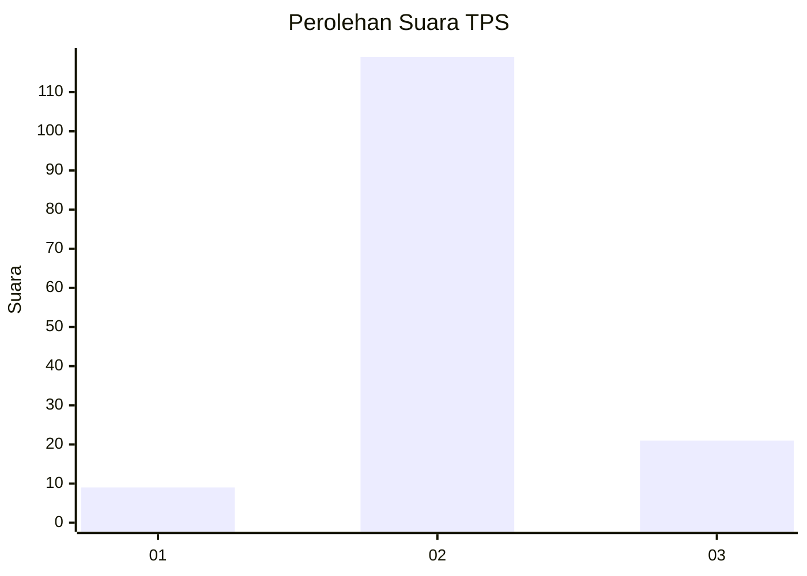
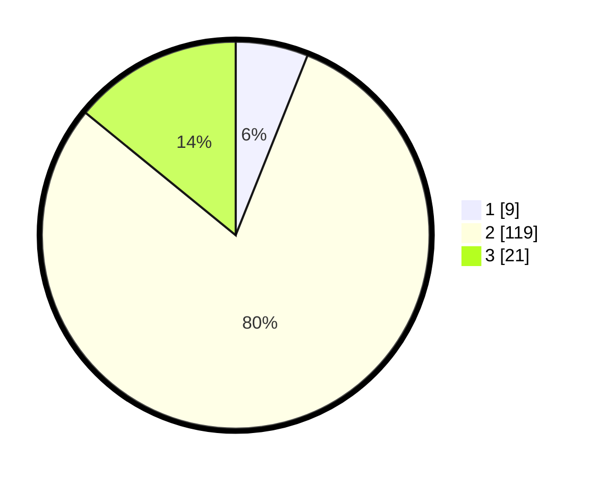

# Hasil

## Grafik

## Tabel

| No. | Nama Paslon    | Suara | Suara (raw) | Persentase |
|:--- |:-------------- | -----:| -----------:| ----------:|
| 1   | ANIES MUHAIMIN | 9     | [9][p-1]    | 6,04       |
| 2   | PRABOWO GIBRAN | 119   | [119][p-2]  | 79,87      |
| 3   | GANJAR MAHFUD  | 21    | [21][p-3]   | 14,09      |

[p-1]: https://github.com/gigit-pemilu/pemilu-2024/blob/main/pilpres/hitung-suara/sub/33-jawa-tengah/sub/29-brebes/sub/07-jatibarang/sub/2018-pamengger/sub/011-tps/sub/paslon-1.txt
[p-2]: https://github.com/gigit-pemilu/pemilu-2024/blob/main/pilpres/hitung-suara/sub/33-jawa-tengah/sub/29-brebes/sub/07-jatibarang/sub/2018-pamengger/sub/011-tps/sub/paslon-2.txt
[p-3]: https://github.com/gigit-pemilu/pemilu-2024/blob/main/pilpres/hitung-suara/sub/33-jawa-tengah/sub/29-brebes/sub/07-jatibarang/sub/2018-pamengger/sub/011-tps/sub/paslon-3.txt

## Foto C Plano

https://sirekap-obj-formc.kpu.go.id/f462/pemilu/ppwp/33/29/07/20/18/3329072018011-20240215-031644--e548c1e2-3b19-4a1c-bbaa-50b3b3a0f61d.jpg

https://sirekap-obj-formc.kpu.go.id/f462/pemilu/ppwp/33/29/07/20/18/3329072018011-20240215-031808--6c634f76-37cb-4bae-9e7f-e31ecf505bca.jpg

https://sirekap-obj-formc.kpu.go.id/f462/pemilu/ppwp/33/29/07/20/18/3329072018011-20240215-031844--cbe77c75-b525-48d6-b299-f04aebc3e402.jpg

## Metadata

| Key        | Value               |
| ---------- | ------------------- |
| Time Stamp | 2024-02-17 18:00:00 |

