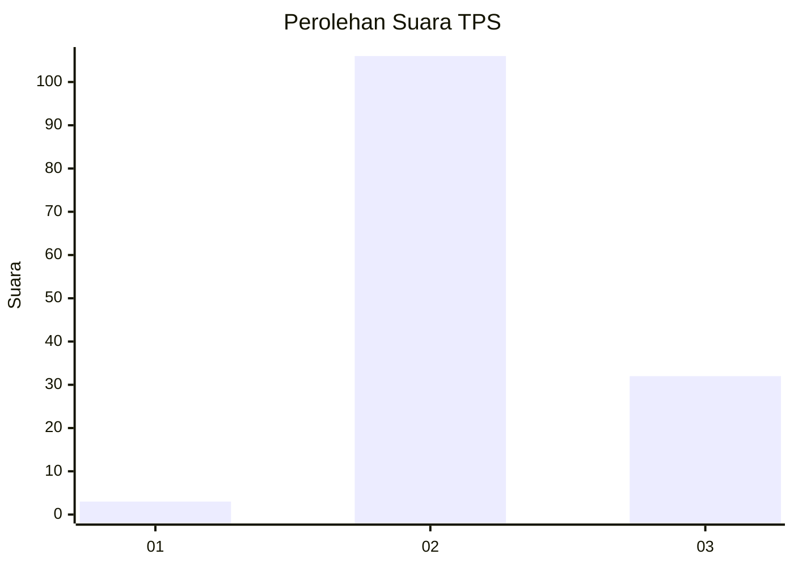
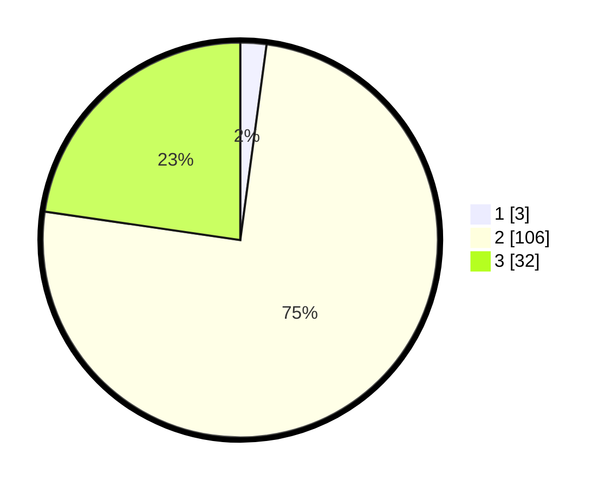

# Hasil

## Grafik

## Tabel

| No. | Nama Paslon    | Suara | Suara (raw) | Persentase |
|:--- |:-------------- | -----:| -----------:| ----------:|
| 1   | ANIES MUHAIMIN | 3     | [3][p-1]    | 2,13       |
| 2   | PRABOWO GIBRAN | 106   | [106][p-2]  | 75,18      |
| 3   | GANJAR MAHFUD  | 32    | [32][p-3]   | 22,70      |

[p-1]: https://github.com/gigit-pemilu/pemilu-2024/blob/main/pilpres/hitung-suara/sub/33-jawa-tengah/sub/29-brebes/sub/07-jatibarang/sub/2022-tembelang/sub/001-tps/sub/paslon-1.txt
[p-2]: https://github.com/gigit-pemilu/pemilu-2024/blob/main/pilpres/hitung-suara/sub/33-jawa-tengah/sub/29-brebes/sub/07-jatibarang/sub/2022-tembelang/sub/001-tps/sub/paslon-2.txt
[p-3]: https://github.com/gigit-pemilu/pemilu-2024/blob/main/pilpres/hitung-suara/sub/33-jawa-tengah/sub/29-brebes/sub/07-jatibarang/sub/2022-tembelang/sub/001-tps/sub/paslon-3.txt

## Foto C Plano

https://sirekap-obj-formc.kpu.go.id/770b/pemilu/ppwp/33/29/07/20/22/3329072022001-20240214-141854--2b9ab9af-e3b2-4956-908e-66b6f27a1bc7.jpg

https://sirekap-obj-formc.kpu.go.id/770b/pemilu/ppwp/33/29/07/20/22/3329072022001-20240214-141142--db77d557-1020-49b1-b50a-f99a855e9120.jpg

https://sirekap-obj-formc.kpu.go.id/770b/pemilu/ppwp/33/29/07/20/22/3329072022001-20240218-173417--97fa229a-a25a-4fe7-abee-f33bef8f6212.jpg

## Metadata

| Key        | Value               |
| ---------- | ------------------- |
| Time Stamp | 2024-02-19 06:16:00 |

