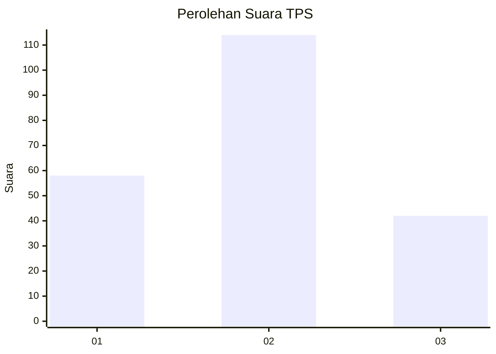
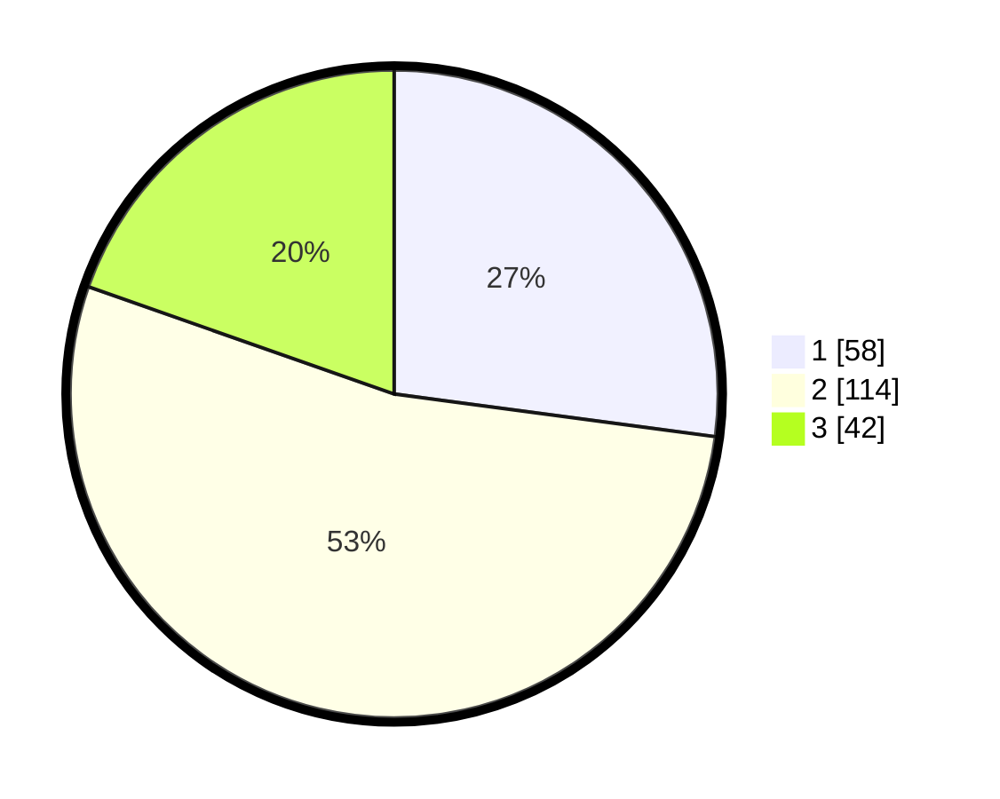

# Hasil

## Grafik

## Tabel

| No. | Nama Paslon    | Suara | Suara (raw) | Persentase |
|:--- |:-------------- | -----:| -----------:| ----------:|
| 1   | ANIES MUHAIMIN | 58    | [58][p-1]   | 27,10      |
| 2   | PRABOWO GIBRAN | 114   | [114][p-2]  | 53,27      |
| 3   | GANJAR MAHFUD  | 42    | [42][p-3]   | 19,63      |

[p-1]: https://github.com/gigit-pemilu/pemilu-2024-33-jawa-tengah/blob/main/pilpres/hitung-suara/sub/33-jawa-tengah/sub/29-brebes/sub/09-brebes/sub/1002-brebes/sub/002-tps/sub/paslon-1.txt
[p-2]: https://github.com/gigit-pemilu/pemilu-2024-33-jawa-tengah/blob/main/pilpres/hitung-suara/sub/33-jawa-tengah/sub/29-brebes/sub/09-brebes/sub/1002-brebes/sub/002-tps/sub/paslon-2.txt
[p-3]: https://github.com/gigit-pemilu/pemilu-2024-33-jawa-tengah/blob/main/pilpres/hitung-suara/sub/33-jawa-tengah/sub/29-brebes/sub/09-brebes/sub/1002-brebes/sub/002-tps/sub/paslon-3.txt

## Foto C Plano

https://sirekap-obj-formc.kpu.go.id/192c/pemilu/ppwp/33/29/09/10/02/3329091002002-20240218-184405--f2840964-b488-4839-838b-12638cf2e251.jpg

https://sirekap-obj-formc.kpu.go.id/192c/pemilu/ppwp/33/29/09/10/02/3329091002002-20240218-184412--426cf582-2dbd-4d25-bea9-a3bad45038d2.jpg

https://sirekap-obj-formc.kpu.go.id/192c/pemilu/ppwp/33/29/09/10/02/3329091002002-20240218-184422--3e93d8f6-3451-49fb-a992-2a4ea8c6d61a.jpg

## Metadata

| Key        | Value               |
| ---------- | ------------------- |
| Time Stamp | 2024-02-26 03:00:00 |

