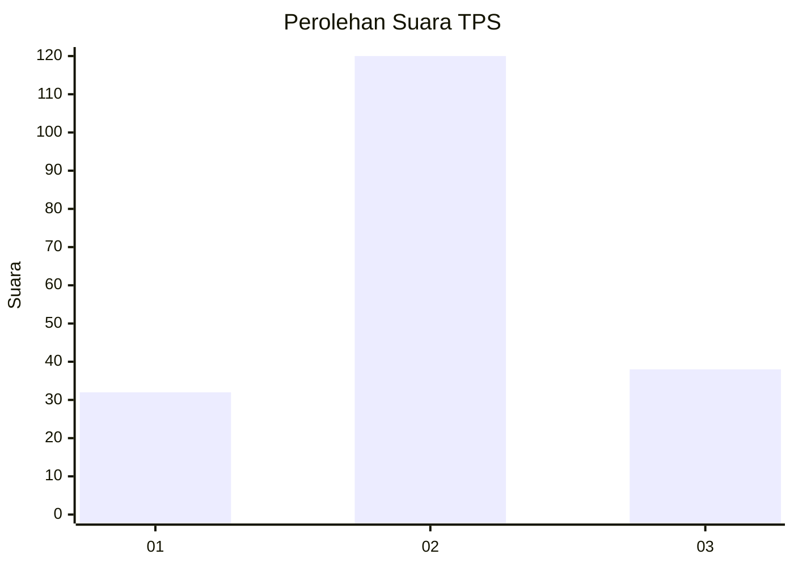
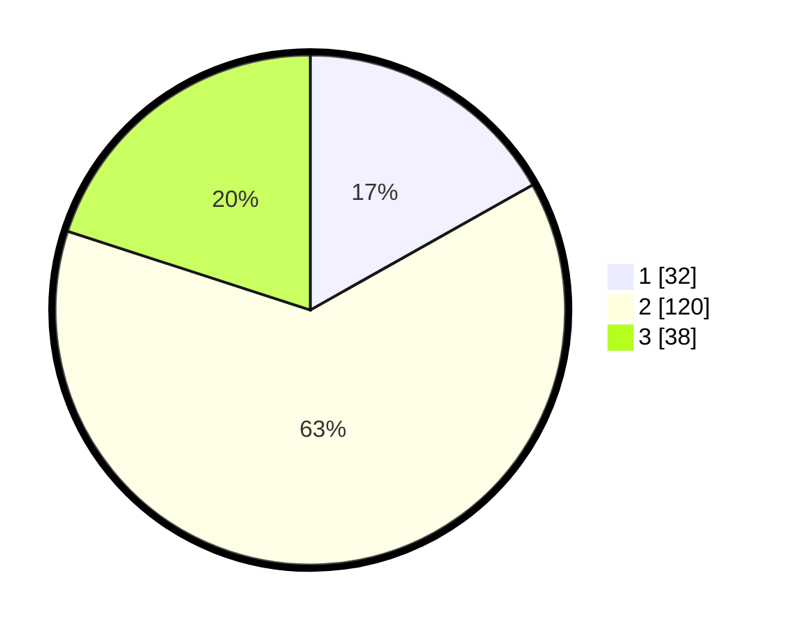

# Hasil

## Grafik

## Tabel

| No. | Nama Paslon    | Suara | Suara (raw) | Persentase |
|:--- |:-------------- | -----:| -----------:| ----------:|
| 1   | ANIES MUHAIMIN | 32    | [32][p-1]   | 16,84      |
| 2   | PRABOWO GIBRAN | 120   | [120][p-2]  | 63,16      |
| 3   | GANJAR MAHFUD  | 38    | [38][p-3]   | 20,00      |

[p-1]: https://github.com/gigit-pemilu/pemilu-2024/blob/main/pilpres/hitung-suara/sub/33-jawa-tengah/sub/29-brebes/sub/09-brebes/sub/1002-brebes/sub/004-tps/sub/paslon-1.txt
[p-2]: https://github.com/gigit-pemilu/pemilu-2024/blob/main/pilpres/hitung-suara/sub/33-jawa-tengah/sub/29-brebes/sub/09-brebes/sub/1002-brebes/sub/004-tps/sub/paslon-2.txt
[p-3]: https://github.com/gigit-pemilu/pemilu-2024/blob/main/pilpres/hitung-suara/sub/33-jawa-tengah/sub/29-brebes/sub/09-brebes/sub/1002-brebes/sub/004-tps/sub/paslon-3.txt

## Foto C Plano

https://sirekap-obj-formc.kpu.go.id/cee6/pemilu/ppwp/33/29/09/10/02/3329091002004-20240215-023723--c0ee4ddf-7129-46a4-a950-b260b36b448a.jpg

https://sirekap-obj-formc.kpu.go.id/cee6/pemilu/ppwp/33/29/09/10/02/3329091002004-20240215-022157--b02e22f8-0f9a-4ee4-827e-0d2defee03bd.jpg

https://sirekap-obj-formc.kpu.go.id/cee6/pemilu/ppwp/33/29/09/10/02/3329091002004-20240215-022447--3e57767f-d4fa-47a6-8006-830802ff6b0a.jpg

## Metadata

| Key        | Value               |
| ---------- | ------------------- |
| Time Stamp | 2024-02-15 15:00:29 |

