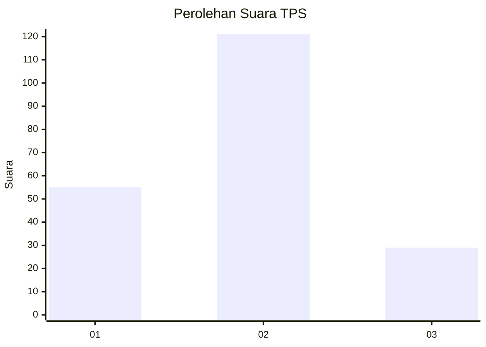
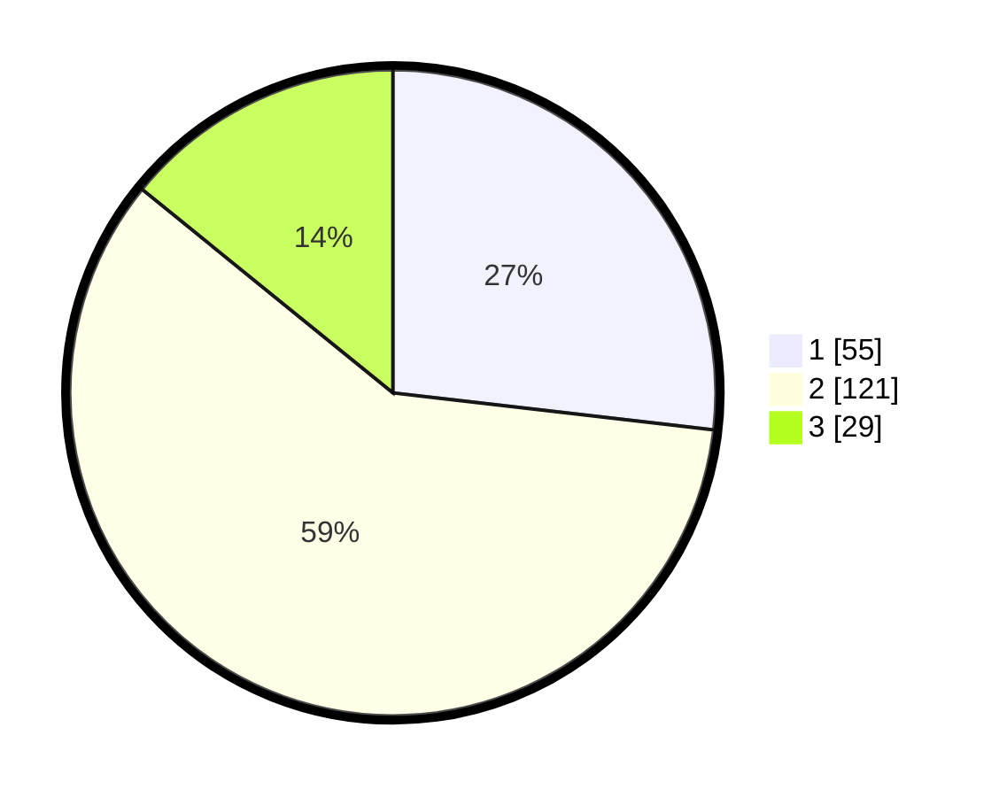

# Hasil

## Grafik

## Tabel

| No. | Nama Paslon    | Suara | Suara (raw) | Persentase |
|:--- |:-------------- | -----:| -----------:| ----------:|
| 1   | ANIES MUHAIMIN | 55    | [55][p-1]   | 26,83      |
| 2   | PRABOWO GIBRAN | 121   | [121][p-2]  | 59,02      |
| 3   | GANJAR MAHFUD  | 29    | [29][p-3]   | 14,15      |

[p-1]: https://github.com/gigit-pemilu/pemilu-2024/blob/main/pilpres/hitung-suara/sub/33-jawa-tengah/sub/29-brebes/sub/09-brebes/sub/1002-brebes/sub/006-tps/sub/paslon-1.txt
[p-2]: https://github.com/gigit-pemilu/pemilu-2024/blob/main/pilpres/hitung-suara/sub/33-jawa-tengah/sub/29-brebes/sub/09-brebes/sub/1002-brebes/sub/006-tps/sub/paslon-2.txt
[p-3]: https://github.com/gigit-pemilu/pemilu-2024/blob/main/pilpres/hitung-suara/sub/33-jawa-tengah/sub/29-brebes/sub/09-brebes/sub/1002-brebes/sub/006-tps/sub/paslon-3.txt

## Foto C Plano

https://sirekap-obj-formc.kpu.go.id/1c7a/pemilu/ppwp/33/29/09/10/02/3329091002006-20240218-214619--91597dba-7dda-4ea4-a855-16c3ad55cfaa.jpg

https://sirekap-obj-formc.kpu.go.id/1c7a/pemilu/ppwp/33/29/09/10/02/3329091002006-20240218-215022--f8196046-dca3-45bf-bb13-ab0a6ece4b1e.jpg

https://sirekap-obj-formc.kpu.go.id/1c7a/pemilu/ppwp/33/29/09/10/02/3329091002006-20240217-192012--cc5f617f-0639-4358-a761-3821848a3fb6.jpg

## Metadata

| Key        | Value               |
| ---------- | ------------------- |
| Time Stamp | 2024-02-25 15:00:00 |

