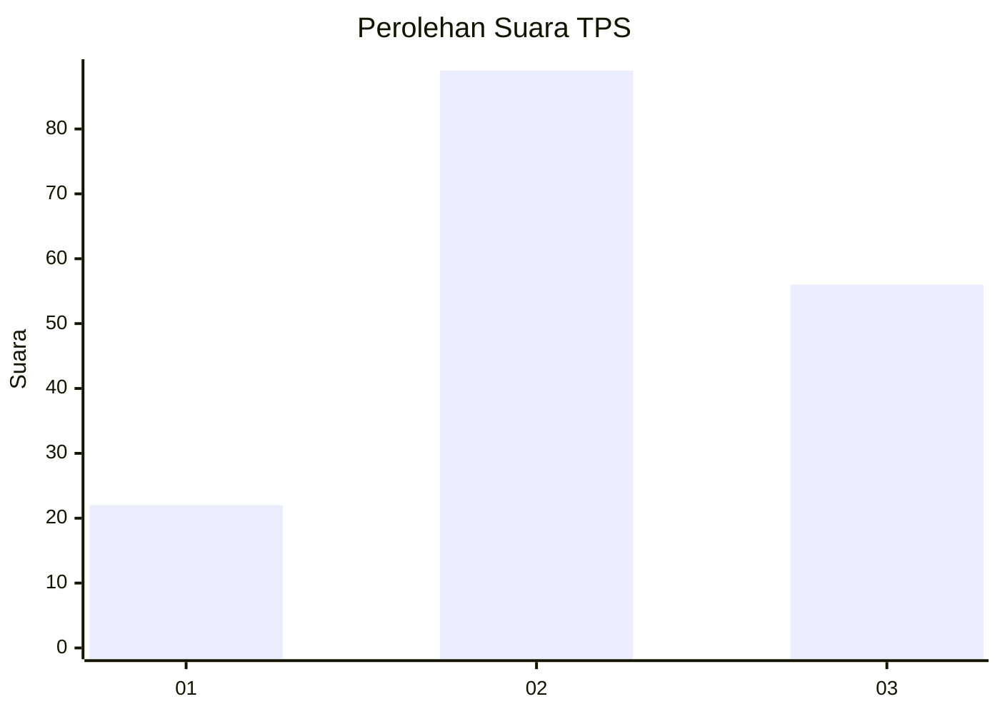
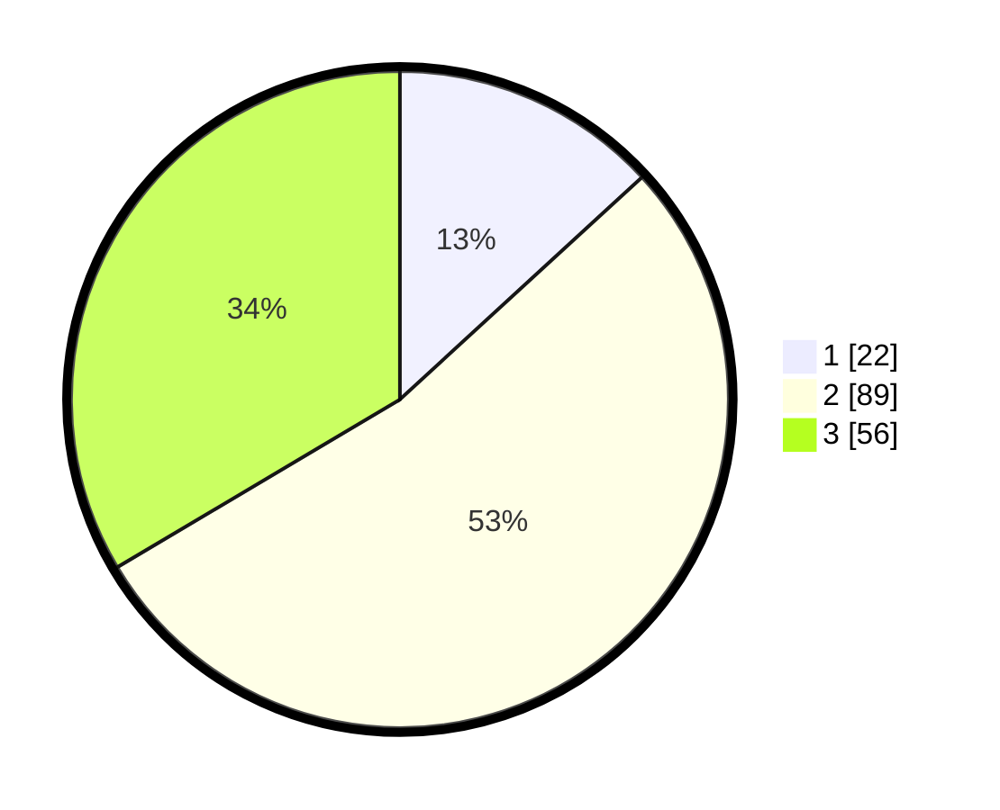

# Hasil

## Grafik

## Tabel

| No. | Nama Paslon    | Suara | Suara (raw) | Persentase |
|:--- |:-------------- | -----:| -----------:| ----------:|
| 1   | ANIES MUHAIMIN | 22    | [22][p-1]   | 13,17      |
| 2   | PRABOWO GIBRAN | 89    | [89][p-2]   | 53,29      |
| 3   | GANJAR MAHFUD  | 56    | [56][p-3]   | 33,53      |

[p-1]: https://github.com/gigit-pemilu/pemilu-2024/blob/main/pilpres/hitung-suara/sub/33-jawa-tengah/sub/29-brebes/sub/09-brebes/sub/2004-kaligangsa-kulon/sub/004-tps/sub/paslon-1.txt
[p-2]: https://github.com/gigit-pemilu/pemilu-2024/blob/main/pilpres/hitung-suara/sub/33-jawa-tengah/sub/29-brebes/sub/09-brebes/sub/2004-kaligangsa-kulon/sub/004-tps/sub/paslon-2.txt
[p-3]: https://github.com/gigit-pemilu/pemilu-2024/blob/main/pilpres/hitung-suara/sub/33-jawa-tengah/sub/29-brebes/sub/09-brebes/sub/2004-kaligangsa-kulon/sub/004-tps/sub/paslon-3.txt

## Foto C Plano

https://sirekap-obj-formc.kpu.go.id/1ab7/pemilu/ppwp/33/29/09/20/04/3329092004004-20240214-205559--88d22913-2904-418e-b4eb-3ab569825dbe.jpg

https://sirekap-obj-formc.kpu.go.id/1ab7/pemilu/ppwp/33/29/09/20/04/3329092004004-20240214-205732--f364886b-95ac-4856-a1c7-8128c15b375f.jpg

https://sirekap-obj-formc.kpu.go.id/1ab7/pemilu/ppwp/33/29/09/20/04/3329092004004-20240214-222401--ebb4eea5-31ed-4760-b387-d10032d1f98c.jpg

## Metadata

| Key        | Value               |
| ---------- | ------------------- |
| Time Stamp | 2024-02-15 00:41:44 |

