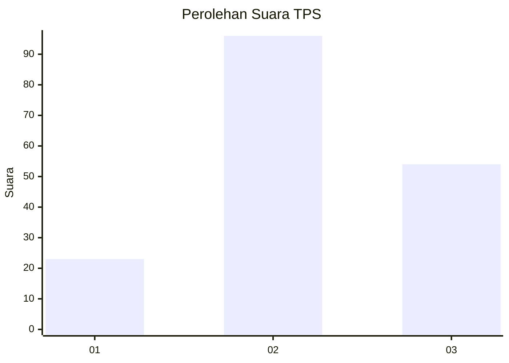
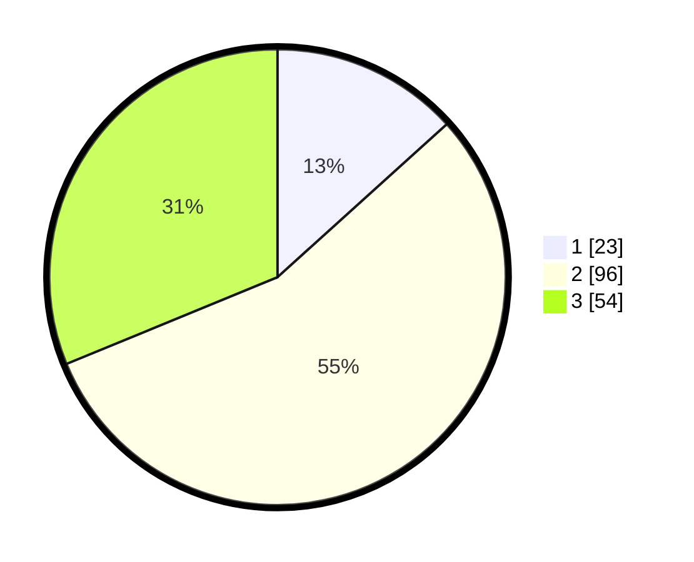

# Hasil

## Grafik

## Tabel

| No. | Nama Paslon    | Suara | Suara (raw) | Persentase |
|:--- |:-------------- | -----:| -----------:| ----------:|
| 1   | ANIES MUHAIMIN | 23    | [23][p-1]   | 13,29      |
| 2   | PRABOWO GIBRAN | 96    | [96][p-2]   | 55,49      |
| 3   | GANJAR MAHFUD  | 54    | [54][p-3]   | 31,21      |

[p-1]: https://github.com/gigit-pemilu/pemilu-2024/blob/main/pilpres/hitung-suara/sub/33-jawa-tengah/sub/29-brebes/sub/09-brebes/sub/2004-kaligangsa-kulon/sub/007-tps/sub/paslon-1.txt
[p-2]: https://github.com/gigit-pemilu/pemilu-2024/blob/main/pilpres/hitung-suara/sub/33-jawa-tengah/sub/29-brebes/sub/09-brebes/sub/2004-kaligangsa-kulon/sub/007-tps/sub/paslon-2.txt
[p-3]: https://github.com/gigit-pemilu/pemilu-2024/blob/main/pilpres/hitung-suara/sub/33-jawa-tengah/sub/29-brebes/sub/09-brebes/sub/2004-kaligangsa-kulon/sub/007-tps/sub/paslon-3.txt

## Foto C Plano

https://sirekap-obj-formc.kpu.go.id/4164/pemilu/ppwp/33/29/09/20/04/3329092004007-20240214-215826--4dac86fd-5668-4eb4-8434-71b2549a5ee8.jpg

https://sirekap-obj-formc.kpu.go.id/4164/pemilu/ppwp/33/29/09/20/04/3329092004007-20240214-220138--13af21b5-565f-4bdf-a96f-01ca9db2ca63.jpg

https://sirekap-obj-formc.kpu.go.id/4164/pemilu/ppwp/33/29/09/20/04/3329092004007-20240214-215835--b3cf50c3-1c46-4316-b8a0-4cb25d15629d.jpg

## Metadata

| Key        | Value               |
| ---------- | ------------------- |
| Time Stamp | 2024-02-15 23:29:50 |

