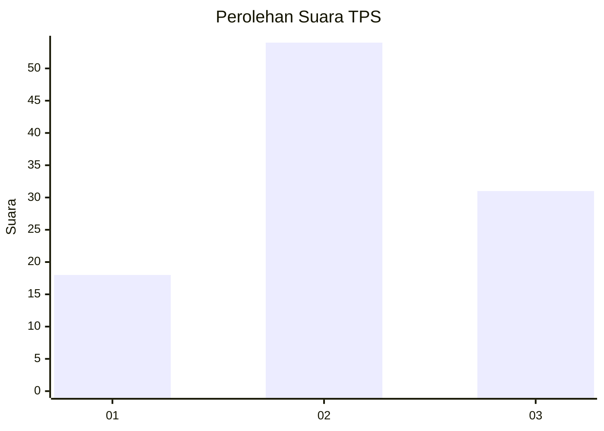
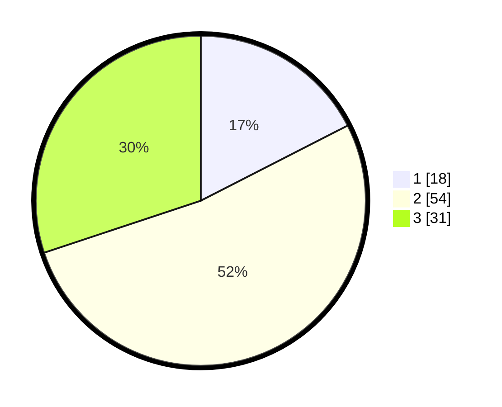

# Hasil

## Grafik

## Tabel

| No. | Nama Paslon    | Suara | Suara (raw) | Persentase |
|:--- |:-------------- | -----:| -----------:| ----------:|
| 1   | ANIES MUHAIMIN | 18    | [18][p-1]   | 17,48      |
| 2   | PRABOWO GIBRAN | 54    | [54][p-2]   | 52,43      |
| 3   | GANJAR MAHFUD  | 31    | [31][p-3]   | 30,10      |

[p-1]: https://github.com/gigit-pemilu/pemilu-2024-33-jawa-tengah/blob/main/pilpres/hitung-suara/sub/33-jawa-tengah/sub/29-brebes/sub/09-brebes/sub/2004-kaligangsa-kulon/sub/011-tps/sub/paslon-1.txt
[p-2]: https://github.com/gigit-pemilu/pemilu-2024-33-jawa-tengah/blob/main/pilpres/hitung-suara/sub/33-jawa-tengah/sub/29-brebes/sub/09-brebes/sub/2004-kaligangsa-kulon/sub/011-tps/sub/paslon-2.txt
[p-3]: https://github.com/gigit-pemilu/pemilu-2024-33-jawa-tengah/blob/main/pilpres/hitung-suara/sub/33-jawa-tengah/sub/29-brebes/sub/09-brebes/sub/2004-kaligangsa-kulon/sub/011-tps/sub/paslon-3.txt

## Foto C Plano

https://sirekap-obj-formc.kpu.go.id/4f4c/pemilu/ppwp/33/29/09/20/04/3329092004011-20240214-204014--91d19113-b6a3-4f8b-a256-2e5fa27f8219.jpg

https://sirekap-obj-formc.kpu.go.id/4f4c/pemilu/ppwp/33/29/09/20/04/3329092004011-20240214-204207--daa66cd1-5654-4552-b26c-760afd7f7838.jpg

https://sirekap-obj-formc.kpu.go.id/4f4c/pemilu/ppwp/33/29/09/20/04/3329092004011-20240214-204303--500d4dbb-7ef0-4197-a29e-0545759772d6.jpg

## Metadata

| Key        | Value               |
| ---------- | ------------------- |
| Time Stamp | 2024-02-24 22:31:28 |

