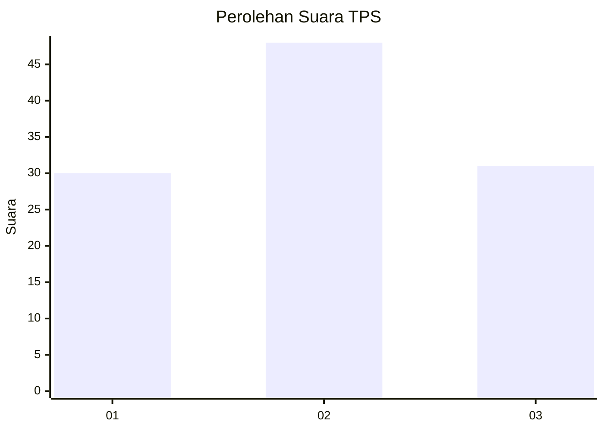
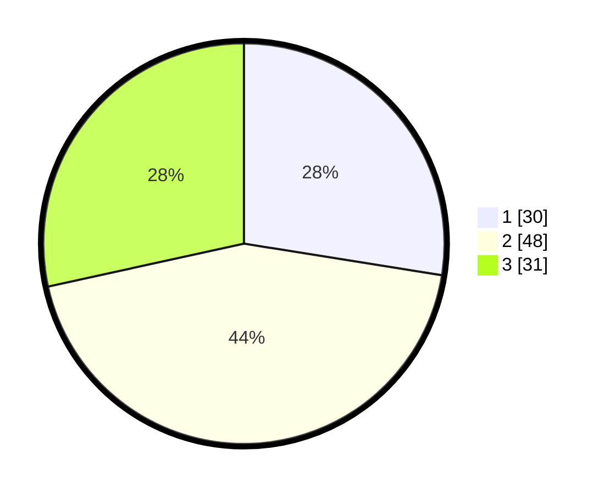

# Hasil

## Grafik

## Tabel

| No. | Nama Paslon    | Suara | Suara (raw) | Persentase |
|:--- |:-------------- | -----:| -----------:| ----------:|
| 1   | ANIES MUHAIMIN | 30    | [30][p-1]   | 27,52      |
| 2   | PRABOWO GIBRAN | 48    | [48][p-2]   | 44,04      |
| 3   | GANJAR MAHFUD  | 31    | [31][p-3]   | 28,44      |

[p-1]: https://github.com/gigit-pemilu/pemilu-2024-33-jawa-tengah/blob/main/pilpres/hitung-suara/sub/33-jawa-tengah/sub/29-brebes/sub/09-brebes/sub/2004-kaligangsa-kulon/sub/025-tps/sub/paslon-1.txt
[p-2]: https://github.com/gigit-pemilu/pemilu-2024-33-jawa-tengah/blob/main/pilpres/hitung-suara/sub/33-jawa-tengah/sub/29-brebes/sub/09-brebes/sub/2004-kaligangsa-kulon/sub/025-tps/sub/paslon-2.txt
[p-3]: https://github.com/gigit-pemilu/pemilu-2024-33-jawa-tengah/blob/main/pilpres/hitung-suara/sub/33-jawa-tengah/sub/29-brebes/sub/09-brebes/sub/2004-kaligangsa-kulon/sub/025-tps/sub/paslon-3.txt

## Foto C Plano

https://sirekap-obj-formc.kpu.go.id/cca0/pemilu/ppwp/33/29/09/20/04/3329092004025-20240214-141007--2fa7c617-1a26-4142-abc6-24672f1bc739.jpg

https://sirekap-obj-formc.kpu.go.id/cca0/pemilu/ppwp/33/29/09/20/04/3329092004025-20240214-141024--6b6c0bef-f07f-46e1-81ab-c6acdc02b37c.jpg

https://sirekap-obj-formc.kpu.go.id/cca0/pemilu/ppwp/33/29/09/20/04/3329092004025-20240214-141142--403f70a3-3bf0-440e-be95-05800f60f51e.jpg

## Metadata

| Key        | Value               |
| ---------- | ------------------- |
| Time Stamp | 2024-02-14 21:46:01 |

