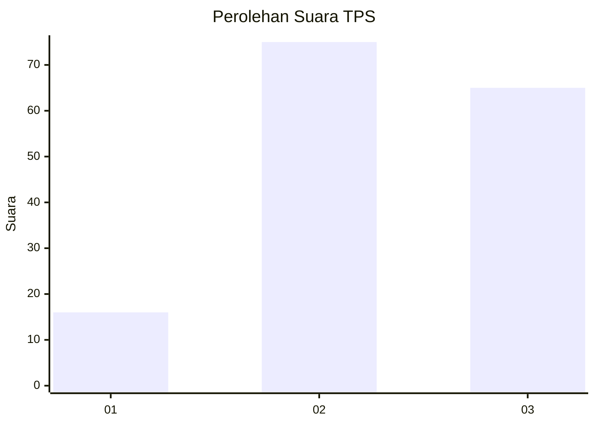
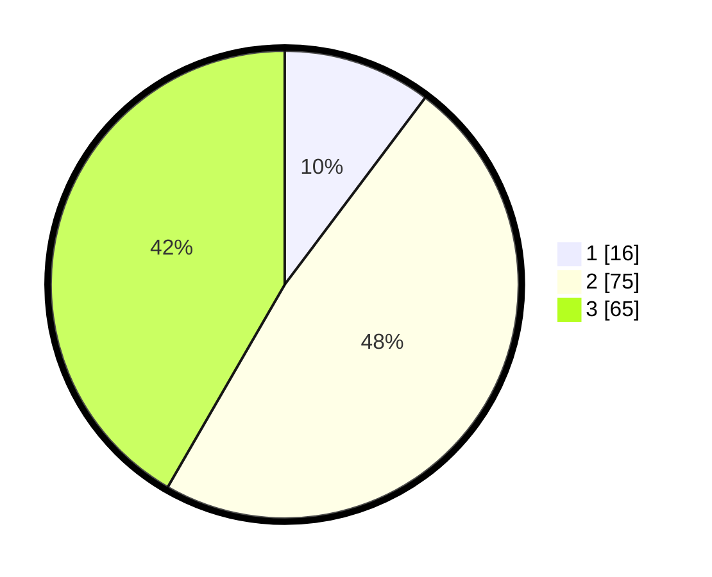

# Hasil

## Grafik

## Tabel

| No. | Nama Paslon    | Suara | Suara (raw) | Persentase |
|:--- |:-------------- | -----:| -----------:| ----------:|
| 1   | ANIES MUHAIMIN | 16    | [16][p-1]   | 10,26      |
| 2   | PRABOWO GIBRAN | 75    | [75][p-2]   | 48,08      |
| 3   | GANJAR MAHFUD  | 65    | [65][p-3]   | 41,67      |

[p-1]: https://github.com/gigit-pemilu/pemilu-2024/blob/main/pilpres/hitung-suara/sub/33-jawa-tengah/sub/29-brebes/sub/09-brebes/sub/2005-kaligangsa-wetan/sub/003-tps/sub/paslon-1.txt
[p-2]: https://github.com/gigit-pemilu/pemilu-2024/blob/main/pilpres/hitung-suara/sub/33-jawa-tengah/sub/29-brebes/sub/09-brebes/sub/2005-kaligangsa-wetan/sub/003-tps/sub/paslon-2.txt
[p-3]: https://github.com/gigit-pemilu/pemilu-2024/blob/main/pilpres/hitung-suara/sub/33-jawa-tengah/sub/29-brebes/sub/09-brebes/sub/2005-kaligangsa-wetan/sub/003-tps/sub/paslon-3.txt

## Foto C Plano

https://sirekap-obj-formc.kpu.go.id/7bbf/pemilu/ppwp/33/29/09/20/05/3329092005003-20240215-005828--0d66c8c6-a7c4-496d-9b2a-d04d253682bb.jpg

https://sirekap-obj-formc.kpu.go.id/7bbf/pemilu/ppwp/33/29/09/20/05/3329092005003-20240215-015637--6886ccc0-1338-4db3-9e3a-a7d758c8d513.jpg

https://sirekap-obj-formc.kpu.go.id/7bbf/pemilu/ppwp/33/29/09/20/05/3329092005003-20240215-031044--fce2bc50-206f-4b3a-8819-d62c5edfea45.jpg

## Metadata

| Key        | Value               |
| ---------- | ------------------- |
| Time Stamp | 2024-02-15 04:00:24 |

