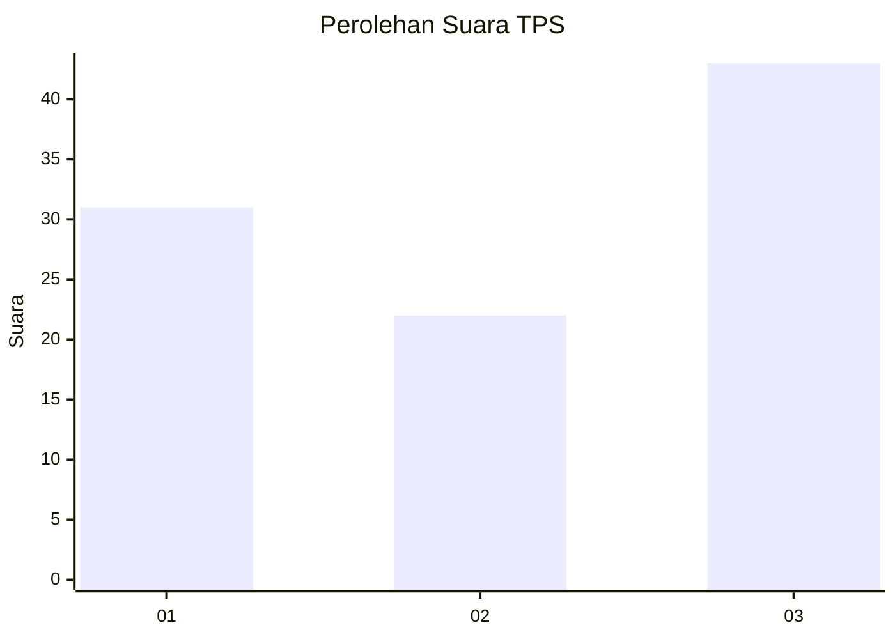
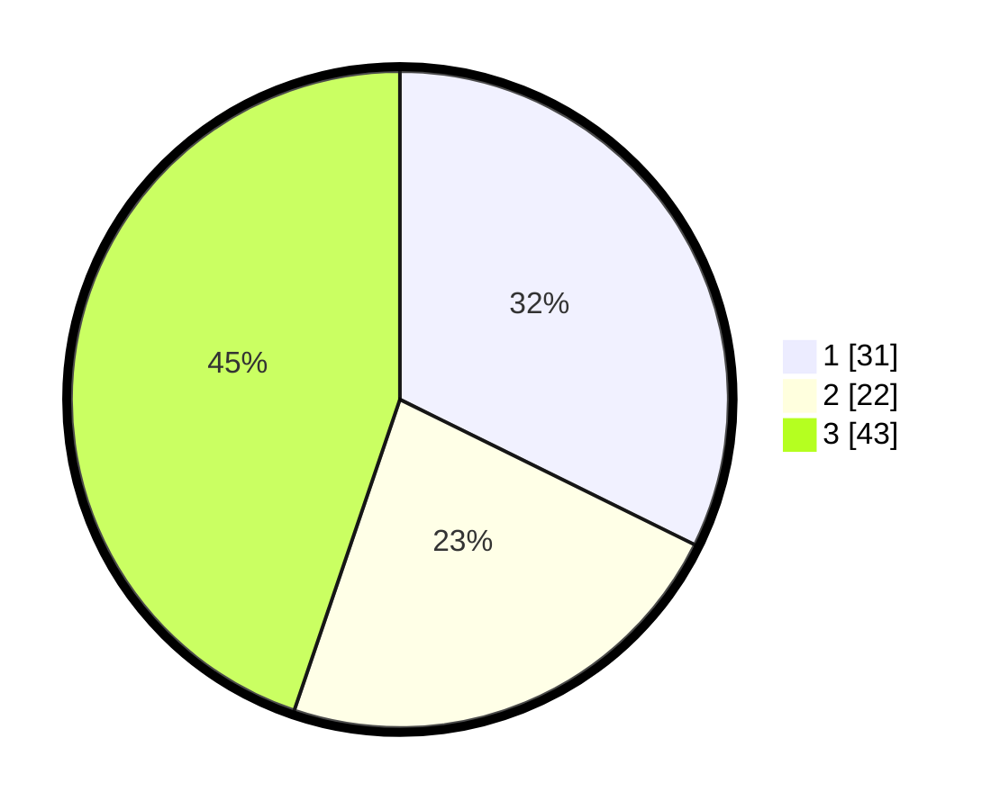

# Hasil

## Grafik

## Tabel

| No. | Nama Paslon    | Suara | Suara (raw) | Persentase |
|:--- |:-------------- | -----:| -----------:| ----------:|
| 1   | ANIES MUHAIMIN | 31    | [31][p-1]   | 32,29      |
| 2   | PRABOWO GIBRAN | 22    | [22][p-2]   | 22,92      |
| 3   | GANJAR MAHFUD  | 43    | [43][p-3]   | 44,79      |

[p-1]: https://github.com/gigit-pemilu/pemilu-2024-33-jawa-tengah/blob/main/pilpres/hitung-suara/sub/33-jawa-tengah/sub/29-brebes/sub/09-brebes/sub/2005-kaligangsa-wetan/sub/007-tps/sub/paslon-1.txt
[p-2]: https://github.com/gigit-pemilu/pemilu-2024-33-jawa-tengah/blob/main/pilpres/hitung-suara/sub/33-jawa-tengah/sub/29-brebes/sub/09-brebes/sub/2005-kaligangsa-wetan/sub/007-tps/sub/paslon-2.txt
[p-3]: https://github.com/gigit-pemilu/pemilu-2024-33-jawa-tengah/blob/main/pilpres/hitung-suara/sub/33-jawa-tengah/sub/29-brebes/sub/09-brebes/sub/2005-kaligangsa-wetan/sub/007-tps/sub/paslon-3.txt

## Foto C Plano

https://sirekap-obj-formc.kpu.go.id/518b/pemilu/ppwp/33/29/09/20/05/3329092005007-20240214-233415--0e888ddd-f2b1-42af-9a61-b2637cc2862c.jpg

https://sirekap-obj-formc.kpu.go.id/518b/pemilu/ppwp/33/29/09/20/05/3329092005007-20240214-233753--2f6e0515-3836-4a5f-aa6e-686892081fce.jpg

https://sirekap-obj-formc.kpu.go.id/518b/pemilu/ppwp/33/29/09/20/05/3329092005007-20240214-233824--76f31685-1809-4bd7-99ed-fadf810f29be.jpg

## Metadata

| Key        | Value               |
| ---------- | ------------------- |
| Time Stamp | 2024-02-25 11:00:00 |

