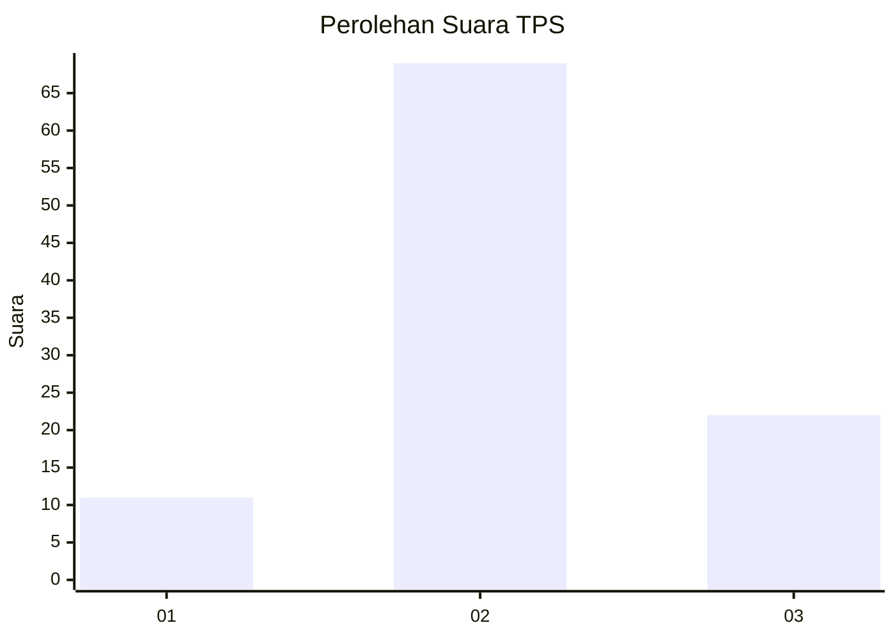
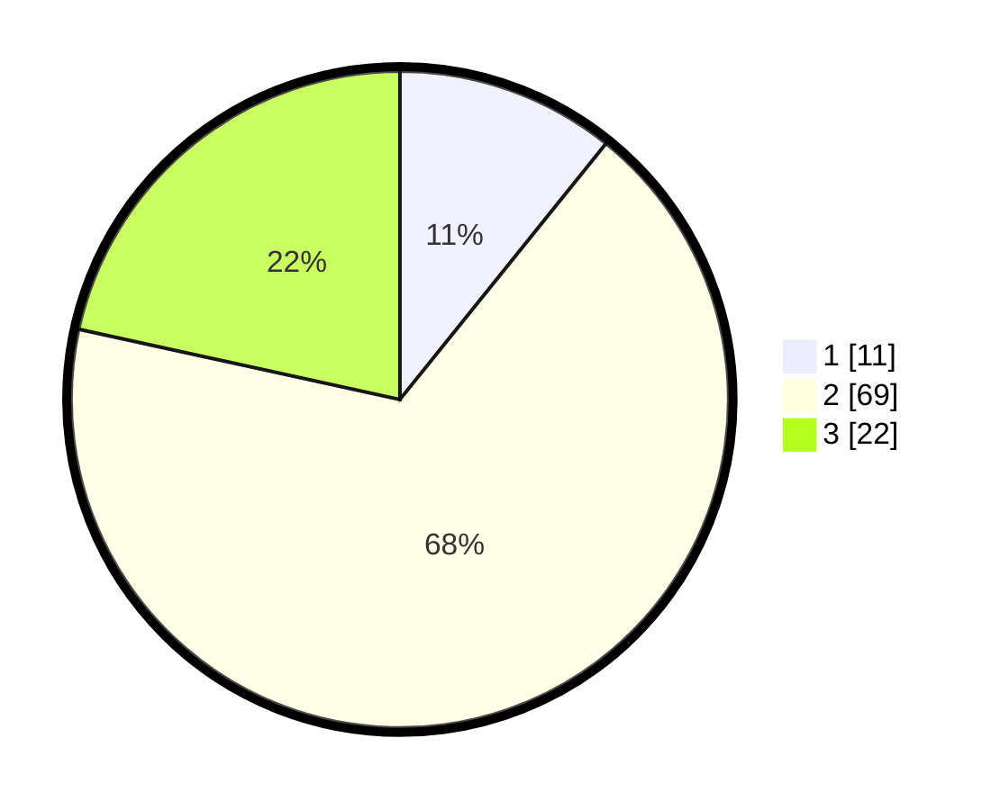

# Hasil

## Grafik

## Tabel

| No. | Nama Paslon    | Suara | Suara (raw) | Persentase |
|:--- |:-------------- | -----:| -----------:| ----------:|
| 1   | ANIES MUHAIMIN | 11    | [11][p-1]   | 10,78      |
| 2   | PRABOWO GIBRAN | 69    | [69][p-2]   | 67,65      |
| 3   | GANJAR MAHFUD  | 22    | [22][p-3]   | 21,57      |

[p-1]: https://github.com/gigit-pemilu/pemilu-2024/blob/main/pilpres/hitung-suara/sub/33-jawa-tengah/sub/29-brebes/sub/09-brebes/sub/2006-kalimati/sub/003-tps/sub/paslon-1.txt
[p-2]: https://github.com/gigit-pemilu/pemilu-2024/blob/main/pilpres/hitung-suara/sub/33-jawa-tengah/sub/29-brebes/sub/09-brebes/sub/2006-kalimati/sub/003-tps/sub/paslon-2.txt
[p-3]: https://github.com/gigit-pemilu/pemilu-2024/blob/main/pilpres/hitung-suara/sub/33-jawa-tengah/sub/29-brebes/sub/09-brebes/sub/2006-kalimati/sub/003-tps/sub/paslon-3.txt

## Foto C Plano

https://sirekap-obj-formc.kpu.go.id/5cf7/pemilu/ppwp/33/29/09/20/06/3329092006003-20240215-100858--6515a891-1c69-402f-b8b7-deb93f75a37c.jpg

https://sirekap-obj-formc.kpu.go.id/5cf7/pemilu/ppwp/33/29/09/20/06/3329092006003-20240214-225116--225180ff-9778-4335-915d-afde5a762741.jpg

https://sirekap-obj-formc.kpu.go.id/5cf7/pemilu/ppwp/33/29/09/20/06/3329092006003-20240214-225207--83af8e4b-40db-42db-bd10-6bc253d072f5.jpg

## Metadata

| Key        | Value               |
| ---------- | ------------------- |
| Time Stamp | 2024-02-24 22:31:28 |

