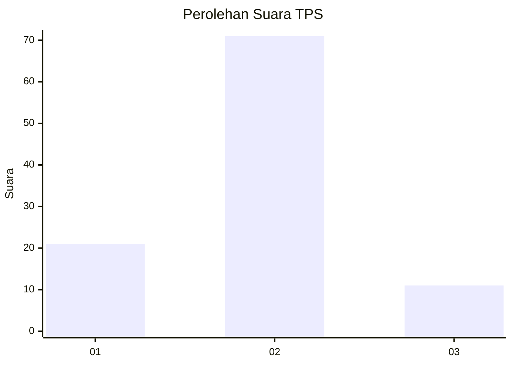
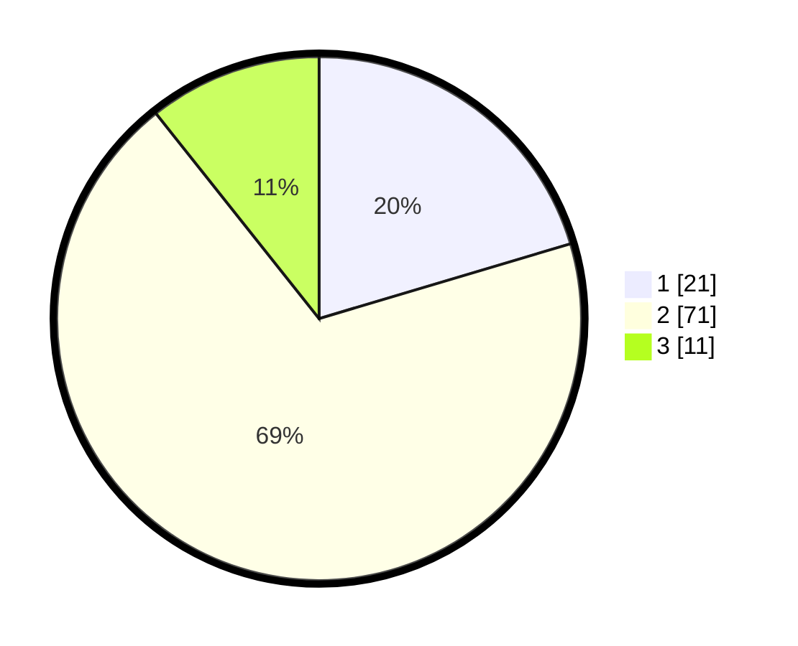

# Hasil

## Grafik

## Tabel

| No. | Nama Paslon    | Suara | Suara (raw) | Persentase |
|:--- |:-------------- | -----:| -----------:| ----------:|
| 1   | ANIES MUHAIMIN | 21    | [21][p-1]   | 20,39      |
| 2   | PRABOWO GIBRAN | 71    | [71][p-2]   | 68,93      |
| 3   | GANJAR MAHFUD  | 11    | [11][p-3]   | 10,68      |

[p-1]: https://github.com/gigit-pemilu/pemilu-2024-33-jawa-tengah/blob/main/pilpres/hitung-suara/sub/33-jawa-tengah/sub/29-brebes/sub/09-brebes/sub/2006-kalimati/sub/004-tps/sub/paslon-1.txt
[p-2]: https://github.com/gigit-pemilu/pemilu-2024-33-jawa-tengah/blob/main/pilpres/hitung-suara/sub/33-jawa-tengah/sub/29-brebes/sub/09-brebes/sub/2006-kalimati/sub/004-tps/sub/paslon-2.txt
[p-3]: https://github.com/gigit-pemilu/pemilu-2024-33-jawa-tengah/blob/main/pilpres/hitung-suara/sub/33-jawa-tengah/sub/29-brebes/sub/09-brebes/sub/2006-kalimati/sub/004-tps/sub/paslon-3.txt

## Foto C Plano

https://sirekap-obj-formc.kpu.go.id/1b6f/pemilu/ppwp/33/29/09/20/06/3329092006004-20240214-223616--05a6e903-ed2d-4729-88c7-e7f732116071.jpg

https://sirekap-obj-formc.kpu.go.id/1b6f/pemilu/ppwp/33/29/09/20/06/3329092006004-20240214-223727--bc1afd46-a477-4e0f-9f3d-fd97059077d6.jpg

https://sirekap-obj-formc.kpu.go.id/1b6f/pemilu/ppwp/33/29/09/20/06/3329092006004-20240214-223827--b2ade077-92b5-4c29-967d-1274d24a8cdf.jpg

## Metadata

| Key        | Value               |
| ---------- | ------------------- |
| Time Stamp | 2024-02-15 12:00:28 |

