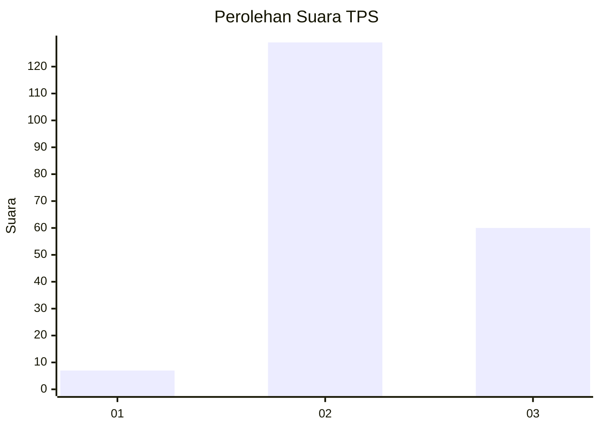

# Hasil

## Grafik

## Tabel

| No. | Nama Paslon    | Suara | Suara (raw) | Persentase |
|:--- |:-------------- | -----:| -----------:| ----------:|
| 1   | ANIES MUHAIMIN | 7     | [7][p-1]    | 3,57       |
| 2   | PRABOWO GIBRAN | 129   | [129][p-2]  | 65,82      |
| 3   | GANJAR MAHFUD  | 60    | [60][p-3]   | 30,61      |

[p-1]: https://github.com/gigit-pemilu/pemilu-2024/blob/main/pilpres/hitung-suara/sub/33-jawa-tengah/sub/29-brebes/sub/09-brebes/sub/2007-kaliwlingi/sub/008-tps/sub/paslon-1.txt
[p-2]: https://github.com/gigit-pemilu/pemilu-2024/blob/main/pilpres/hitung-suara/sub/33-jawa-tengah/sub/29-brebes/sub/09-brebes/sub/2007-kaliwlingi/sub/008-tps/sub/paslon-2.txt
[p-3]: https://github.com/gigit-pemilu/pemilu-2024/blob/main/pilpres/hitung-suara/sub/33-jawa-tengah/sub/29-brebes/sub/09-brebes/sub/2007-kaliwlingi/sub/008-tps/sub/paslon-3.txt

## Foto C Plano

https://sirekap-obj-formc.kpu.go.id/36d2/pemilu/ppwp/33/29/09/20/07/3329092007008-20240214-211907--a16762b7-32fb-4da4-8b3e-fb23500d951a.jpg

https://sirekap-obj-formc.kpu.go.id/36d2/pemilu/ppwp/33/29/09/20/07/3329092007008-20240214-212019--d6d401e1-fbe2-484a-b4ef-026a70f9b734.jpg

https://sirekap-obj-formc.kpu.go.id/36d2/pemilu/ppwp/33/29/09/20/07/3329092007008-20240214-212109--56c40826-2e3b-4f56-bf6d-2aa782f19ac0.jpg

## Metadata

| Key        | Value               |
| ---------- | ------------------- |
| Time Stamp | 2024-02-15 23:29:50 |

