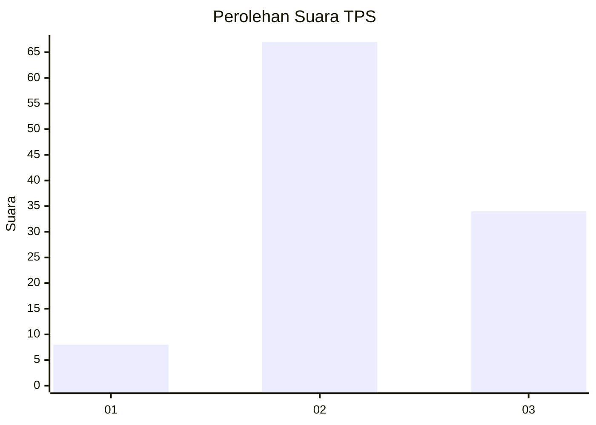
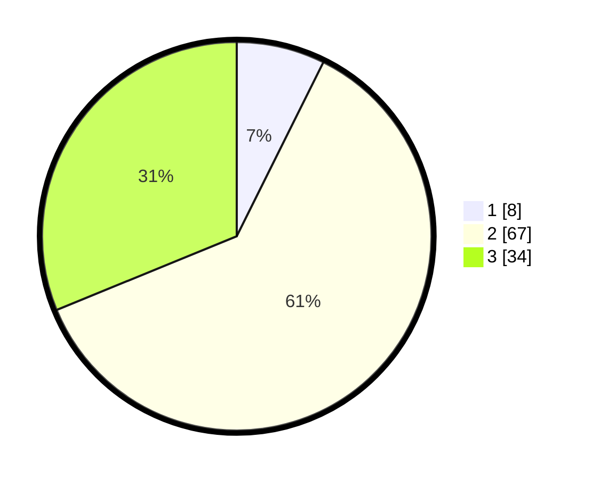

# Hasil

## Grafik

## Tabel

| No. | Nama Paslon    | Suara | Suara (raw) | Persentase |
|:--- |:-------------- | -----:| -----------:| ----------:|
| 1   | ANIES MUHAIMIN | 8     | [8][p-1]    | 7,34       |
| 2   | PRABOWO GIBRAN | 67    | [67][p-2]   | 61,47      |
| 3   | GANJAR MAHFUD  | 34    | [34][p-3]   | 31,19      |

[p-1]: https://github.com/gigit-pemilu/pemilu-2024/blob/main/pilpres/hitung-suara/sub/33-jawa-tengah/sub/29-brebes/sub/09-brebes/sub/2010-lembarawa/sub/002-tps/sub/paslon-1.txt
[p-2]: https://github.com/gigit-pemilu/pemilu-2024/blob/main/pilpres/hitung-suara/sub/33-jawa-tengah/sub/29-brebes/sub/09-brebes/sub/2010-lembarawa/sub/002-tps/sub/paslon-2.txt
[p-3]: https://github.com/gigit-pemilu/pemilu-2024/blob/main/pilpres/hitung-suara/sub/33-jawa-tengah/sub/29-brebes/sub/09-brebes/sub/2010-lembarawa/sub/002-tps/sub/paslon-3.txt

## Foto C Plano

https://sirekap-obj-formc.kpu.go.id/cd15/pemilu/ppwp/33/29/09/20/10/3329092010002-20240214-222007--018a7709-9cb0-4078-b0d3-f70d6db97e34.jpg

https://sirekap-obj-formc.kpu.go.id/cd15/pemilu/ppwp/33/29/09/20/10/3329092010002-20240214-223033--71d44a35-52f9-4060-be83-61e20b37df19.jpg

https://sirekap-obj-formc.kpu.go.id/cd15/pemilu/ppwp/33/29/09/20/10/3329092010002-20240214-223554--3f528a45-af60-4256-8e5a-6ca3a546c796.jpg

## Metadata

| Key        | Value               |
| ---------- | ------------------- |
| Time Stamp | 2024-02-15 04:00:24 |

