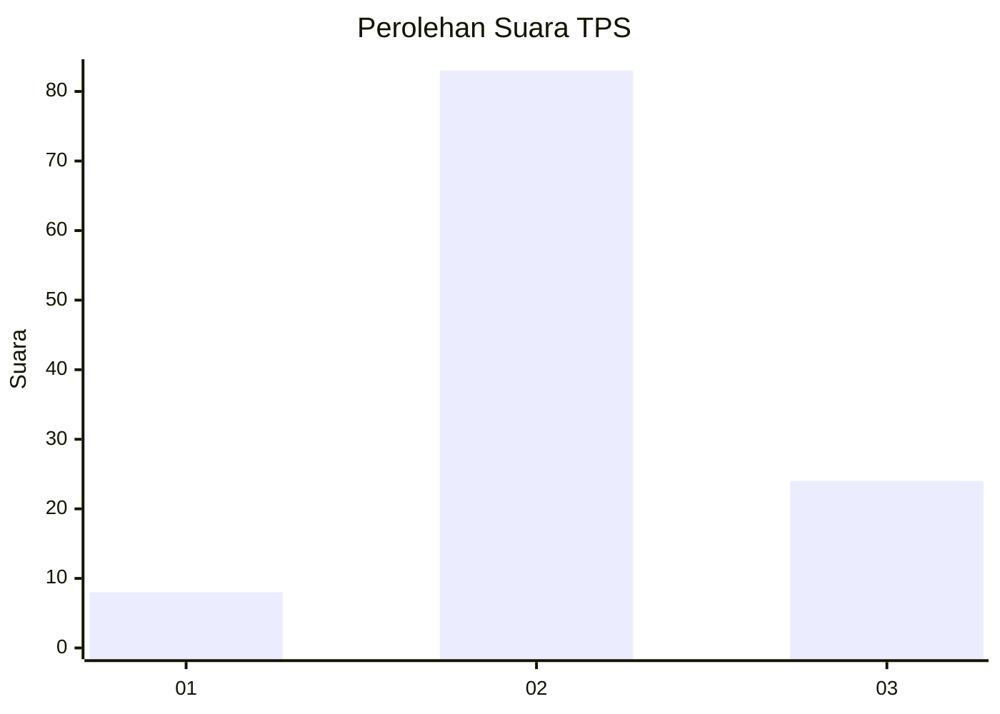

# Hasil

## Grafik

## Tabel

| No. | Nama Paslon    | Suara | Suara (raw) | Persentase |
|:--- |:-------------- | -----:| -----------:| ----------:|
| 1   | ANIES MUHAIMIN | 8     | [8][p-1]    | 6,96       |
| 2   | PRABOWO GIBRAN | 83    | [83][p-2]   | 72,17      |
| 3   | GANJAR MAHFUD  | 24    | [24][p-3]   | 20,87      |

[p-1]: https://github.com/gigit-pemilu/pemilu-2024/blob/main/pilpres/hitung-suara/sub/33-jawa-tengah/sub/29-brebes/sub/09-brebes/sub/2010-lembarawa/sub/010-tps/sub/paslon-1.txt
[p-2]: https://github.com/gigit-pemilu/pemilu-2024/blob/main/pilpres/hitung-suara/sub/33-jawa-tengah/sub/29-brebes/sub/09-brebes/sub/2010-lembarawa/sub/010-tps/sub/paslon-2.txt
[p-3]: https://github.com/gigit-pemilu/pemilu-2024/blob/main/pilpres/hitung-suara/sub/33-jawa-tengah/sub/29-brebes/sub/09-brebes/sub/2010-lembarawa/sub/010-tps/sub/paslon-3.txt

## Foto C Plano

https://sirekap-obj-formc.kpu.go.id/97ea/pemilu/ppwp/33/29/09/20/10/3329092010010-20240215-022133--d4d1a08d-01a3-4a4f-8b20-a64ce4d41423.jpg

https://sirekap-obj-formc.kpu.go.id/97ea/pemilu/ppwp/33/29/09/20/10/3329092010010-20240215-022104--8f15f774-a325-4817-a81d-77ee861a4def.jpg

https://sirekap-obj-formc.kpu.go.id/97ea/pemilu/ppwp/33/29/09/20/10/3329092010010-20240215-022109--62415618-393e-474b-aa91-1e8302069a67.jpg

## Metadata

| Key        | Value               |
| ---------- | ------------------- |
| Time Stamp | 2024-02-16 14:00:34 |

