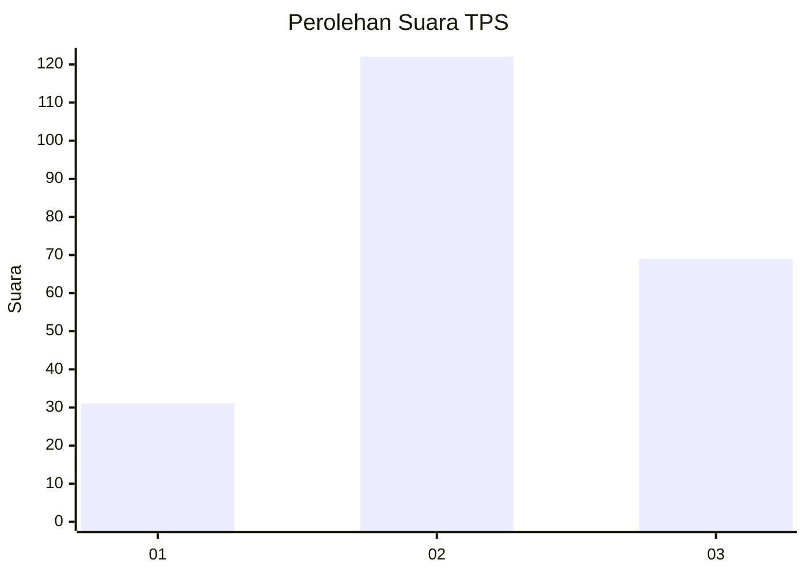
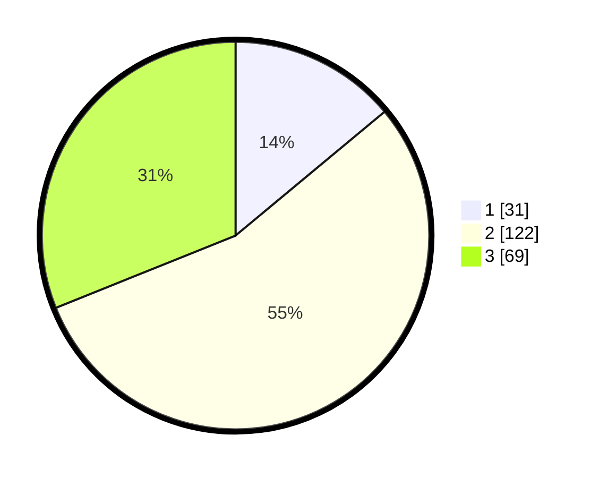

# Hasil

## Grafik

## Tabel

| No. | Nama Paslon    | Suara | Suara (raw) | Persentase |
|:--- |:-------------- | -----:| -----------:| ----------:|
| 1   | ANIES MUHAIMIN | 31    | [31][p-1]   | 13,96      |
| 2   | PRABOWO GIBRAN | 122   | [122][p-2]  | 54,95      |
| 3   | GANJAR MAHFUD  | 69    | [69][p-3]   | 31,08      |

[p-1]: https://github.com/gigit-pemilu/pemilu-2024/blob/main/pilpres/hitung-suara/sub/33-jawa-tengah/sub/29-brebes/sub/09-brebes/sub/2013-padasugih/sub/003-tps/sub/paslon-1.txt
[p-2]: https://github.com/gigit-pemilu/pemilu-2024/blob/main/pilpres/hitung-suara/sub/33-jawa-tengah/sub/29-brebes/sub/09-brebes/sub/2013-padasugih/sub/003-tps/sub/paslon-2.txt
[p-3]: https://github.com/gigit-pemilu/pemilu-2024/blob/main/pilpres/hitung-suara/sub/33-jawa-tengah/sub/29-brebes/sub/09-brebes/sub/2013-padasugih/sub/003-tps/sub/paslon-3.txt

## Foto C Plano

https://sirekap-obj-formc.kpu.go.id/38f9/pemilu/ppwp/33/29/09/20/13/3329092013003-20240214-155522--86b3b8e8-23ad-421c-862f-129e7974ce2e.jpg

https://sirekap-obj-formc.kpu.go.id/38f9/pemilu/ppwp/33/29/09/20/13/3329092013003-20240214-162231--ea6d11e5-c0b8-473e-bed3-a80c66d90fe5.jpg

https://sirekap-obj-formc.kpu.go.id/38f9/pemilu/ppwp/33/29/09/20/13/3329092013003-20240214-231046--e99eb5bb-91f5-4ef1-8cce-076bb2fc6521.jpg

## Metadata

| Key        | Value               |
| ---------- | ------------------- |
| Time Stamp | 2024-02-15 12:00:28 |

