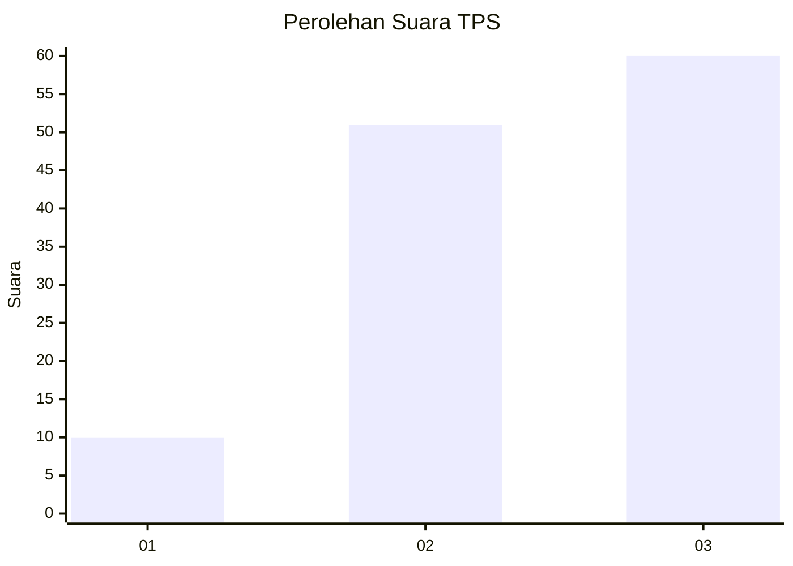
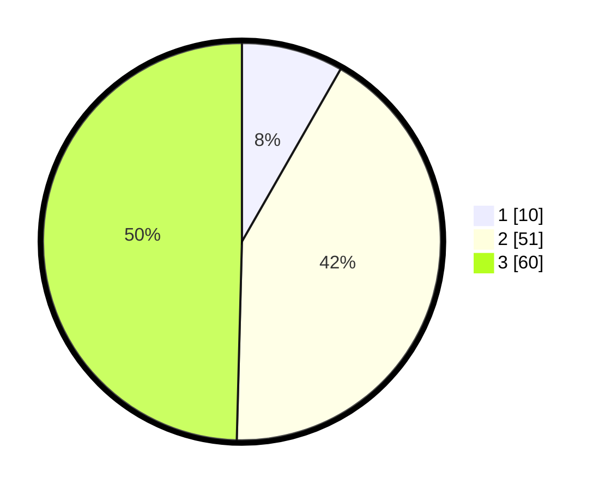

# Hasil

## Grafik

## Tabel

| No. | Nama Paslon    | Suara | Suara (raw) | Persentase |
|:--- |:-------------- | -----:| -----------:| ----------:|
| 1   | ANIES MUHAIMIN | 10    | [10][p-1]   | 8,26       |
| 2   | PRABOWO GIBRAN | 51    | [51][p-2]   | 42,15      |
| 3   | GANJAR MAHFUD  | 60    | [60][p-3]   | 49,59      |

[p-1]: https://github.com/gigit-pemilu/pemilu-2024-33-jawa-tengah/blob/main/pilpres/hitung-suara/sub/33-jawa-tengah/sub/29-brebes/sub/09-brebes/sub/2018-randusanga-kulon/sub/021-tps/sub/paslon-1.txt
[p-2]: https://github.com/gigit-pemilu/pemilu-2024-33-jawa-tengah/blob/main/pilpres/hitung-suara/sub/33-jawa-tengah/sub/29-brebes/sub/09-brebes/sub/2018-randusanga-kulon/sub/021-tps/sub/paslon-2.txt
[p-3]: https://github.com/gigit-pemilu/pemilu-2024-33-jawa-tengah/blob/main/pilpres/hitung-suara/sub/33-jawa-tengah/sub/29-brebes/sub/09-brebes/sub/2018-randusanga-kulon/sub/021-tps/sub/paslon-3.txt

## Foto C Plano

https://sirekap-obj-formc.kpu.go.id/eb62/pemilu/ppwp/33/29/09/20/18/3329092018021-20240214-231538--45ee6f06-a334-4982-b0d5-a7d8e13d8f4b.jpg

https://sirekap-obj-formc.kpu.go.id/eb62/pemilu/ppwp/33/29/09/20/18/3329092018021-20240214-230605--aa8bede9-8ea9-4d08-9967-955c1dac099d.jpg

https://sirekap-obj-formc.kpu.go.id/eb62/pemilu/ppwp/33/29/09/20/18/3329092018021-20240214-231738--084f15de-e477-468b-a94f-829becb3dcbc.jpg

## Metadata

| Key        | Value               |
| ---------- | ------------------- |
| Time Stamp | 2024-02-24 22:31:28 |

