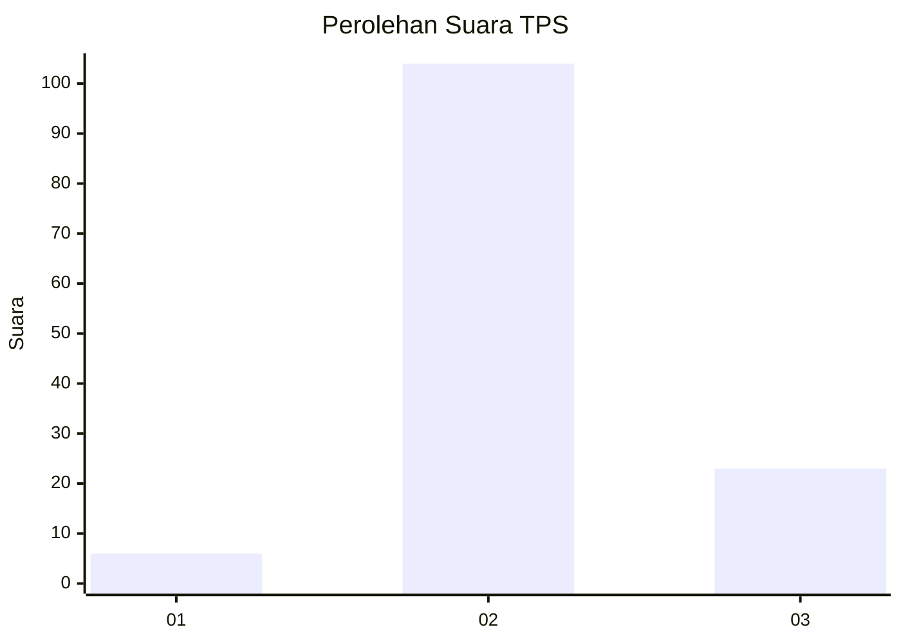

# Hasil

## Grafik

## Tabel

| No. | Nama Paslon    | Suara | Suara (raw) | Persentase |
|:--- |:-------------- | -----:| -----------:| ----------:|
| 1   | ANIES MUHAIMIN | 6     | [6][p-1]    | 4,51       |
| 2   | PRABOWO GIBRAN | 104   | [104][p-2]  | 78,20      |
| 3   | GANJAR MAHFUD  | 23    | [23][p-3]   | 17,29      |

[p-1]: https://github.com/gigit-pemilu/pemilu-2024/blob/main/pilpres/hitung-suara/sub/33-jawa-tengah/sub/29-brebes/sub/10-songgom/sub/2001-cenang/sub/021-tps/sub/paslon-1.txt
[p-2]: https://github.com/gigit-pemilu/pemilu-2024/blob/main/pilpres/hitung-suara/sub/33-jawa-tengah/sub/29-brebes/sub/10-songgom/sub/2001-cenang/sub/021-tps/sub/paslon-2.txt
[p-3]: https://github.com/gigit-pemilu/pemilu-2024/blob/main/pilpres/hitung-suara/sub/33-jawa-tengah/sub/29-brebes/sub/10-songgom/sub/2001-cenang/sub/021-tps/sub/paslon-3.txt

## Foto C Plano

https://sirekap-obj-formc.kpu.go.id/642d/pemilu/ppwp/33/29/10/20/01/3329102001021-20240215-133240--7f9c9b28-ba12-4ea3-9a46-9f9281532dc0.jpg

https://sirekap-obj-formc.kpu.go.id/642d/pemilu/ppwp/33/29/10/20/01/3329102001021-20240215-130004--2972db55-1817-4839-b52b-327abcbc25ef.jpg

https://sirekap-obj-formc.kpu.go.id/642d/pemilu/ppwp/33/29/10/20/01/3329102001021-20240215-130234--9eae4b4f-52c8-4de1-baa7-9d13b1b8cc66.jpg

## Metadata

| Key        | Value               |
| ---------- | ------------------- |
| Time Stamp | 2024-02-25 15:00:00 |

