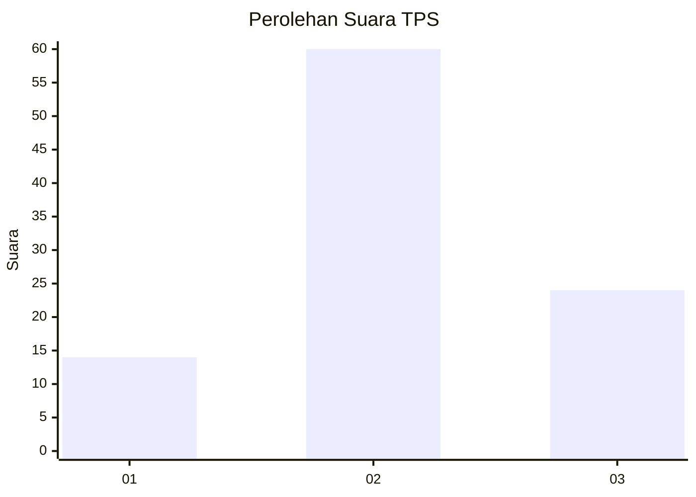
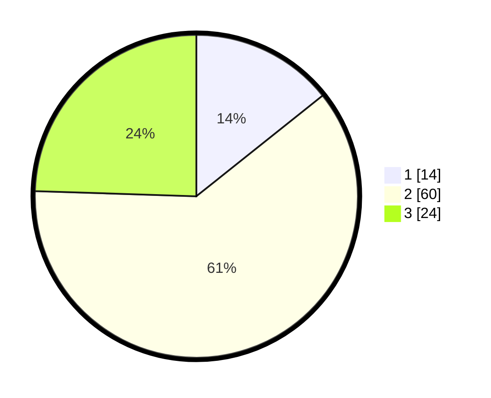

# Hasil

## Grafik

## Tabel

| No. | Nama Paslon    | Suara | Suara (raw) | Persentase |
|:--- |:-------------- | -----:| -----------:| ----------:|
| 1   | ANIES MUHAIMIN | 14    | [14][p-1]   | 14,29      |
| 2   | PRABOWO GIBRAN | 60    | [60][p-2]   | 61,22      |
| 3   | GANJAR MAHFUD  | 24    | [24][p-3]   | 24,49      |

[p-1]: https://github.com/gigit-pemilu/pemilu-2024/blob/main/pilpres/hitung-suara/sub/33-jawa-tengah/sub/29-brebes/sub/10-songgom/sub/2002-dukuhmaja/sub/013-tps/sub/paslon-1.txt
[p-2]: https://github.com/gigit-pemilu/pemilu-2024/blob/main/pilpres/hitung-suara/sub/33-jawa-tengah/sub/29-brebes/sub/10-songgom/sub/2002-dukuhmaja/sub/013-tps/sub/paslon-2.txt
[p-3]: https://github.com/gigit-pemilu/pemilu-2024/blob/main/pilpres/hitung-suara/sub/33-jawa-tengah/sub/29-brebes/sub/10-songgom/sub/2002-dukuhmaja/sub/013-tps/sub/paslon-3.txt

## Foto C Plano

https://sirekap-obj-formc.kpu.go.id/02a1/pemilu/ppwp/33/29/10/20/02/3329102002013-20240215-005947--47a05491-4801-4fdd-ab24-e32f6dc6385e.jpg

https://sirekap-obj-formc.kpu.go.id/02a1/pemilu/ppwp/33/29/10/20/02/3329102002013-20240215-010159--e1893a19-37ad-4e60-ae5c-2bd939a9cbc6.jpg

https://sirekap-obj-formc.kpu.go.id/02a1/pemilu/ppwp/33/29/10/20/02/3329102002013-20240215-010310--38bca039-4504-44de-8ac7-acf23cc1cf1d.jpg

## Metadata

| Key        | Value               |
| ---------- | ------------------- |
| Time Stamp | 2024-02-19 06:16:00 |

