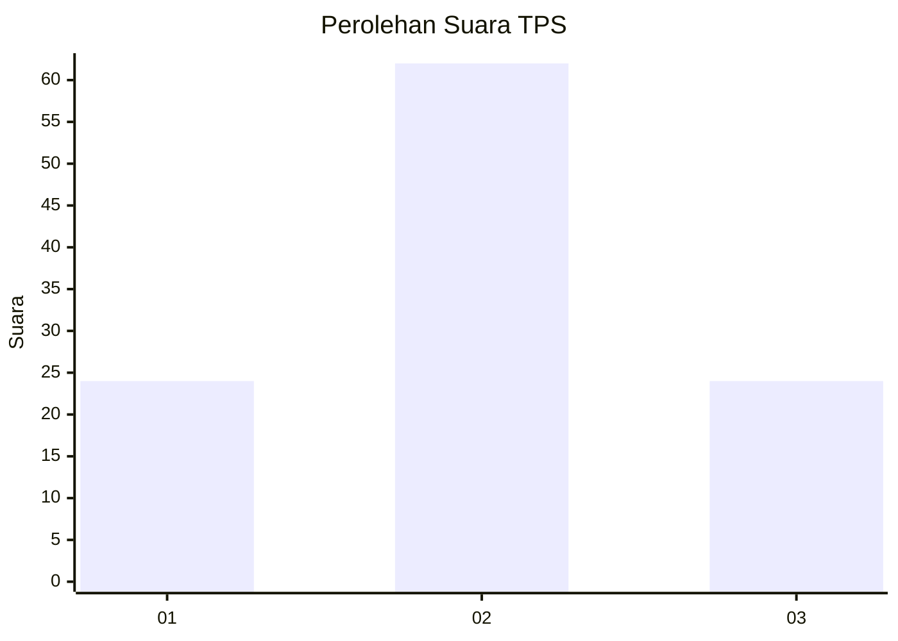
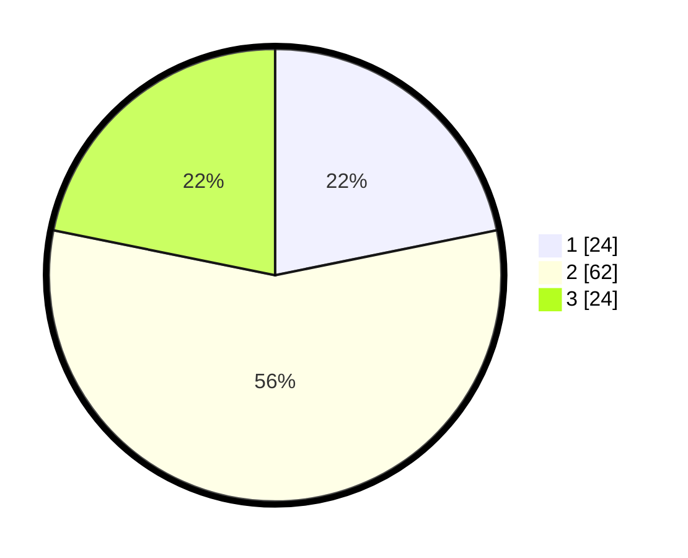

# Hasil

## Grafik

## Tabel

| No. | Nama Paslon    | Suara | Suara (raw) | Persentase |
|:--- |:-------------- | -----:| -----------:| ----------:|
| 1   | ANIES MUHAIMIN | 24    | [24][p-1]   | 21,82      |
| 2   | PRABOWO GIBRAN | 62    | [62][p-2]   | 56,36      |
| 3   | GANJAR MAHFUD  | 24    | [24][p-3]   | 21,82      |

[p-1]: https://github.com/gigit-pemilu/pemilu-2024-33-jawa-tengah/blob/main/pilpres/hitung-suara/sub/33-jawa-tengah/sub/29-brebes/sub/10-songgom/sub/2002-dukuhmaja/sub/015-tps/sub/paslon-1.txt
[p-2]: https://github.com/gigit-pemilu/pemilu-2024-33-jawa-tengah/blob/main/pilpres/hitung-suara/sub/33-jawa-tengah/sub/29-brebes/sub/10-songgom/sub/2002-dukuhmaja/sub/015-tps/sub/paslon-2.txt
[p-3]: https://github.com/gigit-pemilu/pemilu-2024-33-jawa-tengah/blob/main/pilpres/hitung-suara/sub/33-jawa-tengah/sub/29-brebes/sub/10-songgom/sub/2002-dukuhmaja/sub/015-tps/sub/paslon-3.txt

## Foto C Plano

https://sirekap-obj-formc.kpu.go.id/360a/pemilu/ppwp/33/29/10/20/02/3329102002015-20240214-235600--2fafe080-1b40-4467-b16e-532ba3cb9478.jpg

https://sirekap-obj-formc.kpu.go.id/360a/pemilu/ppwp/33/29/10/20/02/3329102002015-20240214-235941--cf9621b9-ed27-41ea-8a57-82a6d4cc4dfd.jpg

https://sirekap-obj-formc.kpu.go.id/360a/pemilu/ppwp/33/29/10/20/02/3329102002015-20240215-000111--7521b067-3997-4e61-a9e0-1db7f51295e4.jpg

## Metadata

| Key        | Value               |
| ---------- | ------------------- |
| Time Stamp | 2024-02-25 16:00:00 |

