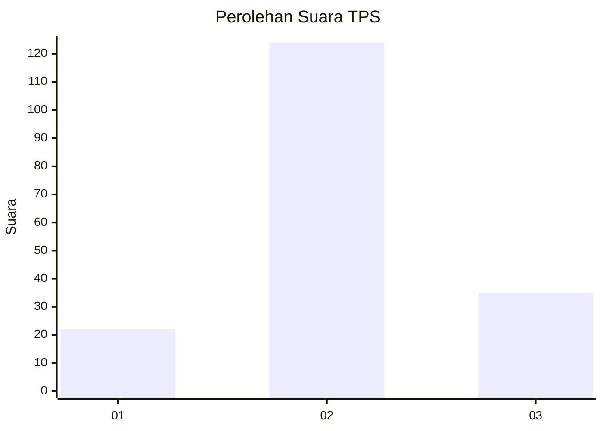
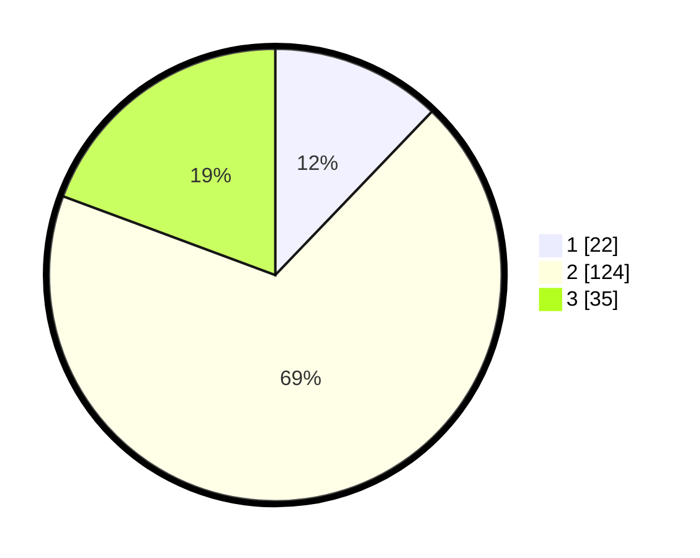

# Hasil

## Grafik

## Tabel

| No. | Nama Paslon    | Suara | Suara (raw) | Persentase |
|:--- |:-------------- | -----:| -----------:| ----------:|
| 1   | ANIES MUHAIMIN | 22    | [22][p-1]   | 12,15      |
| 2   | PRABOWO GIBRAN | 124   | [124][p-2]  | 68,51      |
| 3   | GANJAR MAHFUD  | 35    | [35][p-3]   | 19,34      |

[p-1]: https://github.com/gigit-pemilu/pemilu-2024/blob/main/pilpres/hitung-suara/sub/33-jawa-tengah/sub/29-brebes/sub/10-songgom/sub/2003-jatirokeh/sub/005-tps/sub/paslon-1.txt
[p-2]: https://github.com/gigit-pemilu/pemilu-2024/blob/main/pilpres/hitung-suara/sub/33-jawa-tengah/sub/29-brebes/sub/10-songgom/sub/2003-jatirokeh/sub/005-tps/sub/paslon-2.txt
[p-3]: https://github.com/gigit-pemilu/pemilu-2024/blob/main/pilpres/hitung-suara/sub/33-jawa-tengah/sub/29-brebes/sub/10-songgom/sub/2003-jatirokeh/sub/005-tps/sub/paslon-3.txt

## Foto C Plano

https://sirekap-obj-formc.kpu.go.id/f7de/pemilu/ppwp/33/29/10/20/03/3329102003005-20240214-221814--31188dc8-be05-4d6a-9fca-0bdc9fdb88c2.jpg

https://sirekap-obj-formc.kpu.go.id/f7de/pemilu/ppwp/33/29/10/20/03/3329102003005-20240215-112222--03c71009-c4ac-44cc-b0c2-34b7763592ae.jpg

https://sirekap-obj-formc.kpu.go.id/f7de/pemilu/ppwp/33/29/10/20/03/3329102003005-20240215-114036--dd3b2cdd-371e-4a02-a465-fbce265875e8.jpg

## Metadata

| Key        | Value               |
| ---------- | ------------------- |
| Time Stamp | 2024-02-19 06:16:00 |

