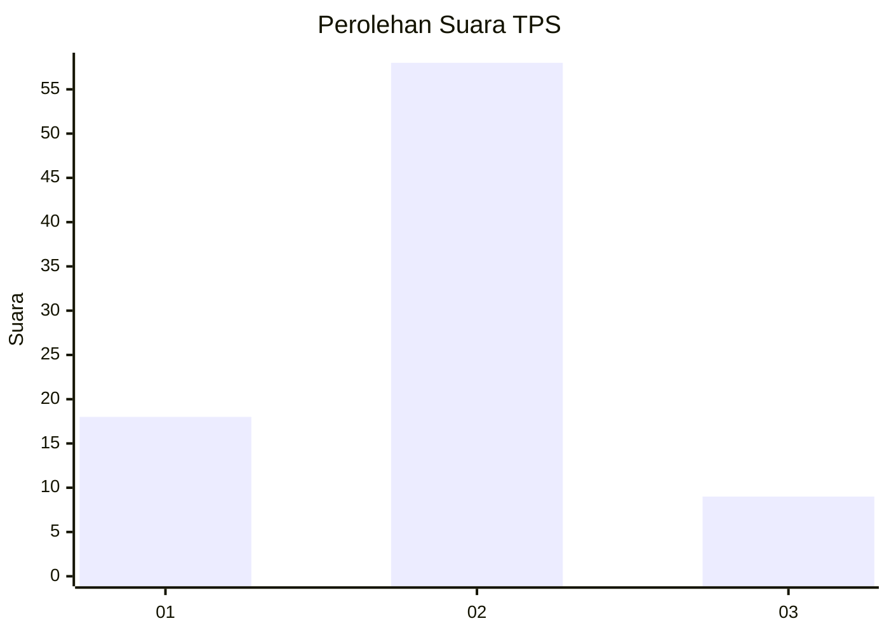

# Hasil

## Grafik

## Tabel

| No. | Nama Paslon    | Suara | Suara (raw) | Persentase |
|:--- |:-------------- | -----:| -----------:| ----------:|
| 1   | ANIES MUHAIMIN | 18    | [18][p-1]   | 21,18      |
| 2   | PRABOWO GIBRAN | 58    | [58][p-2]   | 68,24      |
| 3   | GANJAR MAHFUD  | 9     | [9][p-3]    | 10,59      |

[p-1]: https://github.com/gigit-pemilu/pemilu-2024-33-jawa-tengah/blob/main/pilpres/hitung-suara/sub/33-jawa-tengah/sub/29-brebes/sub/10-songgom/sub/2003-jatirokeh/sub/013-tps/sub/paslon-1.txt
[p-2]: https://github.com/gigit-pemilu/pemilu-2024-33-jawa-tengah/blob/main/pilpres/hitung-suara/sub/33-jawa-tengah/sub/29-brebes/sub/10-songgom/sub/2003-jatirokeh/sub/013-tps/sub/paslon-2.txt
[p-3]: https://github.com/gigit-pemilu/pemilu-2024-33-jawa-tengah/blob/main/pilpres/hitung-suara/sub/33-jawa-tengah/sub/29-brebes/sub/10-songgom/sub/2003-jatirokeh/sub/013-tps/sub/paslon-3.txt

## Foto C Plano

https://sirekap-obj-formc.kpu.go.id/1fed/pemilu/ppwp/33/29/10/20/03/3329102003013-20240215-103902--0fee8d9e-63bf-481c-85f1-856db57cc2d3.jpg

https://sirekap-obj-formc.kpu.go.id/1fed/pemilu/ppwp/33/29/10/20/03/3329102003013-20240215-104343--28899ec6-6f8b-4bd6-8387-992f81ac8634.jpg

https://sirekap-obj-formc.kpu.go.id/1fed/pemilu/ppwp/33/29/10/20/03/3329102003013-20240215-104635--ca9a19b9-c2fd-4069-afbb-f4ce4aa24744.jpg

## Metadata

| Key        | Value               |
| ---------- | ------------------- |
| Time Stamp | 2024-02-15 17:30:25 |

