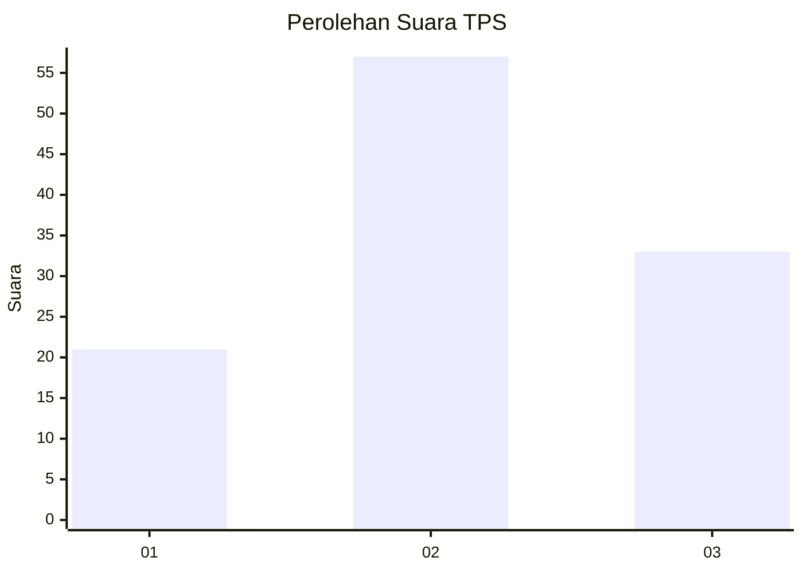
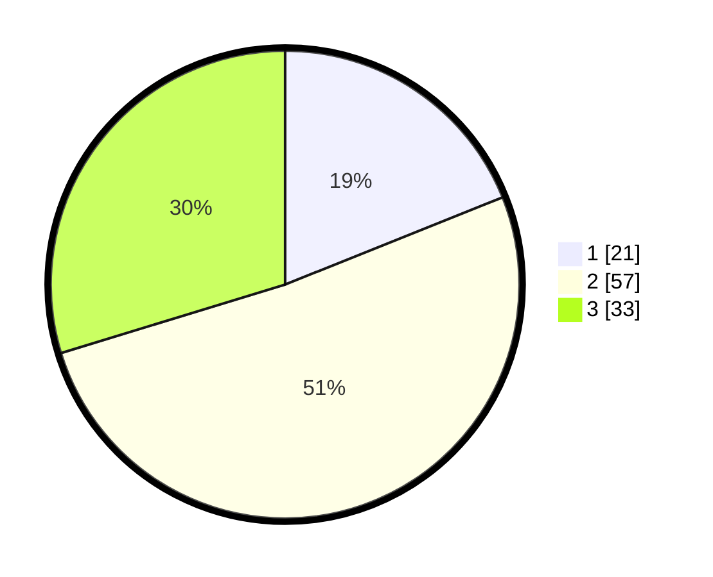

# Hasil

## Grafik

## Tabel

| No. | Nama Paslon    | Suara | Suara (raw) | Persentase |
|:--- |:-------------- | -----:| -----------:| ----------:|
| 1   | ANIES MUHAIMIN | 21    | [21][p-1]   | 18,92      |
| 2   | PRABOWO GIBRAN | 57    | [57][p-2]   | 51,35      |
| 3   | GANJAR MAHFUD  | 33    | [33][p-3]   | 29,73      |

[p-1]: https://github.com/gigit-pemilu/pemilu-2024-33-jawa-tengah/blob/main/pilpres/hitung-suara/sub/33-jawa-tengah/sub/29-brebes/sub/10-songgom/sub/2004-karangsembung/sub/010-tps/sub/paslon-1.txt
[p-2]: https://github.com/gigit-pemilu/pemilu-2024-33-jawa-tengah/blob/main/pilpres/hitung-suara/sub/33-jawa-tengah/sub/29-brebes/sub/10-songgom/sub/2004-karangsembung/sub/010-tps/sub/paslon-2.txt
[p-3]: https://github.com/gigit-pemilu/pemilu-2024-33-jawa-tengah/blob/main/pilpres/hitung-suara/sub/33-jawa-tengah/sub/29-brebes/sub/10-songgom/sub/2004-karangsembung/sub/010-tps/sub/paslon-3.txt

## Foto C Plano

https://sirekap-obj-formc.kpu.go.id/9174/pemilu/ppwp/33/29/10/20/04/3329102004010-20240215-002237--325e262f-600d-426d-a9f8-21c2f7447695.jpg

https://sirekap-obj-formc.kpu.go.id/9174/pemilu/ppwp/33/29/10/20/04/3329102004010-20240215-093139--c5d4d71e-ff29-4631-98ce-ef39c1700056.jpg

https://sirekap-obj-formc.kpu.go.id/9174/pemilu/ppwp/33/29/10/20/04/3329102004010-20240215-093430--1df42e54-f392-4de6-8912-e346bfcfcb8f.jpg

## Metadata

| Key        | Value               |
| ---------- | ------------------- |
| Time Stamp | 2024-02-24 22:31:28 |

