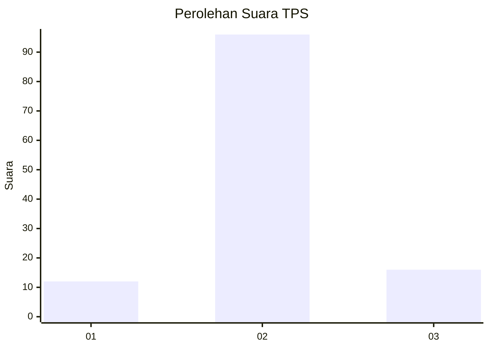
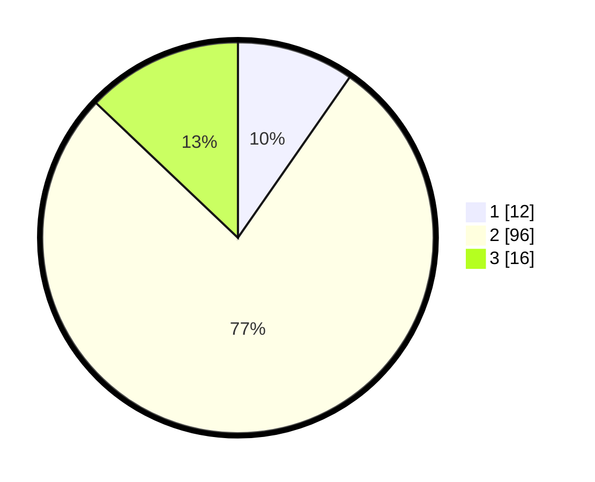

# Hasil

## Grafik

## Tabel

| No. | Nama Paslon    | Suara | Suara (raw) | Persentase |
|:--- |:-------------- | -----:| -----------:| ----------:|
| 1   | ANIES MUHAIMIN | 12    | [12][p-1]   | 9,68       |
| 2   | PRABOWO GIBRAN | 96    | [96][p-2]   | 77,42      |
| 3   | GANJAR MAHFUD  | 16    | [16][p-3]   | 12,90      |

[p-1]: https://github.com/gigit-pemilu/pemilu-2024/blob/main/pilpres/hitung-suara/sub/33-jawa-tengah/sub/29-brebes/sub/10-songgom/sub/2005-songgom/sub/010-tps/sub/paslon-1.txt
[p-2]: https://github.com/gigit-pemilu/pemilu-2024/blob/main/pilpres/hitung-suara/sub/33-jawa-tengah/sub/29-brebes/sub/10-songgom/sub/2005-songgom/sub/010-tps/sub/paslon-2.txt
[p-3]: https://github.com/gigit-pemilu/pemilu-2024/blob/main/pilpres/hitung-suara/sub/33-jawa-tengah/sub/29-brebes/sub/10-songgom/sub/2005-songgom/sub/010-tps/sub/paslon-3.txt

## Foto C Plano

https://sirekap-obj-formc.kpu.go.id/2d50/pemilu/ppwp/33/29/10/20/05/3329102005010-20240215-103643--45e2681f-1862-47c5-8112-dab43a078f61.jpg

https://sirekap-obj-formc.kpu.go.id/2d50/pemilu/ppwp/33/29/10/20/05/3329102005010-20240215-103654--59c39370-47e7-4135-a44f-88ab390b6c53.jpg

https://sirekap-obj-formc.kpu.go.id/2d50/pemilu/ppwp/33/29/10/20/05/3329102005010-20240215-103925--fd809527-ae0a-4402-b605-a4724c4de108.jpg

## Metadata

| Key        | Value               |
| ---------- | ------------------- |
| Time Stamp | 2024-02-19 06:16:00 |

