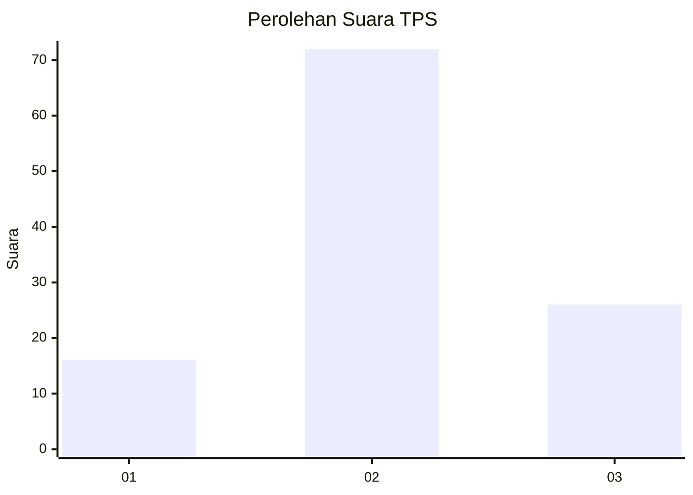
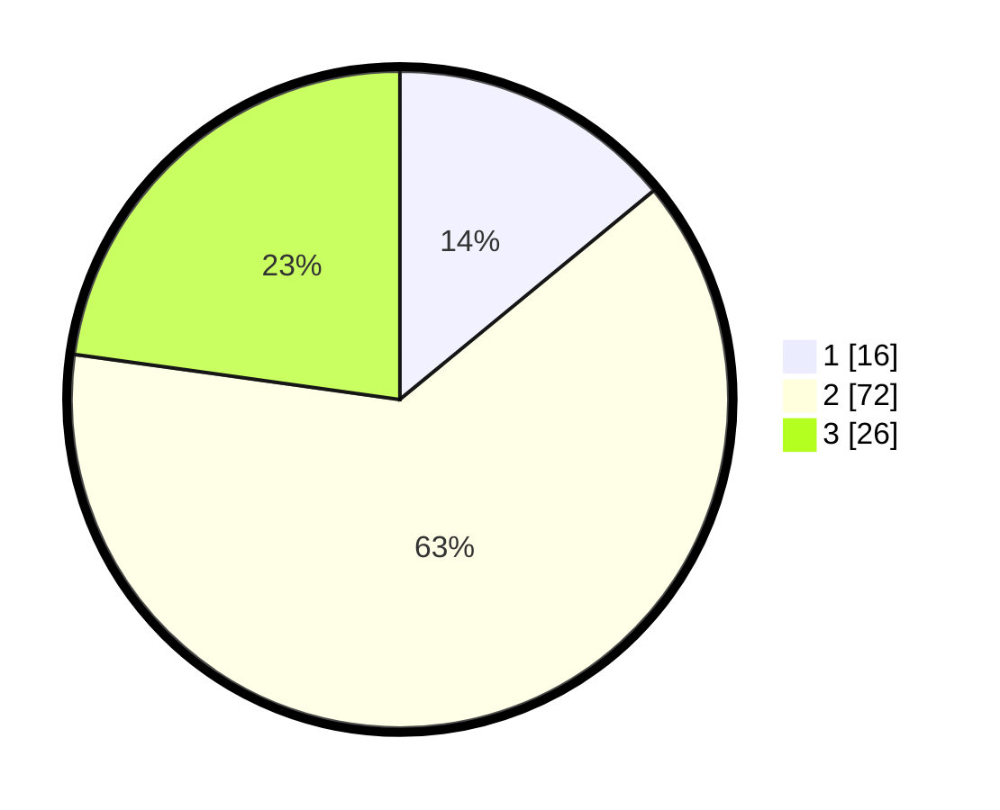

# Hasil

## Grafik

## Tabel

| No. | Nama Paslon    | Suara | Suara (raw) | Persentase |
|:--- |:-------------- | -----:| -----------:| ----------:|
| 1   | ANIES MUHAIMIN | 16    | [16][p-1]   | 14,04      |
| 2   | PRABOWO GIBRAN | 72    | [72][p-2]   | 63,16      |
| 3   | GANJAR MAHFUD  | 26    | [26][p-3]   | 22,81      |

[p-1]: https://github.com/gigit-pemilu/pemilu-2024/blob/main/pilpres/hitung-suara/sub/33-jawa-tengah/sub/29-brebes/sub/10-songgom/sub/2005-songgom/sub/013-tps/sub/paslon-1.txt
[p-2]: https://github.com/gigit-pemilu/pemilu-2024/blob/main/pilpres/hitung-suara/sub/33-jawa-tengah/sub/29-brebes/sub/10-songgom/sub/2005-songgom/sub/013-tps/sub/paslon-2.txt
[p-3]: https://github.com/gigit-pemilu/pemilu-2024/blob/main/pilpres/hitung-suara/sub/33-jawa-tengah/sub/29-brebes/sub/10-songgom/sub/2005-songgom/sub/013-tps/sub/paslon-3.txt

## Foto C Plano

https://sirekap-obj-formc.kpu.go.id/ff82/pemilu/ppwp/33/29/10/20/05/3329102005013-20240215-053256--f211b809-aeec-48d8-90b5-593d5bf143e0.jpg

https://sirekap-obj-formc.kpu.go.id/ff82/pemilu/ppwp/33/29/10/20/05/3329102005013-20240214-155344--313eec32-5aef-458f-adac-ad09cbfc3a3e.jpg

https://sirekap-obj-formc.kpu.go.id/ff82/pemilu/ppwp/33/29/10/20/05/3329102005013-20240217-105727--33b4e733-4fac-4c0d-af14-cd1d5c1f1b18.jpg

## Metadata

| Key        | Value               |
| ---------- | ------------------- |
| Time Stamp | 2024-02-19 06:16:00 |

