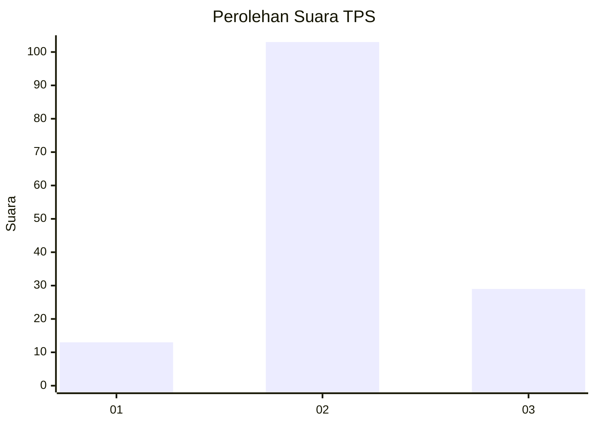
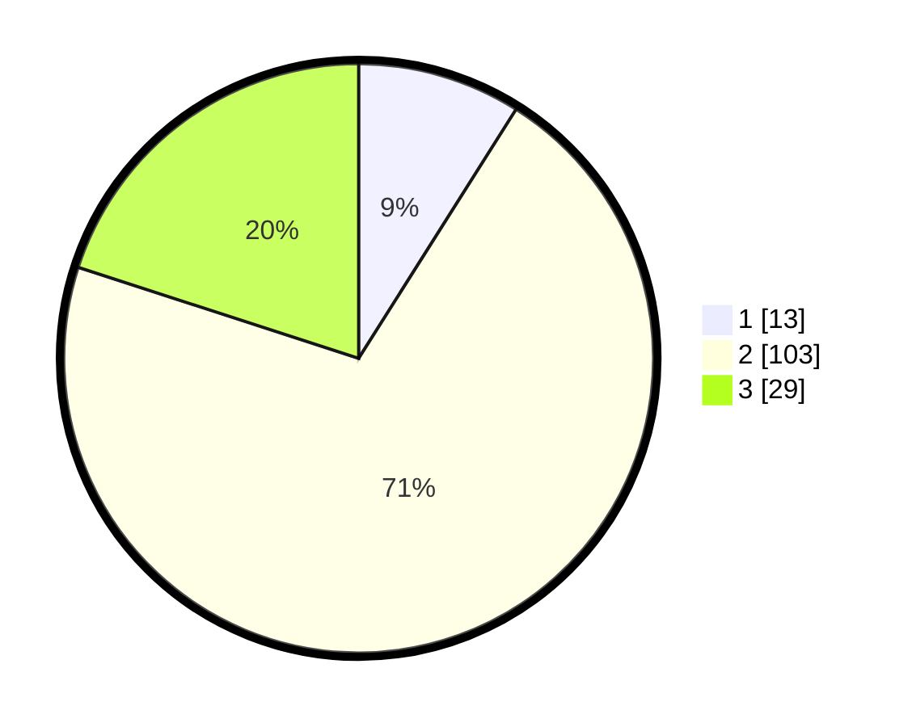

# Hasil

## Grafik

## Tabel

| No. | Nama Paslon    | Suara | Suara (raw) | Persentase |
|:--- |:-------------- | -----:| -----------:| ----------:|
| 1   | ANIES MUHAIMIN | 13    | [13][p-1]   | 8,97       |
| 2   | PRABOWO GIBRAN | 103   | [103][p-2]  | 71,03      |
| 3   | GANJAR MAHFUD  | 29    | [29][p-3]   | 20,00      |

[p-1]: https://github.com/gigit-pemilu/pemilu-2024/blob/main/pilpres/hitung-suara/sub/33-jawa-tengah/sub/29-brebes/sub/10-songgom/sub/2005-songgom/sub/026-tps/sub/paslon-1.txt
[p-2]: https://github.com/gigit-pemilu/pemilu-2024/blob/main/pilpres/hitung-suara/sub/33-jawa-tengah/sub/29-brebes/sub/10-songgom/sub/2005-songgom/sub/026-tps/sub/paslon-2.txt
[p-3]: https://github.com/gigit-pemilu/pemilu-2024/blob/main/pilpres/hitung-suara/sub/33-jawa-tengah/sub/29-brebes/sub/10-songgom/sub/2005-songgom/sub/026-tps/sub/paslon-3.txt

## Foto C Plano

https://sirekap-obj-formc.kpu.go.id/237c/pemilu/ppwp/33/29/10/20/05/3329102005026-20240215-012104--c149c24c-cc24-415a-9f20-0f94f6c6e2e6.jpg

https://sirekap-obj-formc.kpu.go.id/237c/pemilu/ppwp/33/29/10/20/05/3329102005026-20240215-001036--ea151a94-0749-4dcf-a2a3-edfec0f027c7.jpg

https://sirekap-obj-formc.kpu.go.id/237c/pemilu/ppwp/33/29/10/20/05/3329102005026-20240215-001154--224dcdb2-0bd8-463e-a4a0-802f3fd4a83e.jpg

## Metadata

| Key        | Value               |
| ---------- | ------------------- |
| Time Stamp | 2024-02-24 22:31:28 |

