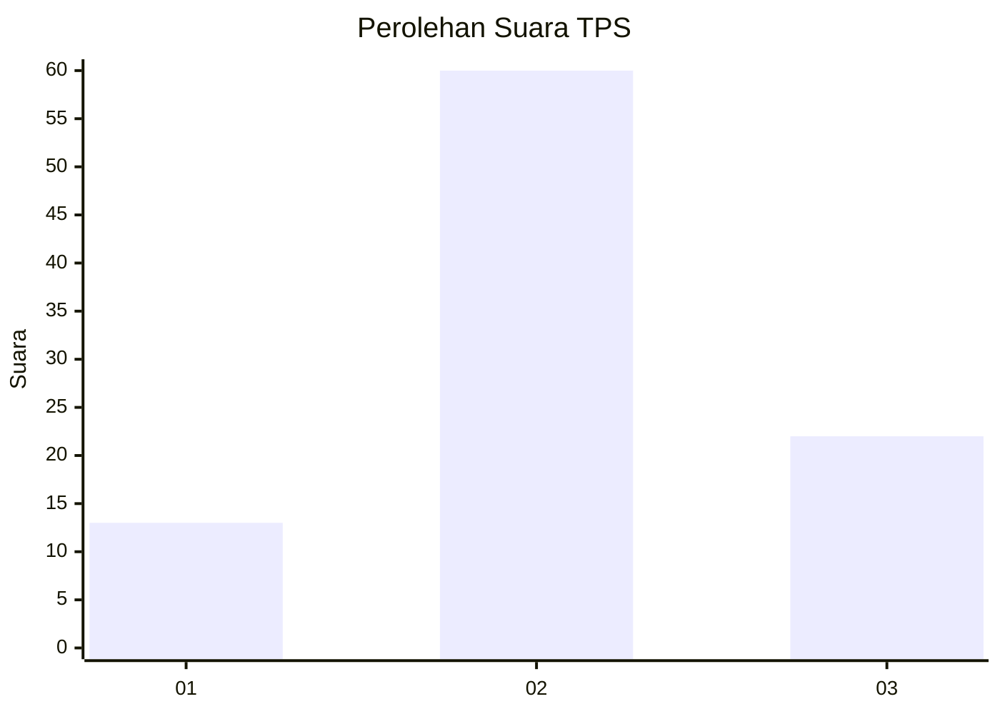
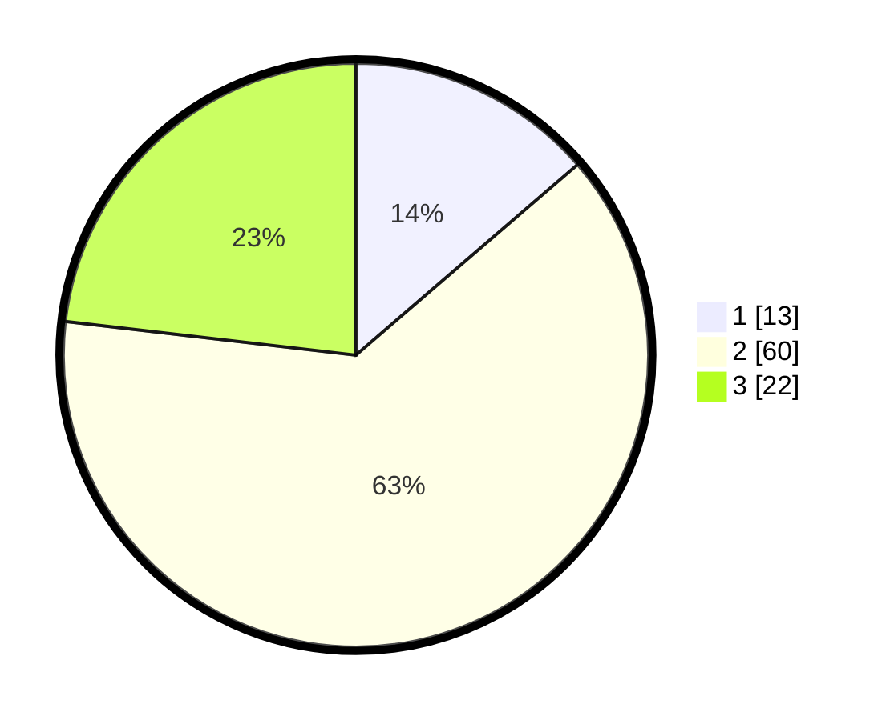

# Hasil

## Grafik

## Tabel

| No. | Nama Paslon    | Suara | Suara (raw) | Persentase |
|:--- |:-------------- | -----:| -----------:| ----------:|
| 1   | ANIES MUHAIMIN | 13    | [13][p-1]   | 13,68      |
| 2   | PRABOWO GIBRAN | 60    | [60][p-2]   | 63,16      |
| 3   | GANJAR MAHFUD  | 22    | [22][p-3]   | 23,16      |

[p-1]: https://github.com/gigit-pemilu/pemilu-2024-33-jawa-tengah/blob/main/pilpres/hitung-suara/sub/33-jawa-tengah/sub/29-brebes/sub/10-songgom/sub/2005-songgom/sub/030-tps/sub/paslon-1.txt
[p-2]: https://github.com/gigit-pemilu/pemilu-2024-33-jawa-tengah/blob/main/pilpres/hitung-suara/sub/33-jawa-tengah/sub/29-brebes/sub/10-songgom/sub/2005-songgom/sub/030-tps/sub/paslon-2.txt
[p-3]: https://github.com/gigit-pemilu/pemilu-2024-33-jawa-tengah/blob/main/pilpres/hitung-suara/sub/33-jawa-tengah/sub/29-brebes/sub/10-songgom/sub/2005-songgom/sub/030-tps/sub/paslon-3.txt

## Foto C Plano

https://sirekap-obj-formc.kpu.go.id/596e/pemilu/ppwp/33/29/10/20/05/3329102005030-20240215-102913--8c92f1ef-38d7-4083-9c47-9bcea4c7f9c4.jpg

https://sirekap-obj-formc.kpu.go.id/596e/pemilu/ppwp/33/29/10/20/05/3329102005030-20240215-103235--b3598a67-dc8e-4321-9ca3-60fccefdf737.jpg

https://sirekap-obj-formc.kpu.go.id/596e/pemilu/ppwp/33/29/10/20/05/3329102005030-20240215-103710--abbb79a3-6ed1-45bf-88be-44c576ef46a7.jpg

## Metadata

| Key        | Value               |
| ---------- | ------------------- |
| Time Stamp | 2024-02-24 22:31:28 |

