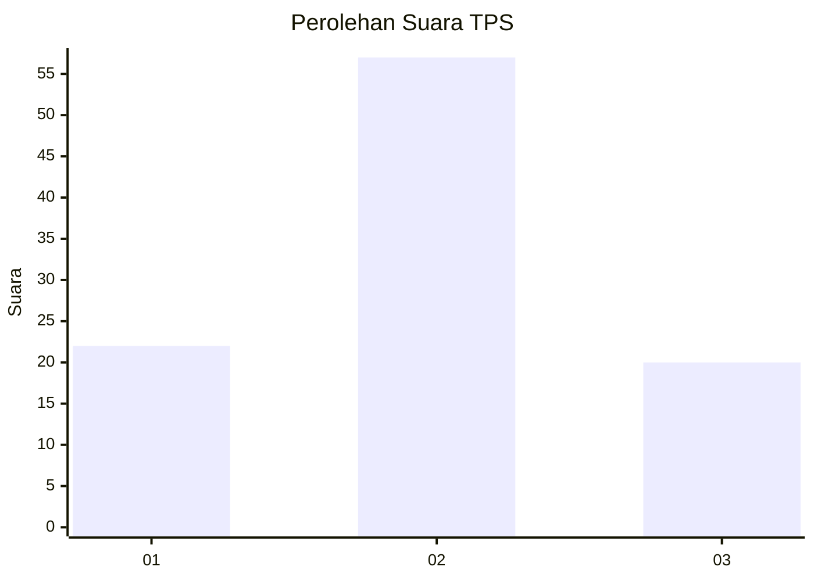
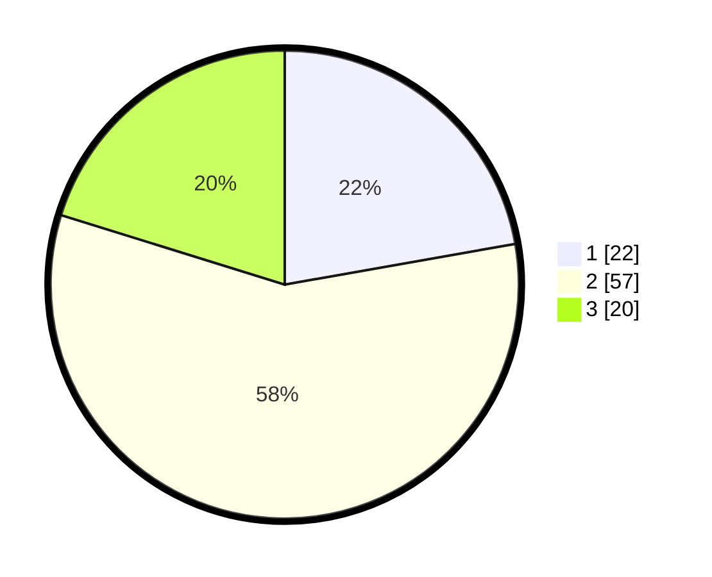

# Hasil

## Grafik

## Tabel

| No. | Nama Paslon    | Suara | Suara (raw) | Persentase |
|:--- |:-------------- | -----:| -----------:| ----------:|
| 1   | ANIES MUHAIMIN | 22    | [22][p-1]   | 22,22      |
| 2   | PRABOWO GIBRAN | 57    | [57][p-2]   | 57,58      |
| 3   | GANJAR MAHFUD  | 20    | [20][p-3]   | 20,20      |

[p-1]: https://github.com/gigit-pemilu/pemilu-2024/blob/main/pilpres/hitung-suara/sub/33-jawa-tengah/sub/29-brebes/sub/10-songgom/sub/2005-songgom/sub/032-tps/sub/paslon-1.txt
[p-2]: https://github.com/gigit-pemilu/pemilu-2024/blob/main/pilpres/hitung-suara/sub/33-jawa-tengah/sub/29-brebes/sub/10-songgom/sub/2005-songgom/sub/032-tps/sub/paslon-2.txt
[p-3]: https://github.com/gigit-pemilu/pemilu-2024/blob/main/pilpres/hitung-suara/sub/33-jawa-tengah/sub/29-brebes/sub/10-songgom/sub/2005-songgom/sub/032-tps/sub/paslon-3.txt

## Foto C Plano

https://sirekap-obj-formc.kpu.go.id/695d/pemilu/ppwp/33/29/10/20/05/3329102005032-20240214-225633--6ba7a7c7-9d86-4c71-b1de-e18471579fe6.jpg

https://sirekap-obj-formc.kpu.go.id/695d/pemilu/ppwp/33/29/10/20/05/3329102005032-20240215-092743--76eb6c2d-3265-4bfc-a0dc-04b9d58a201d.jpg

https://sirekap-obj-formc.kpu.go.id/695d/pemilu/ppwp/33/29/10/20/05/3329102005032-20240215-093026--addc9e10-6d2e-40f8-8950-301afebe26b5.jpg

## Metadata

| Key        | Value               |
| ---------- | ------------------- |
| Time Stamp | 2024-02-24 22:31:28 |

