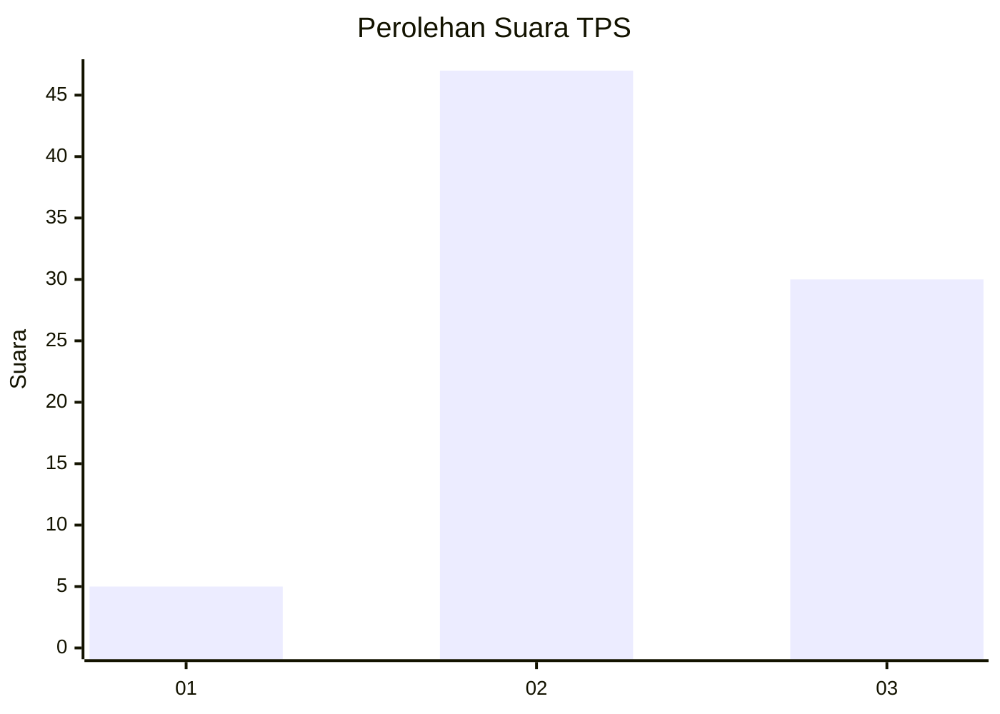
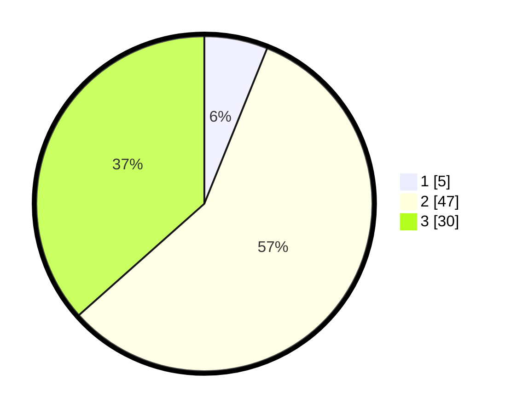

# Hasil

## Grafik

## Tabel

| No. | Nama Paslon    | Suara | Suara (raw) | Persentase |
|:--- |:-------------- | -----:| -----------:| ----------:|
| 1   | ANIES MUHAIMIN | 5     | [5][p-1]    | 6,10       |
| 2   | PRABOWO GIBRAN | 47    | [47][p-2]   | 57,32      |
| 3   | GANJAR MAHFUD  | 30    | [30][p-3]   | 36,59      |

[p-1]: https://github.com/gigit-pemilu/pemilu-2024-33-jawa-tengah/blob/main/pilpres/hitung-suara/sub/33-jawa-tengah/sub/29-brebes/sub/10-songgom/sub/2005-songgom/sub/034-tps/sub/paslon-1.txt
[p-2]: https://github.com/gigit-pemilu/pemilu-2024-33-jawa-tengah/blob/main/pilpres/hitung-suara/sub/33-jawa-tengah/sub/29-brebes/sub/10-songgom/sub/2005-songgom/sub/034-tps/sub/paslon-2.txt
[p-3]: https://github.com/gigit-pemilu/pemilu-2024-33-jawa-tengah/blob/main/pilpres/hitung-suara/sub/33-jawa-tengah/sub/29-brebes/sub/10-songgom/sub/2005-songgom/sub/034-tps/sub/paslon-3.txt

## Foto C Plano

https://sirekap-obj-formc.kpu.go.id/c007/pemilu/ppwp/33/29/10/20/05/3329102005034-20240215-070745--455b06de-7ca9-4b6d-bd91-ae6237bddac0.jpg

https://sirekap-obj-formc.kpu.go.id/c007/pemilu/ppwp/33/29/10/20/05/3329102005034-20240215-071639--63cc0769-408e-4abc-8fbf-139237120503.jpg

https://sirekap-obj-formc.kpu.go.id/c007/pemilu/ppwp/33/29/10/20/05/3329102005034-20240215-071905--73c70c1c-2ab6-496a-bfef-ee34984ff6fd.jpg

## Metadata

| Key        | Value               |
| ---------- | ------------------- |
| Time Stamp | 2024-02-24 22:31:28 |

