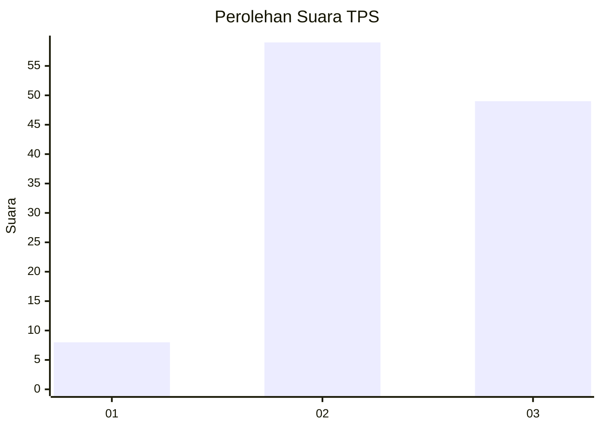
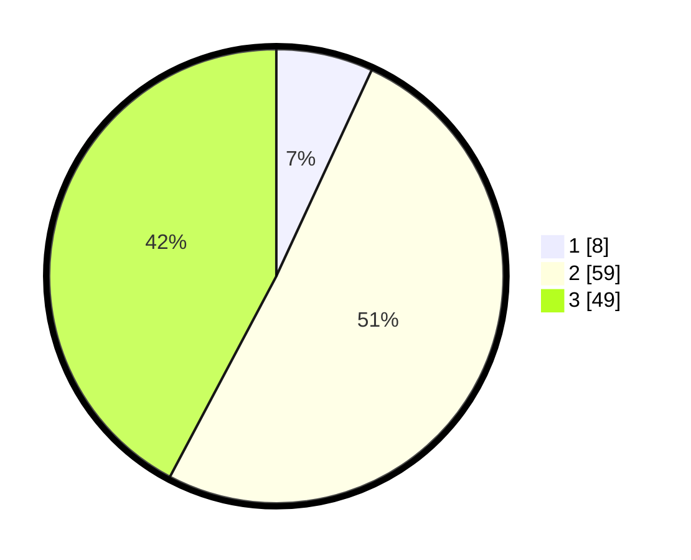

# Hasil

## Grafik

## Tabel

| No. | Nama Paslon    | Suara | Suara (raw) | Persentase |
|:--- |:-------------- | -----:| -----------:| ----------:|
| 1   | ANIES MUHAIMIN | 8     | [8][p-1]    | 6,90       |
| 2   | PRABOWO GIBRAN | 59    | [59][p-2]   | 50,86      |
| 3   | GANJAR MAHFUD  | 49    | [49][p-3]   | 42,24      |

[p-1]: https://github.com/gigit-pemilu/pemilu-2024-33-jawa-tengah/blob/main/pilpres/hitung-suara/sub/33-jawa-tengah/sub/29-brebes/sub/10-songgom/sub/2005-songgom/sub/035-tps/sub/paslon-1.txt
[p-2]: https://github.com/gigit-pemilu/pemilu-2024-33-jawa-tengah/blob/main/pilpres/hitung-suara/sub/33-jawa-tengah/sub/29-brebes/sub/10-songgom/sub/2005-songgom/sub/035-tps/sub/paslon-2.txt
[p-3]: https://github.com/gigit-pemilu/pemilu-2024-33-jawa-tengah/blob/main/pilpres/hitung-suara/sub/33-jawa-tengah/sub/29-brebes/sub/10-songgom/sub/2005-songgom/sub/035-tps/sub/paslon-3.txt

## Foto C Plano

https://sirekap-obj-formc.kpu.go.id/64be/pemilu/ppwp/33/29/10/20/05/3329102005035-20240215-111925--55eba2da-3196-48cf-92e5-1d891b649bcb.jpg

https://sirekap-obj-formc.kpu.go.id/64be/pemilu/ppwp/33/29/10/20/05/3329102005035-20240215-112106--2dc7e405-3d08-4e81-8d20-7edcfed8b2e6.jpg

https://sirekap-obj-formc.kpu.go.id/64be/pemilu/ppwp/33/29/10/20/05/3329102005035-20240215-112247--55ced220-113c-4895-a2f3-3a679cda76b6.jpg

## Metadata

| Key        | Value               |
| ---------- | ------------------- |
| Time Stamp | 2024-02-19 06:16:00 |

