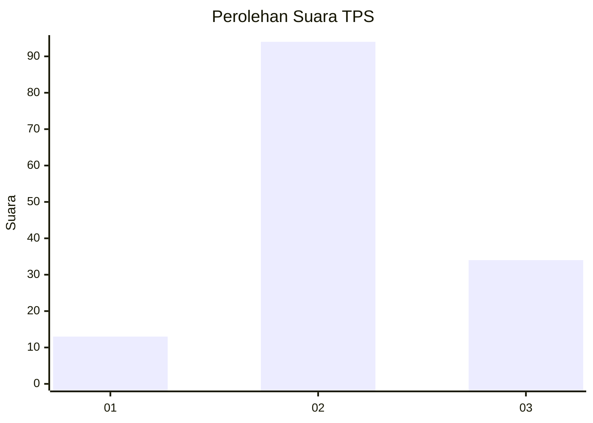
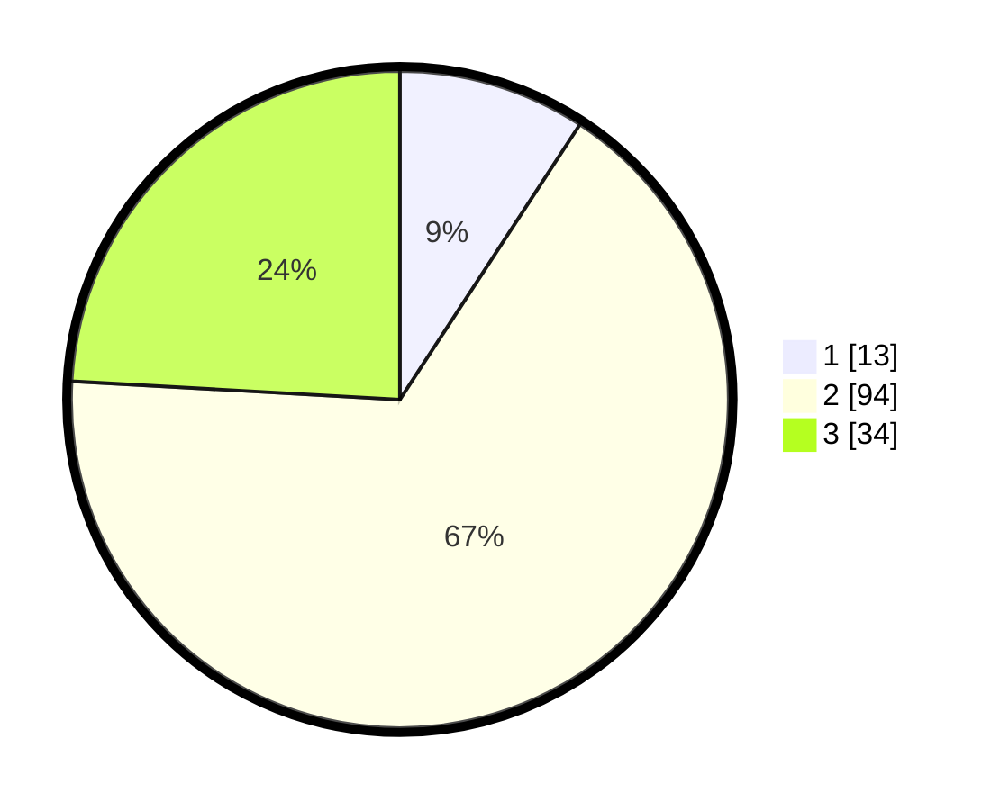

# Hasil

## Grafik

## Tabel

| No. | Nama Paslon    | Suara | Suara (raw) | Persentase |
|:--- |:-------------- | -----:| -----------:| ----------:|
| 1   | ANIES MUHAIMIN | 13    | [13][p-1]   | 9,22       |
| 2   | PRABOWO GIBRAN | 94    | [94][p-2]   | 66,67      |
| 3   | GANJAR MAHFUD  | 34    | [34][p-3]   | 24,11      |

[p-1]: https://github.com/gigit-pemilu/pemilu-2024/blob/main/pilpres/hitung-suara/sub/33-jawa-tengah/sub/29-brebes/sub/10-songgom/sub/2007-wanatawang/sub/004-tps/sub/paslon-1.txt
[p-2]: https://github.com/gigit-pemilu/pemilu-2024/blob/main/pilpres/hitung-suara/sub/33-jawa-tengah/sub/29-brebes/sub/10-songgom/sub/2007-wanatawang/sub/004-tps/sub/paslon-2.txt
[p-3]: https://github.com/gigit-pemilu/pemilu-2024/blob/main/pilpres/hitung-suara/sub/33-jawa-tengah/sub/29-brebes/sub/10-songgom/sub/2007-wanatawang/sub/004-tps/sub/paslon-3.txt

## Foto C Plano

https://sirekap-obj-formc.kpu.go.id/4d58/pemilu/ppwp/33/29/10/20/07/3329102007004-20240214-224656--0c41fe8a-c231-4465-b682-2d382e2bf42e.jpg

https://sirekap-obj-formc.kpu.go.id/4d58/pemilu/ppwp/33/29/10/20/07/3329102007004-20240214-224801--45c1559b-582c-403c-96d5-1bd63f44d0fe.jpg

https://sirekap-obj-formc.kpu.go.id/4d58/pemilu/ppwp/33/29/10/20/07/3329102007004-20240214-224959--a962d7aa-13e8-41ae-aa66-f8cbd1fc694d.jpg

## Metadata

| Key        | Value               |
| ---------- | ------------------- |
| Time Stamp | 2024-02-24 22:31:28 |

