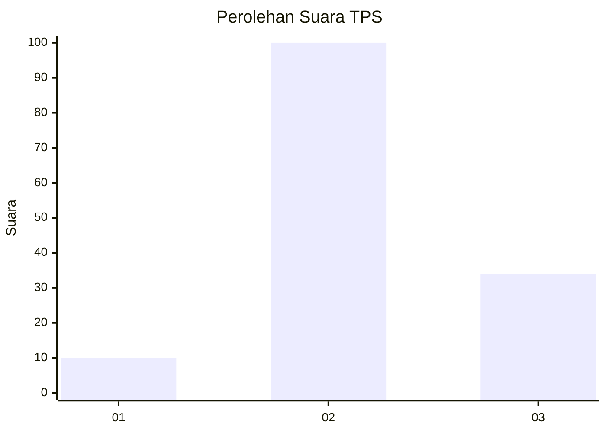
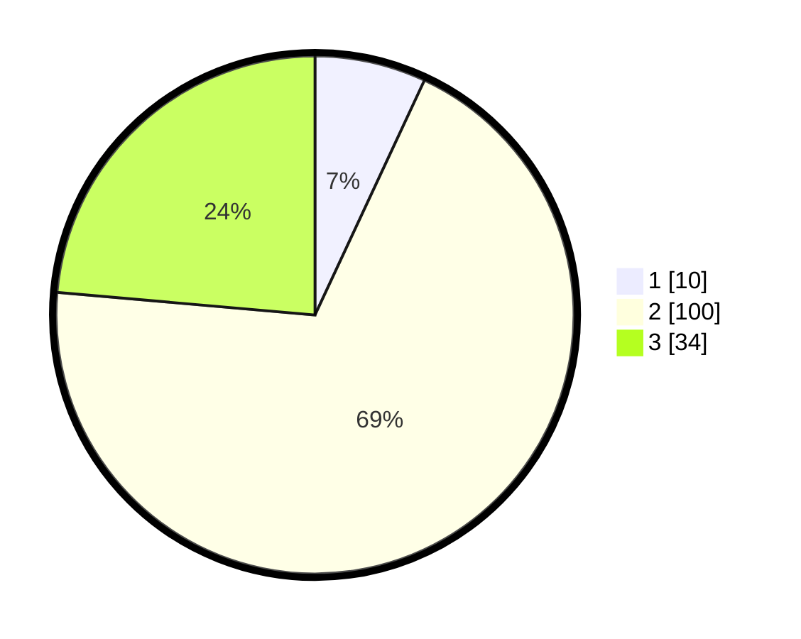

# Hasil

## Grafik

## Tabel

| No. | Nama Paslon    | Suara | Suara (raw) | Persentase |
|:--- |:-------------- | -----:| -----------:| ----------:|
| 1   | ANIES MUHAIMIN | 10    | [10][p-1]   | 6,94       |
| 2   | PRABOWO GIBRAN | 100   | [100][p-2]  | 69,44      |
| 3   | GANJAR MAHFUD  | 34    | [34][p-3]   | 23,61      |

[p-1]: https://github.com/gigit-pemilu/pemilu-2024-33-jawa-tengah/blob/main/pilpres/hitung-suara/sub/33-jawa-tengah/sub/29-brebes/sub/10-songgom/sub/2007-wanatawang/sub/005-tps/sub/paslon-1.txt
[p-2]: https://github.com/gigit-pemilu/pemilu-2024-33-jawa-tengah/blob/main/pilpres/hitung-suara/sub/33-jawa-tengah/sub/29-brebes/sub/10-songgom/sub/2007-wanatawang/sub/005-tps/sub/paslon-2.txt
[p-3]: https://github.com/gigit-pemilu/pemilu-2024-33-jawa-tengah/blob/main/pilpres/hitung-suara/sub/33-jawa-tengah/sub/29-brebes/sub/10-songgom/sub/2007-wanatawang/sub/005-tps/sub/paslon-3.txt

## Foto C Plano

https://sirekap-obj-formc.kpu.go.id/808f/pemilu/ppwp/33/29/10/20/07/3329102007005-20240215-080844--787e830a-67f9-4332-a679-cc6a26fa162a.jpg

https://sirekap-obj-formc.kpu.go.id/808f/pemilu/ppwp/33/29/10/20/07/3329102007005-20240214-233940--dbfabd61-ccc7-44f2-add7-3b31671338bd.jpg

https://sirekap-obj-formc.kpu.go.id/808f/pemilu/ppwp/33/29/10/20/07/3329102007005-20240215-081325--c1955161-e7e9-471e-9a1e-aee4cc368114.jpg

## Metadata

| Key        | Value               |
| ---------- | ------------------- |
| Time Stamp | 2024-02-24 22:31:28 |

