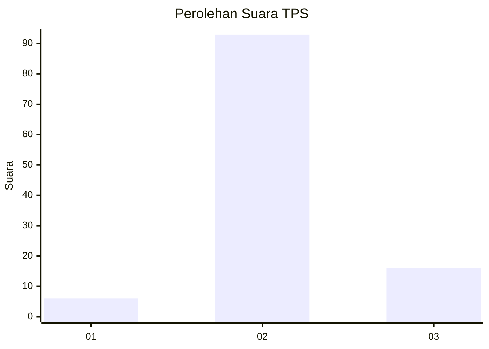
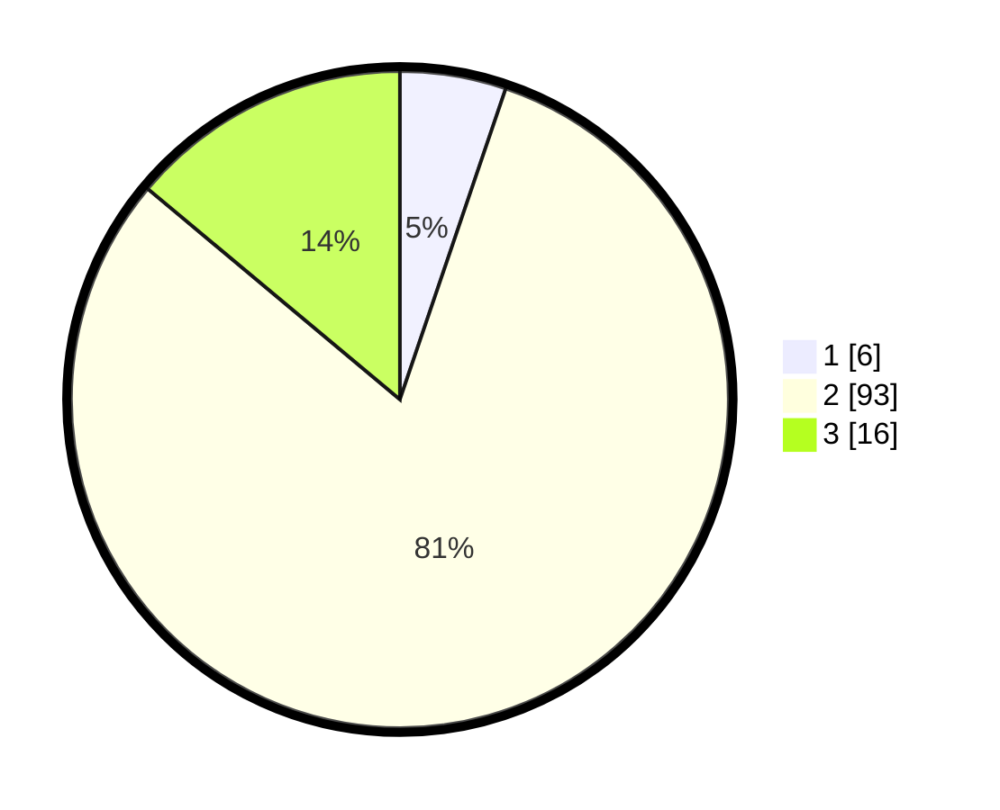

# Hasil

## Grafik

## Tabel

| No. | Nama Paslon    | Suara | Suara (raw) | Persentase |
|:--- |:-------------- | -----:| -----------:| ----------:|
| 1   | ANIES MUHAIMIN | 6     | [6][p-1]    | 5,22       |
| 2   | PRABOWO GIBRAN | 93    | [93][p-2]   | 80,87      |
| 3   | GANJAR MAHFUD  | 16    | [16][p-3]   | 13,91      |

[p-1]: https://github.com/gigit-pemilu/pemilu-2024/blob/main/pilpres/hitung-suara/sub/33-jawa-tengah/sub/29-brebes/sub/10-songgom/sub/2007-wanatawang/sub/015-tps/sub/paslon-1.txt
[p-2]: https://github.com/gigit-pemilu/pemilu-2024/blob/main/pilpres/hitung-suara/sub/33-jawa-tengah/sub/29-brebes/sub/10-songgom/sub/2007-wanatawang/sub/015-tps/sub/paslon-2.txt
[p-3]: https://github.com/gigit-pemilu/pemilu-2024/blob/main/pilpres/hitung-suara/sub/33-jawa-tengah/sub/29-brebes/sub/10-songgom/sub/2007-wanatawang/sub/015-tps/sub/paslon-3.txt

## Foto C Plano

https://sirekap-obj-formc.kpu.go.id/014c/pemilu/ppwp/33/29/10/20/07/3329102007015-20240215-103439--3af73eba-acaf-46b7-9524-b217857bb803.jpg

https://sirekap-obj-formc.kpu.go.id/014c/pemilu/ppwp/33/29/10/20/07/3329102007015-20240215-103336--672a77e7-071a-4c05-8060-1bb6585cd5ba.jpg

https://sirekap-obj-formc.kpu.go.id/014c/pemilu/ppwp/33/29/10/20/07/3329102007015-20240215-103359--c9a0f547-541a-4331-b209-abd3712dfd98.jpg

## Metadata

| Key        | Value               |
| ---------- | ------------------- |
| Time Stamp | 2024-02-25 15:00:00 |

