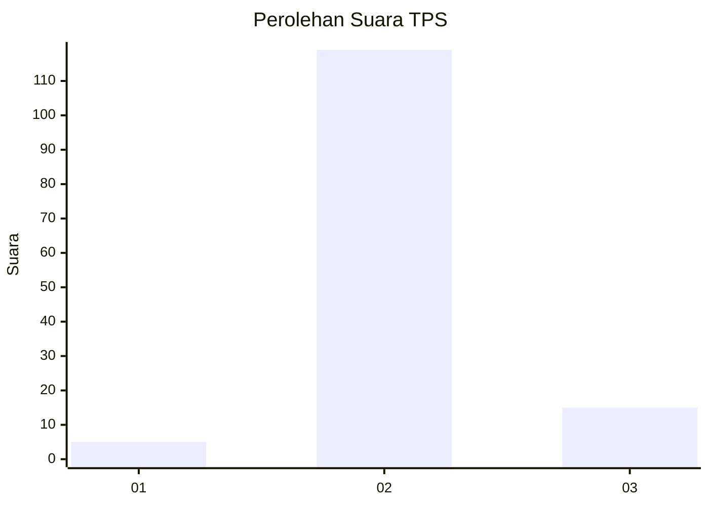
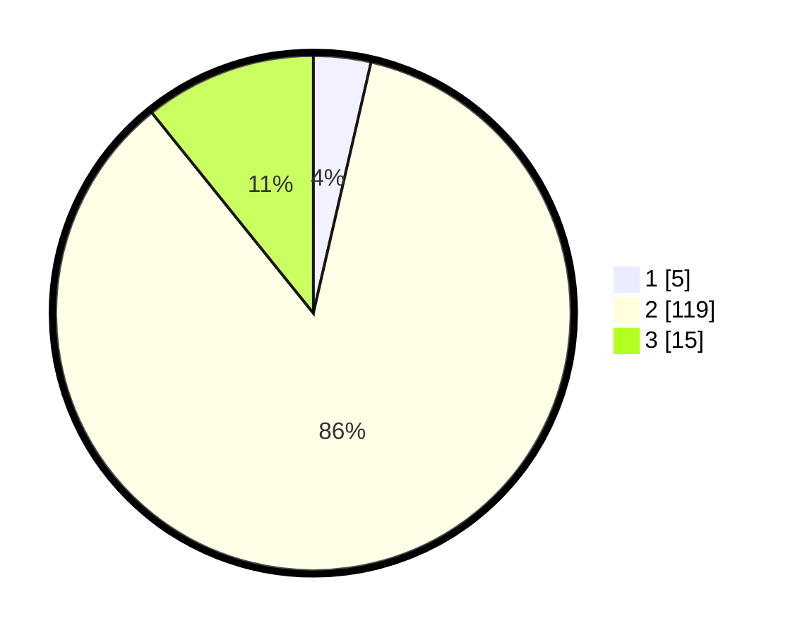

# Hasil

## Grafik

## Tabel

| No. | Nama Paslon    | Suara | Suara (raw) | Persentase |
|:--- |:-------------- | -----:| -----------:| ----------:|
| 1   | ANIES MUHAIMIN | 5     | [5][p-1]    | 3,60       |
| 2   | PRABOWO GIBRAN | 119   | [119][p-2]  | 85,61      |
| 3   | GANJAR MAHFUD  | 15    | [15][p-3]   | 10,79      |

[p-1]: https://github.com/gigit-pemilu/pemilu-2024/blob/main/pilpres/hitung-suara/sub/33-jawa-tengah/sub/29-brebes/sub/10-songgom/sub/2007-wanatawang/sub/016-tps/sub/paslon-1.txt
[p-2]: https://github.com/gigit-pemilu/pemilu-2024/blob/main/pilpres/hitung-suara/sub/33-jawa-tengah/sub/29-brebes/sub/10-songgom/sub/2007-wanatawang/sub/016-tps/sub/paslon-2.txt
[p-3]: https://github.com/gigit-pemilu/pemilu-2024/blob/main/pilpres/hitung-suara/sub/33-jawa-tengah/sub/29-brebes/sub/10-songgom/sub/2007-wanatawang/sub/016-tps/sub/paslon-3.txt

## Foto C Plano

https://sirekap-obj-formc.kpu.go.id/a27f/pemilu/ppwp/33/29/10/20/07/3329102007016-20240215-014430--1990fbe8-2e2d-4401-9be4-65d6599def36.jpg

https://sirekap-obj-formc.kpu.go.id/a27f/pemilu/ppwp/33/29/10/20/07/3329102007016-20240215-014547--0520a185-1cf7-4970-99e4-2b524c9455d8.jpg

https://sirekap-obj-formc.kpu.go.id/a27f/pemilu/ppwp/33/29/10/20/07/3329102007016-20240215-014639--1ee5416c-a8d1-4c0f-9d20-5ad170b2ea61.jpg

## Metadata

| Key        | Value               |
| ---------- | ------------------- |
| Time Stamp | 2024-02-24 22:31:28 |

