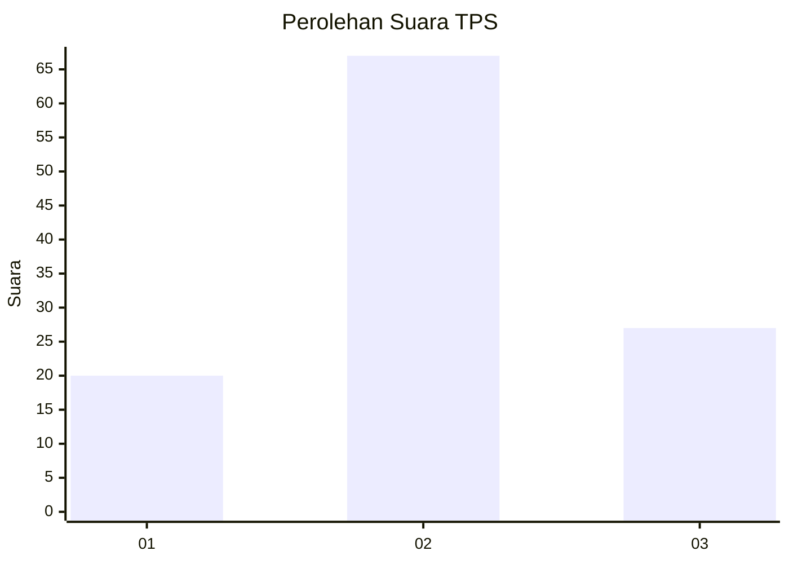
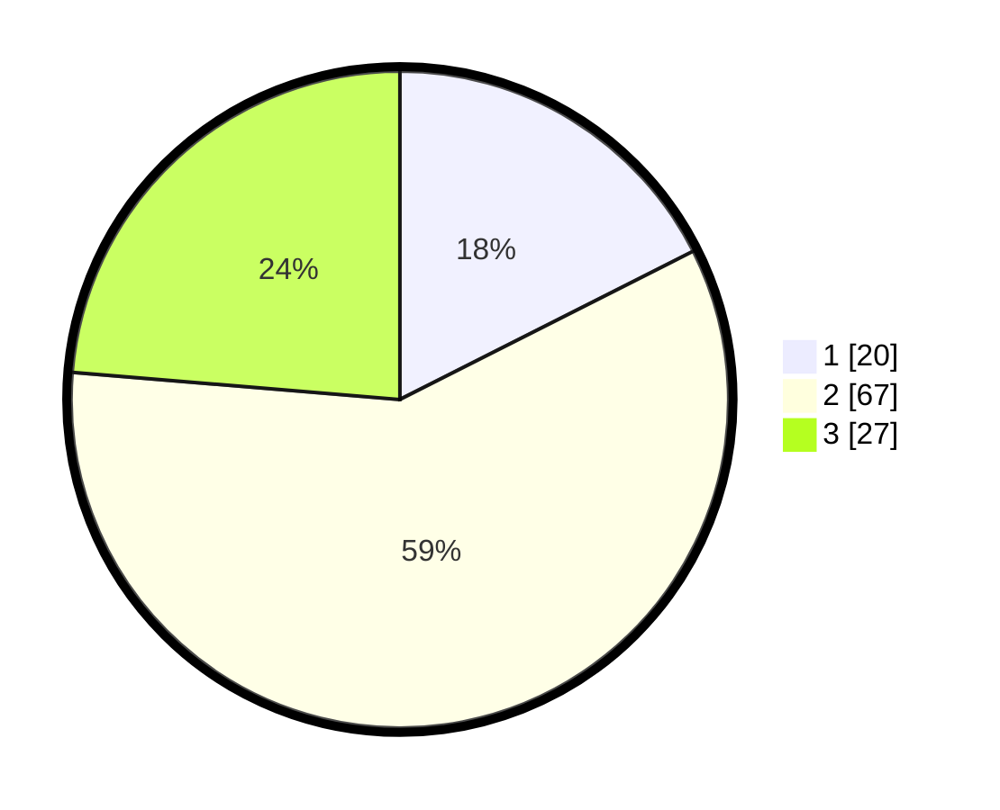

# Hasil

## Grafik

## Tabel

| No. | Nama Paslon    | Suara | Suara (raw) | Persentase |
|:--- |:-------------- | -----:| -----------:| ----------:|
| 1   | ANIES MUHAIMIN | 20    | [20][p-1]   | 17,54      |
| 2   | PRABOWO GIBRAN | 67    | [67][p-2]   | 58,77      |
| 3   | GANJAR MAHFUD  | 27    | [27][p-3]   | 23,68      |

[p-1]: https://github.com/gigit-pemilu/pemilu-2024/blob/main/pilpres/hitung-suara/sub/33-jawa-tengah/sub/29-brebes/sub/10-songgom/sub/2008-gegerkunci/sub/008-tps/sub/paslon-1.txt
[p-2]: https://github.com/gigit-pemilu/pemilu-2024/blob/main/pilpres/hitung-suara/sub/33-jawa-tengah/sub/29-brebes/sub/10-songgom/sub/2008-gegerkunci/sub/008-tps/sub/paslon-2.txt
[p-3]: https://github.com/gigit-pemilu/pemilu-2024/blob/main/pilpres/hitung-suara/sub/33-jawa-tengah/sub/29-brebes/sub/10-songgom/sub/2008-gegerkunci/sub/008-tps/sub/paslon-3.txt

## Foto C Plano

https://sirekap-obj-formc.kpu.go.id/3f93/pemilu/ppwp/33/29/10/20/08/3329102008008-20240214-140928--d4369562-ec35-4706-ba57-d4f6406c352f.jpg

https://sirekap-obj-formc.kpu.go.id/3f93/pemilu/ppwp/33/29/10/20/08/3329102008008-20240214-141100--14c6e4bd-9563-4549-bce9-0d915e3dc717.jpg

https://sirekap-obj-formc.kpu.go.id/3f93/pemilu/ppwp/33/29/10/20/08/3329102008008-20240214-141225--f362fc71-8770-434e-9630-5976e251f786.jpg

## Metadata

| Key        | Value               |
| ---------- | ------------------- |
| Time Stamp | 2024-02-15 00:46:45 |

