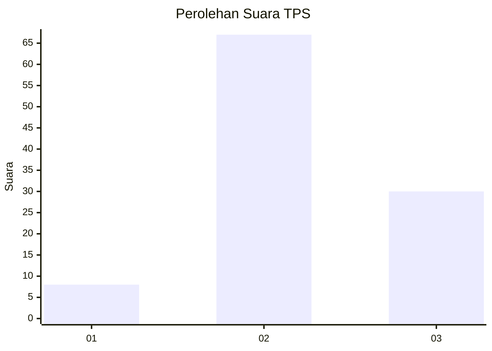
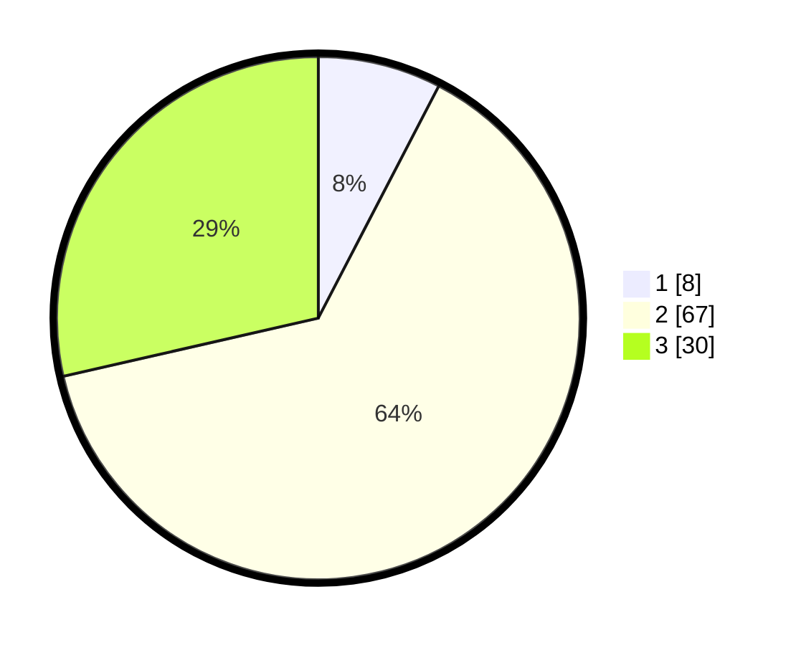

# Hasil

## Grafik

## Tabel

| No. | Nama Paslon    | Suara | Suara (raw) | Persentase |
|:--- |:-------------- | -----:| -----------:| ----------:|
| 1   | ANIES MUHAIMIN | 8     | [8][p-1]    | 7,62       |
| 2   | PRABOWO GIBRAN | 67    | [67][p-2]   | 63,81      |
| 3   | GANJAR MAHFUD  | 30    | [30][p-3]   | 28,57      |

[p-1]: https://github.com/gigit-pemilu/pemilu-2024-33-jawa-tengah/blob/main/pilpres/hitung-suara/sub/33-jawa-tengah/sub/29-brebes/sub/10-songgom/sub/2008-gegerkunci/sub/012-tps/sub/paslon-1.txt
[p-2]: https://github.com/gigit-pemilu/pemilu-2024-33-jawa-tengah/blob/main/pilpres/hitung-suara/sub/33-jawa-tengah/sub/29-brebes/sub/10-songgom/sub/2008-gegerkunci/sub/012-tps/sub/paslon-2.txt
[p-3]: https://github.com/gigit-pemilu/pemilu-2024-33-jawa-tengah/blob/main/pilpres/hitung-suara/sub/33-jawa-tengah/sub/29-brebes/sub/10-songgom/sub/2008-gegerkunci/sub/012-tps/sub/paslon-3.txt

## Foto C Plano

https://sirekap-obj-formc.kpu.go.id/2854/pemilu/ppwp/33/29/10/20/08/3329102008012-20240215-004138--188fa7e0-adb9-4ece-9193-2c2faae9215e.jpg

https://sirekap-obj-formc.kpu.go.id/2854/pemilu/ppwp/33/29/10/20/08/3329102008012-20240215-004310--67e7d43b-dd36-4839-b4a3-4d232bb923f4.jpg

https://sirekap-obj-formc.kpu.go.id/2854/pemilu/ppwp/33/29/10/20/08/3329102008012-20240215-004411--31c956da-f082-43af-a3e0-303b9b6b44a9.jpg

## Metadata

| Key        | Value               |
| ---------- | ------------------- |
| Time Stamp | 2024-02-25 13:00:00 |

